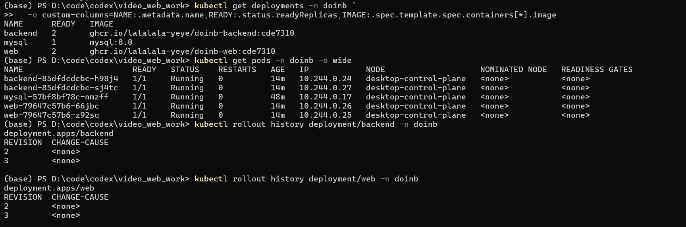
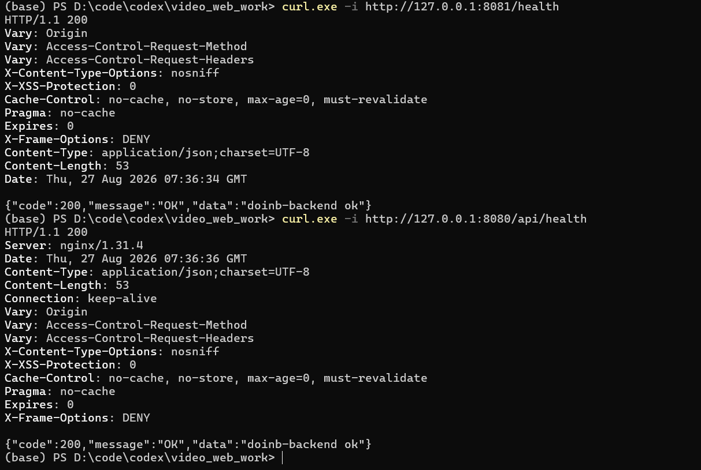
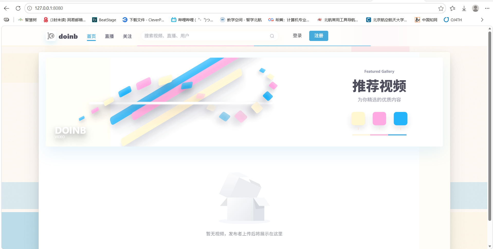
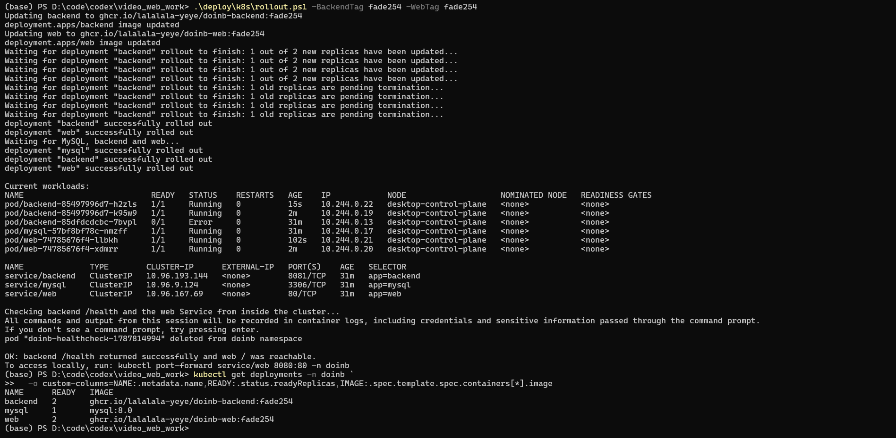
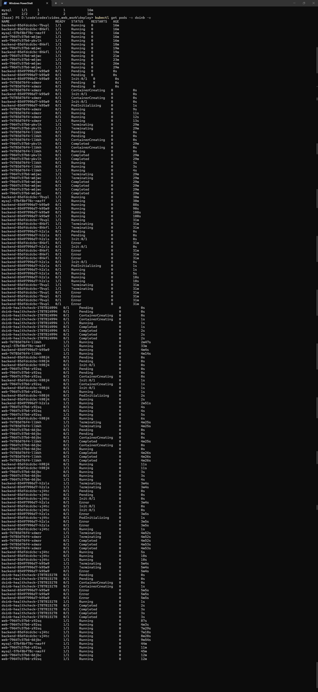

# CD-02 Kubernetes 部署验收记录

执行日期：2026-08-27

执行环境：本地 Kubernetes 集群，节点 `desktop-control-plane`

Namespace：`doinb`

## 1. 清单与版本

部署清单位于 [`deploy/k8s/`](./)：

| 资源 | 清单 | 部署结果 |
|---|---|---|
| Namespace | [`namespace.yaml`](namespace.yaml) | `doinb` |
| MySQL Deployment/Service/PVC | [`mysql.yaml`](mysql.yaml) | `mysql:8.0`，1 个 Pod |
| backend Deployment/Service | [`backend.yaml`](backend.yaml) | `ghcr.io/lalalala-yeye/doinb-backend:cde7310`，2 个 Pod |
| web Deployment/Service | [`web.yaml`](web.yaml) | `ghcr.io/lalalala-yeye/doinb-web:cde7310`，2 个 Pod |
| 聚合部署入口 | [`kustomization.yaml`](kustomization.yaml) | `kubectl apply -k deploy/k8s` |

最终 Deployment 均使用明确版本 tag，没有使用 `latest`；5 个业务 Pod 全部为 `1/1 Running`、重启次数为 0。backend 和 web 的 rollout history 均记录了 revision 2、3。

## 2. 健康检查与页面访问

更新完成后验证结果：

- 直接访问 backend：`http://127.0.0.1:8081/health` 返回 HTTP 200。
- 通过 web Nginx 反向代理访问：`http://127.0.0.1:8080/api/health` 返回 HTTP 200。
- 浏览器访问 `http://127.0.0.1:8080`，前端页面正常显示。

## 3. 滚动更新验证

先将 backend、web 部署为旧版本 `fade254`，确认 Deployment 就绪以及集群内部健康检查通过：

随后将两个 Deployment 更新到 `cde7310`。输出显示新副本逐步更新、旧副本等待终止，最终 backend 和 web 均 `successfully rolled out`；脚本随后再次验证 backend `/health` 与 web `/` 可访问。

Pod 监听记录中，新 Pod 依次经历 `Pending`、`ContainerCreating/Init`、`Running`，达到 `1/1` 后旧 Pod 才进入 `Terminating`。其中：

- backend：旧 ReplicaSet `85497996d7` → 新 ReplicaSet `85dfdcdcbc`
- web：旧 ReplicaSet `74785676f4` → 新 ReplicaSet `79647c57b6`

监听中旧 backend Pod 在退出阶段短暂显示 `Error`，属于已被替换副本的终止状态；最终状态截图证明旧 Pod 已清理，所有当前 Pod 均为 `1/1 Running`。

## 4. 验收结论

| 验收项 | 结果 | 证据 |
|---|---|---|
| MySQL、backend、web 均部署到 K8s | 通过 | 最终 Pod 状态截图、清单文件 |
| 镜像使用版本 tag，禁止 `latest` | 通过 | 最终镜像截图、清单文件、`rollout.ps1` 校验 |
| backend readiness/liveness 访问 `/health` | 通过 | [`backend.yaml`](backend.yaml)、HTTP 200 截图 |
| web 探活访问 `/` | 通过 | [`web.yaml`](web.yaml)、脚本集群内验证结果 |
| web `/api` 反代到 backend | 通过 | 代理 HTTP 200 截图、[`web/nginx.conf`](../../web/nginx.conf) |
| namespace 与 Secret 注入步骤完整 | 通过 | [`README.md`](README.md) |
| 修改 tag 后滚动更新且健康检查仍成功 | 通过 | 两次 rollout、Pod 监听及最终状态截图 |

代码版本以包含本验收记录和 `deploy/k8s/` 目录的 Git commit 为准；本地可用 `git rev-parse --short HEAD` 获取该 commit ID。
