# 用户手册

## 登录注册

### 登录

打开 doinb 网站首页后，点击页面右上角的登录入口，进入登录页面。
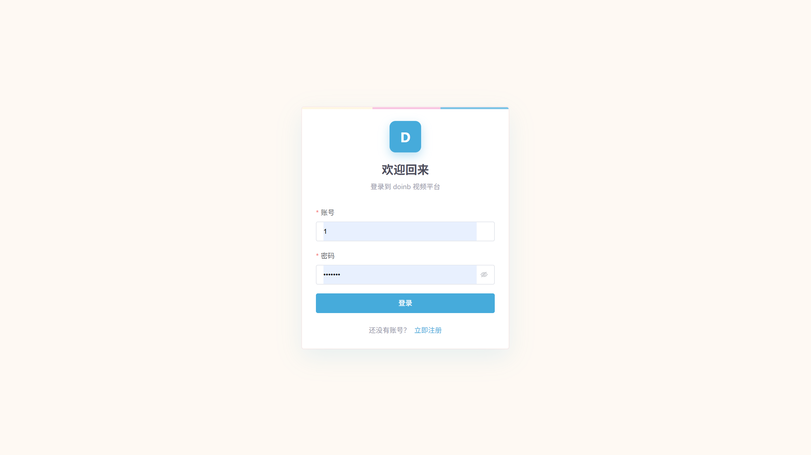
在登录页面输入已经注册过的用户名和密码，点击登录即可。登录成功后，右上角会出现用户头像或用户昵称，表示当前账号已经进入登录状态。
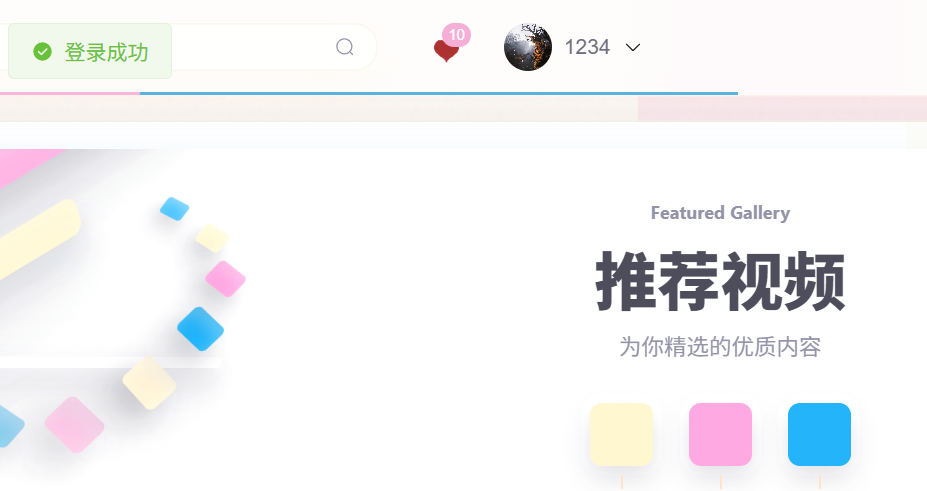
若尚未注册，可点击注册入口跳转到注册页面。若登录失败，请检查用户名和密码是否正确，或确认后端服务和数据库是否已经正常启动。

管理员账号同样通过登录页面进入系统，账号 `role` 字段为 2 时，登录后可以访问管理员后台。

### 注册

点击页面右上角注册入口，进入注册页面。
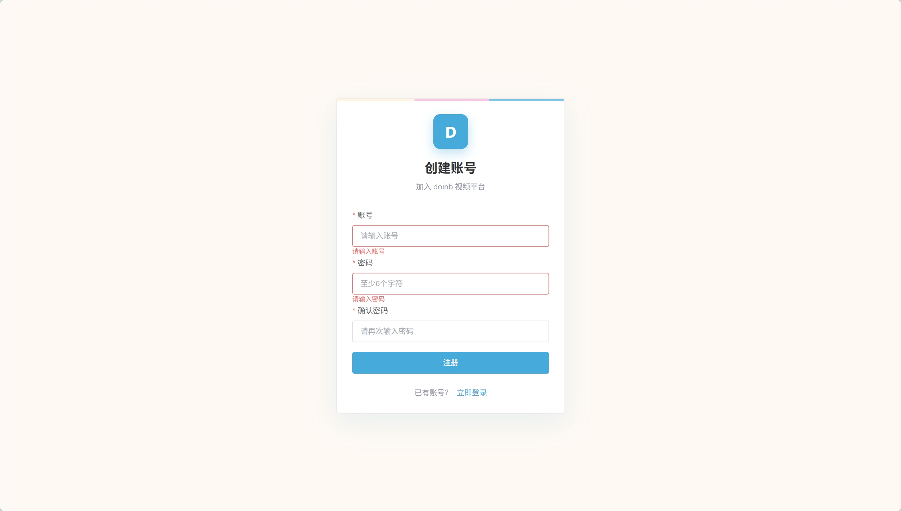
在注册页面输入用户名、密码、昵称等信息，点击注册按钮。系统会校验用户名是否重复，校验通过后完成注册，并根据页面流程跳转到登录页或直接进入系统。

注册成功后，用户默认为发布者角色，可以观看视频、发表评论、关注作者，也可以进入创作中心上传自己的视频。

### 退出登录

鼠标点击或悬浮右上角用户头像，打开用户菜单。

点击退出当前账号，即可退出当前登录状态。若当前浏览器保存了多个账号，也可以选择切换账号、添加账号或退出全部账号。
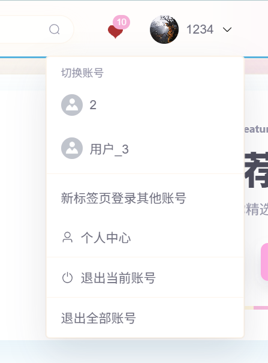
## 用户信息

### 个人中心

登录后点击右上角头像菜单，进入个人中心。
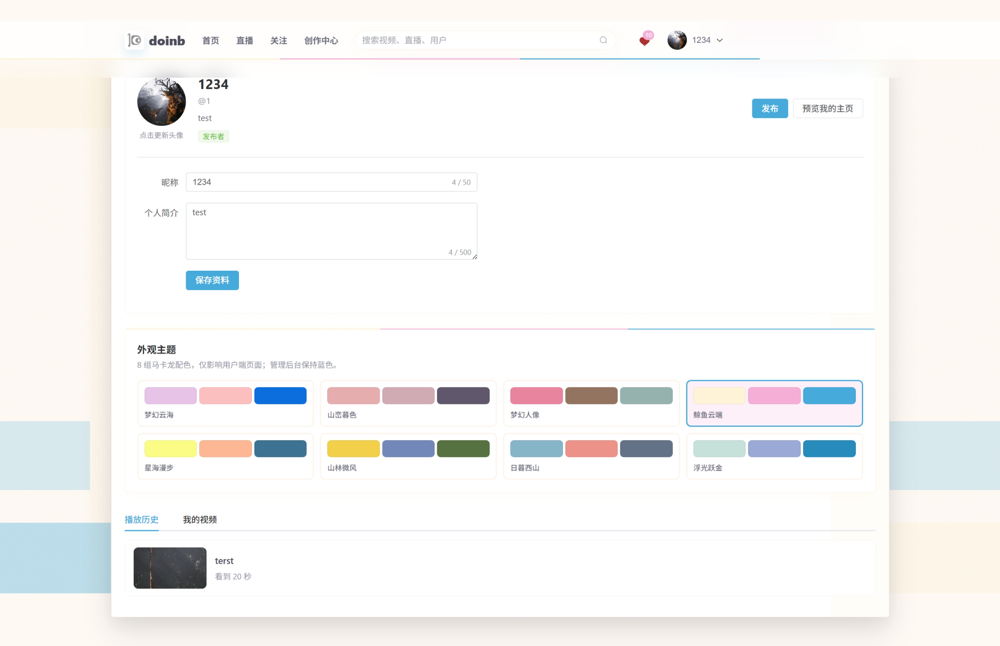
个人中心可以查看当前用户的昵称、头像、简介和播放历史。用户可以在此修改个人资料，保存后页面会展示新的信息。

### 修改头像

在个人中心点击头像区域，选择本地图片文件并确认上传。上传成功后，系统会将头像文件保存到本地上传目录，并在导航栏、个人中心和公开主页中显示新的头像。

### 修改资料

在个人中心填写新的昵称和个人简介，点击保存。保存成功后，系统会提示修改成功，并在个人展示页中同步显示最新资料。

### 公开主页

点击视频作者头像或用户名可以进入该用户的公开主页。公开主页展示用户头像、昵称、简介和已发布作品，不展示密码等隐私信息。
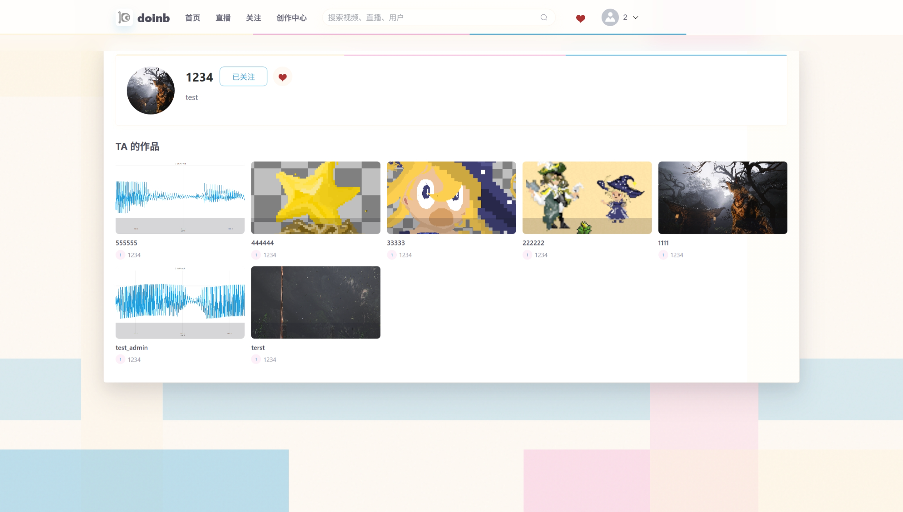
## 视频浏览与播放

### 查询视频信息

进入网站首页后，系统会自动加载公开视频列表。每个视频卡片会显示封面、标题、作者和发布时间等信息。

点击视频卡片即可进入视频详情页。若当前没有公开视频，页面会显示空状态提示。
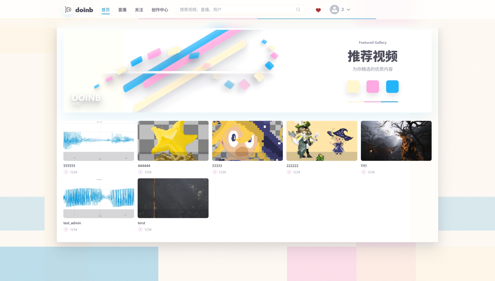
### 播放视频

在视频详情页，页面上方为播放器区域，下方为视频标题、作者信息、简介和互动区域。

点击播放器播放按钮即可播放视频。用户可以暂停视频、拖动进度条或继续观看。登录用户观看视频时，系统会保存播放历史和播放进度。

若视频已经被删除、驳回或设置为仅自己可见，普通用户无法在公开列表中看到该视频。
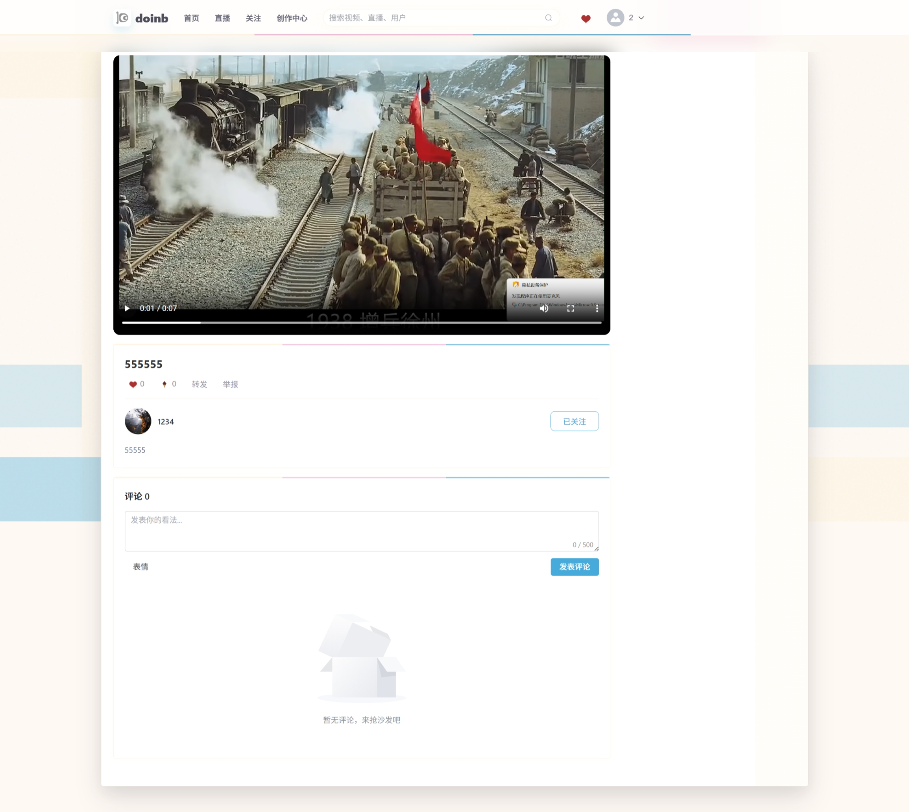
### 查看播放历史

登录后进入个人中心，在播放历史区域可以查看自己观看过的视频。历史记录会显示视频封面、标题和最近观看进度。

点击历史记录中的视频可以重新进入视频详情页继续观看。

## 视频互动

### 发表评论

在视频详情页评论区域输入评论内容，点击发送。发送成功后，评论会出现在评论列表中，并显示评论用户、评论内容和发布时间。

评论内容支持普通文本，也可结合项目内置表情资源进行展示。
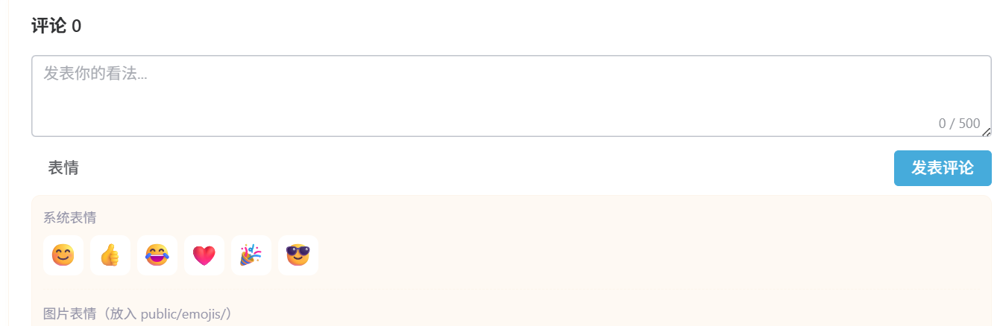
### 视频点赞和点踩

在视频详情页点击点赞或点踩按钮，可以表达对视频的反馈。再次切换操作时，系统会更新当前用户对该视频的反应状态。

点赞或点踩成功后，页面上的计数会随之刷新。
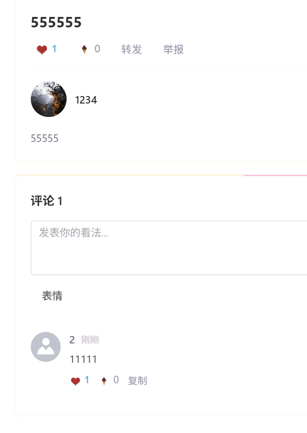
### 评论点赞和点踩

每条评论旁边有点赞和点踩操作。点击后系统会保存当前用户对该评论的反应，并更新评论互动状态。

### 分享视频

在视频详情页点击分享或复制链接按钮，系统会复制当前视频页面地址。用户可以将链接发送给其他用户访问。

## 关注订阅

### 关注作者

在视频详情页作者区域或用户公开主页，点击关注按钮即可关注该作者。关注成功后，按钮会变为已关注状态。

如果已经关注该作者，再次点击已关注按钮可以取消关注。

### 查看订阅动态

点击顶部导航的订阅入口，进入订阅动态页面。系统会根据当前用户关注的作者，展示这些作者最近发布的视频或相关内容。

若当前未关注任何作者，页面会提示暂无订阅内容。
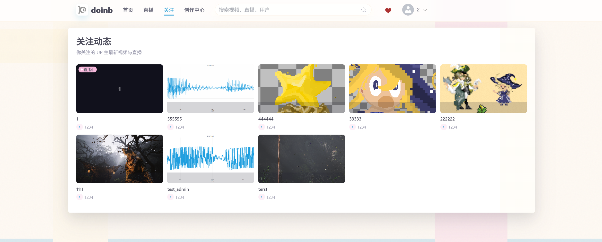
## 搜索

### 关键词搜索

点击顶部导航中的搜索入口，进入搜索页面。

输入关键词后点击搜索，系统会在视频标题、直播间标题、用户昵称等信息中查找匹配结果。搜索结果会按视频、直播和用户等类别展示。

若没有匹配内容，页面会显示空结果提示。

## 创作中心

### 上传视频

登录后点击创作中心，进入上传视频页面。

选择本地视频文件，填写视频标题和简介，并可选择封面图片。确认信息无误后点击提交。

上传成功后，系统会保存视频文件、封面文件和视频元数据。公开视频通常会进入待审核状态，管理员审核通过后才会出现在公开视频列表中。
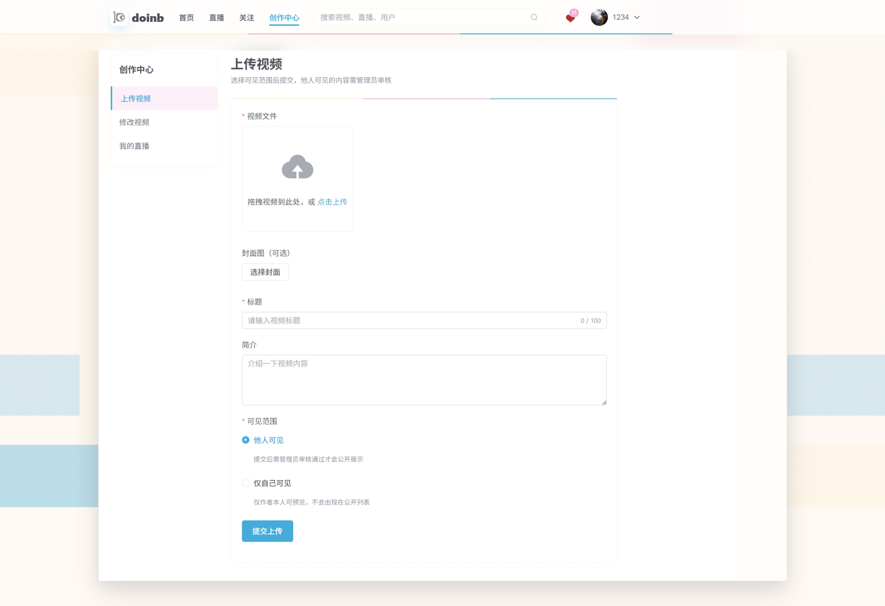
### 修改视频

进入创作中心的修改视频页面，可以查看自己上传过的视频列表。

选择需要修改的视频，点击编辑后可以修改标题、简介、封面、视频文件或可见性。保存后系统会更新视频信息。

当公开视频被重新编辑为他人可见时，系统可将其重新置为待审核状态，等待管理员审核。
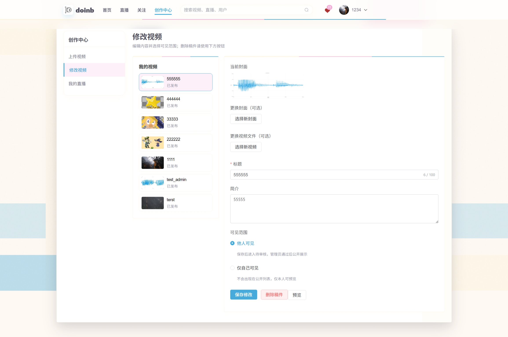
### 删除稿件

在创作中心选择自己发布的视频，点击删除稿件。确认后系统会删除或隐藏该视频记录，公开视频列表不再显示该视频。

### 仅自己可见

发布者可以将视频设置为仅自己可见。设置成功后，视频只会在作者自己的创作中心或相关个人视图中显示，其他用户无法在公开视频列表中访问。

## 直播

### 查看直播列表
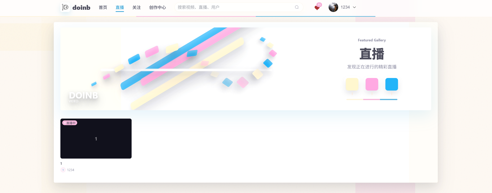
点击顶部导航中的直播入口，进入直播列表页面。直播列表只展示当前正在直播的房间。

每个直播卡片会显示直播标题、主播和直播状态。点击直播卡片可进入直播间。

### 进入直播间
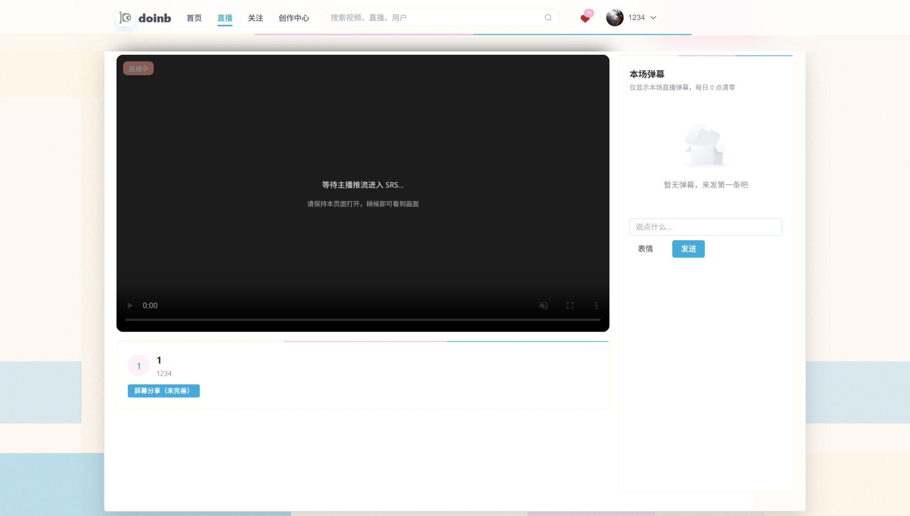
进入直播间后，页面会展示直播播放区域、直播标题、主播信息和评论区域。

如果直播间已经结束或不存在，系统会提示无法进入或直播已结束。

### 创建直播间
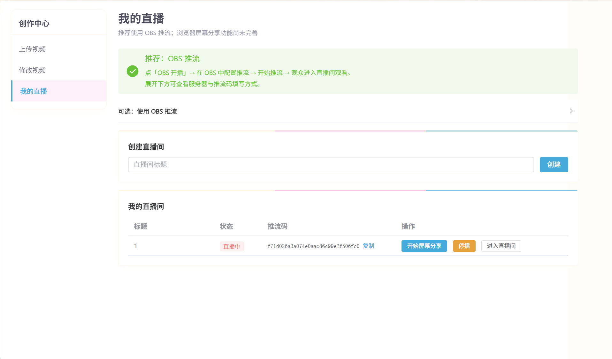
发布者可以进入创作中心的我的直播页面，点击创建直播间。填写直播标题后，系统会生成直播间和对应的推流标识。

### 开播和停播

在我的直播页面点击开播，直播间状态会变为直播中，并出现在公开直播列表。点击停播后，直播间状态变为已停播，观众侧直播列表不再展示该房间。

### 直播评论

进入直播间后，可以在评论区域输入内容并发送。系统会展示当前直播场次的评论，不会混入上一场直播的历史评论。

## 通知与私信

### 查看通知
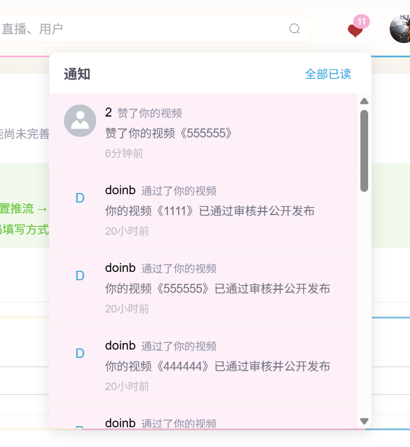
页面右上角为通知入口，未读通知数量会以数字或红点形式提示。

点击通知入口可以查看通知列表。通知包括他人点赞、私信、视频审核结果等系统消息。

### 标记已读

点击某条通知或点击全部已读按钮，可以将通知标记为已读。标记成功后，未读数量会减少或清零。

### 发送私信
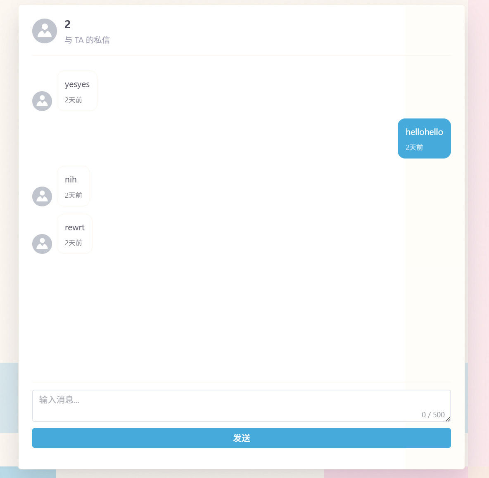
进入他人的公开主页后，点击私信图标，系统会打开或创建与该用户的私信房间。

在私信房间输入消息并点击发送，消息会按时间顺序显示在会话中。

## 管理员后台

### 进入管理员后台
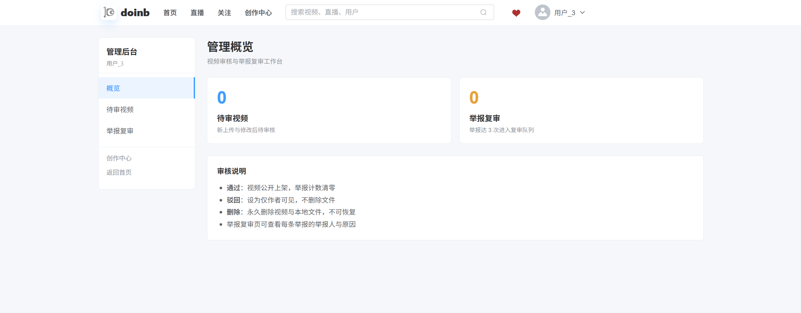
管理员登录后，可访问 `/admin` 管理后台。非管理员访问该路径时，系统会提示需要管理员权限并返回首页。

### 仪表盘

管理员仪表盘用于查看平台内容概况和审核入口。可从此进入待审视频、举报复审和视频预览页面。

### 待审视频
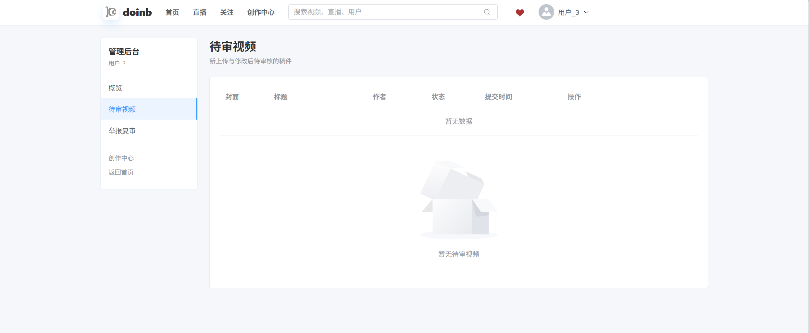
进入待审视频页面，可以查看发布者提交的待审核视频。

管理员可以预览视频内容，点击审核通过后，视频状态变为已发布并出现在公开视频列表；点击驳回后，视频变为仅作者可见。

### 举报复审

当视频被用户举报后，管理员可以进入举报复审页面查看举报原因和视频详情。

管理员可根据内容情况选择通过复审、驳回或删除视频。

### 视频预览

管理员在审核或复审过程中可以进入视频预览页，查看视频标题、简介、封面和播放内容，以便作出审核判断。

## 常见问题

### 页面提示网络错误

请确认后端服务已经启动，前端代理配置是否指向正确的后端端口。当前项目默认前端端口为 8787，后端端口为 8081。

### 登录后仍无法上传视频

请确认登录状态是否有效。若 Token 过期，可退出后重新登录。

### 管理员后台无法进入

请确认当前账号在数据库 `users` 表中的 `role` 字段是否为 2。普通用户和发布者不能进入管理员后台。

### 视频无法播放

请检查视频文件是否上传成功，`video_url` 是否正确，后端是否开放了上传目录访问。若使用直播媒体服务，还需确认 SRS 或相关流媒体服务是否已经启动。

### 直播列表没有内容

直播列表只展示正在直播的房间。请先在创作中心创建直播间并点击开播。

### 昵称或提示出现乱码

请确认数据库字符集为 `utf8mb4`，后端编码配置为 UTF-8，已有脏数据可在数据库中手动修正。
