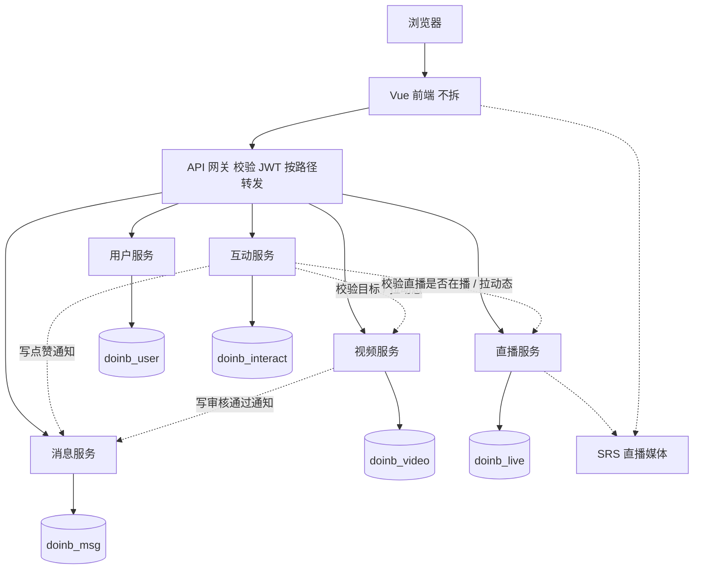

# doinb 微服务划分、服务接口清单与数据表归属方案

| 项目 | 内容 |
|---|---|
| 文档版本 | v1.0 |
| 编制日期 | 2026-08-28 |
| 用途 | 中期检查「微服务划分图、服务接口清单、数据表归属方案」；后续拆进程按本边界执行 |
| 用例编号 | 与《需求追溯矩阵》《软件需求规格说明书》《测试报告》一致（UC-01～UC-15） |

## 1 现状与目标

**现状**：前后端分离单体。浏览器访问一份 Vue；业务接口由一个 Spring Boot 进程提供；结构化数据在一台 MySQL；直播媒体由 SRS 接收与分发。

**目标**：前端不拆。后端按数据归属拆成 5 个业务服务，经 API 网关对外。搜索不单独建服务，由网关聚合。

**本期交付范围**：只给出逻辑拆分与接口/表归属。运行时代码仍为单体，路径保持不变，后续拆进程时前端尽量不改调用地址。

---

## 2 微服务划分图

图注：实线为同步请求与数据归属；虚线为服务间协作或媒体面。JWT 由用户服务签发，网关用同一密钥校验，下游服务信任网关注入的 userId，不必每次回问用户服务。

### 2.1 服务与用例、模块对照

| 服务 | 测试模块 | 用例 | 现有代码入口 |
|---|---|---|---|
| 用户服务 | M1 用户与权限 | UC-01 注册、UC-02 登录/登出、UC-03 资料 | `UserAccountController`、`UserController` |
| 视频服务 | M2 视频、M10 管理员审核 | UC-04 浏览播放、UC-05 播放历史、UC-06 上传编辑、UC-07 举报、UC-15 审核 | `VideoController`、`AdminVideoController` |
| 直播服务 | M7 直播 | UC-08 直播间管理 | `LiveRoomController` |
| 互动服务 | M3 评论、M4 赞踩、M5 关注订阅 | UC-10 评论、UC-11 赞踩、UC-09 关注与订阅动态 | `CommentController`、`ReactionController`、`SubscriptionController` |
| 消息服务 | M8 通知、M9 私信 | UC-13 通知、UC-14 私信 | `NotificationController`、`MessageController` |
| 网关聚合 | M6 搜索 | UC-12 关键词搜索 | `SearchController`（拆分后放到网关） |

说明：

- 不按 15 个用例拆成 15 个服务。一个模块对应多个用例是正常的。
- UC-15 管理后台仍归视频服务：待审、通过、驳回、举报复审都写 `videos` / `video_reports`。
- 每个服务提供 `GET /health`。媒体流不进入 Java 服务，仍由 SRS 处理。

### 2.2 服务间协作

| 发生的事 | 调用关系 |
|---|---|
| 管理员审核通过 | 视频服务 → 消息服务：创建「审核通过」通知 |
| 视频/评论点赞 | 互动服务 → 消息服务：创建「赞了你」通知 |
| 发送私信 | 消息服务内部写入会话，并写「发来私信」通知 |
| 发表评论 | 互动服务 → 视频服务或直播服务：确认目标存在；直播弹幕还需确认开播 |
| 订阅动态 | 互动服务读取关注关系，再向视频服务、直播服务查询作者新内容 |
| 关键词搜索 | 网关并行调用用户、视频、直播三个服务后合并为现有 `/search` 结构 |

---

## 3 服务接口清单

路径与当前单体一致。拆分后由网关按前缀转发。

### 3.1 用户服务

| 方法 | 路径 | 关联 UC | 关联测试 |
|---|---|---|---|
| POST | `/user/account/register` | UC-01 | U000、U001、U002 |
| POST | `/user/account/login` | UC-02 | U010、U011 |
| POST | `/admin/account/login` | UC-02 | U020 |
| GET | `/user/personal/info` | UC-03 | U030、U031 |
| GET | `/admin/personal/info` | UC-03 | — |
| GET | `/user/account/logout` | UC-02 | U040 |
| POST | `/user/password/update` | UC-03 | — |
| GET | `/user/info/get-one` | UC-03 | U060、U061 |
| GET | `/user/profile/showcase` | UC-03 | — |
| POST | `/user/info/update` | UC-03 | U080 |
| POST | `/user/avatar/upload` | UC-03 | U081 |
| GET | `/health` | — | H000 |

### 3.2 视频服务

| 方法 | 路径 | 关联 UC | 关联测试 |
|---|---|---|---|
| GET | `/video/list` | UC-04 | V000 |
| GET | `/video/getone` | UC-04 | V010、V011 |
| POST | `/video/history/progress` | UC-05 | V050 |
| GET | `/video/history/list` | UC-05 | V051 |
| POST | `/video/upload` | UC-06 | V030、V031 |
| GET | `/video/my/list` | UC-06 | V040 |
| GET | `/video/my/getone` | UC-06 | — |
| POST | `/video/update` | UC-06 | V060 |
| POST | `/video/visibility` | UC-06 | V061 |
| POST | `/video/delete` | UC-06 | — |
| POST | `/video/report` | UC-07 | V063 |
| GET | `/admin/video/pending` | UC-15 | A000、A001 |
| GET | `/admin/video/getone` | UC-15 | — |
| POST | `/admin/video/approve` | UC-15 | A010 |
| POST | `/admin/video/reject` | UC-15 | A011 |
| GET | `/admin/video/report-review` | UC-15 | A020 |
| GET | `/admin/video/reports` | UC-07、UC-15 | — |
| POST | `/admin/video/delete` | UC-15 | A040 |
| GET | `/health` | — | H000 |

### 3.3 直播服务

| 方法 | 路径 | 关联 UC | 关联测试 |
|---|---|---|---|
| GET | `/live/list` | UC-08 | L000 |
| GET | `/live/getone` | UC-08 | L010 |
| POST | `/live/create` | UC-08 | L020 |
| POST | `/live/start` | UC-08 | L021 |
| POST | `/live/stop` | UC-08 | L022 |
| GET | `/live/my/list` | UC-08 | — |
| GET | `/health` | — | H000 |

### 3.4 互动服务

| 方法 | 路径 | 关联 UC | 关联测试 |
|---|---|---|---|
| POST | `/comment/add` | UC-10、UC-08 | C000、C001、C002、L040、L041 |
| GET | `/comment/list` | UC-10 | C010 |
| GET | `/video/reaction/summary` | UC-11 | V020 |
| POST | `/video/reaction` | UC-11 | R000、R001 |
| POST | `/comment/reaction` | UC-11 | R010 |
| POST | `/subscription/follow` | UC-09 | F000 |
| POST | `/subscription/unfollow` | UC-09 | F001 |
| GET | `/subscription/status` | UC-09 | F010 |
| GET | `/subscription/following` | UC-09 | — |
| GET | `/subscription/feed` | UC-09 | F030 |
| GET | `/health` | — | H000 |

### 3.5 消息服务

| 方法 | 路径 | 关联 UC | 关联测试 |
|---|---|---|---|
| GET | `/notification/list` | UC-13 | N000 |
| GET | `/notification/unread-count` | UC-13 | N010 |
| POST | `/notification/read` | UC-13 | N021 |
| POST | `/message/room/open` | UC-14 | M000 |
| GET | `/message/room/get` | UC-14 | M010 |
| POST | `/message/send` | UC-14 | M020 |
| GET | `/health` | — | H000 |

### 3.6 网关

| 方法 | 路径 | 关联 UC | 关联测试 | 说明 |
|---|---|---|---|---|
| GET | `/search` | UC-12 | S000、S001、S002 | 聚合用户、已发布视频、直播间 |
| GET | `/health` | — | H000 | 网关自身探活 |

---

## 4 数据表归属方案

| 表 | 归属服务 | 库/schema（目标） | 其它服务如何使用 |
|---|---|---|---|
| `users` | 用户服务 | `doinb_user` | 只保存 `user_id` / `author_id` / `anchor_id`，不直接写本表 |
| `videos` | 视频服务 | `doinb_video` | 互动/搜索通过接口读取标题、状态、封面 |
| `play_history` | 视频服务 | `doinb_video` | 仅视频服务写入播放进度 |
| `video_reports` | 视频服务 | `doinb_video` | 举报与复审只在视频服务内完成 |
| `live_rooms` | 直播服务 | `doinb_live` | 表内存 `stream_key`、`is_live`；媒体面归 SRS |
| `comments` | 互动服务 | `doinb_interact` | `target_type`：1=视频，2=直播间 |
| `comment_reactions` | 互动服务 | `doinb_interact` | 只关联本服务评论 |
| `video_reactions` | 互动服务 | `doinb_interact` | 视频 ID 为外部引用 |
| `subscriptions` | 互动服务 | `doinb_interact` | 关注关系只由互动服务维护 |
| `notifications` | 消息服务 | `doinb_msg` | 其它服务只调用「创建通知」接口 |
| `dm_rooms` | 消息服务 | `doinb_msg` | 仅消息服务读写 |
| `dm_messages` | 消息服务 | `doinb_msg` | 仅消息服务读写 |

文件存储：头像归用户服务；视频文件与封面归视频服务。

约束：

- 服务内部可以保留外键。跨服务不使用数据库外键，只保存对方业务 ID。
- 课设第一期仍可使用同一台 MySQL 实例，但逻辑上按上表分库（或分 schema）。
- 单体阶段全部表仍在库 `doinb` 中，与 `database/database.sql` 一致；本表描述的是拆分后的归属，不是当前物理结构。

---

## 5 后续拆分顺序（实现阶段，非本期）

1. 增加网关，路径仍转发到当前这一个 Spring Boot。
2. 拆出用户服务（JWT 最独立）。
3. 拆出消息服务，将审核通过、点赞、私信中的直接 `NotificationService` 调用改为 HTTP。
4. 再拆视频、直播、互动。
