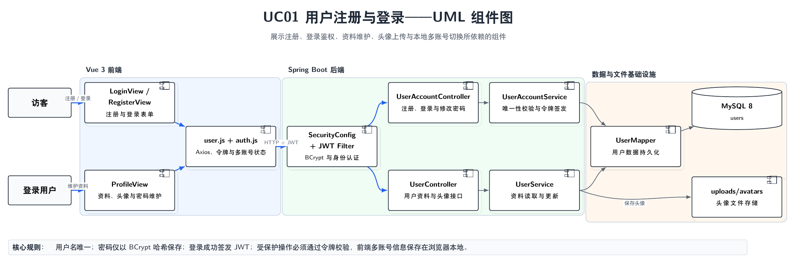
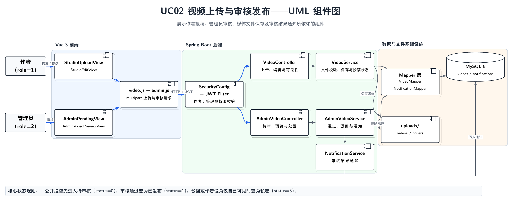
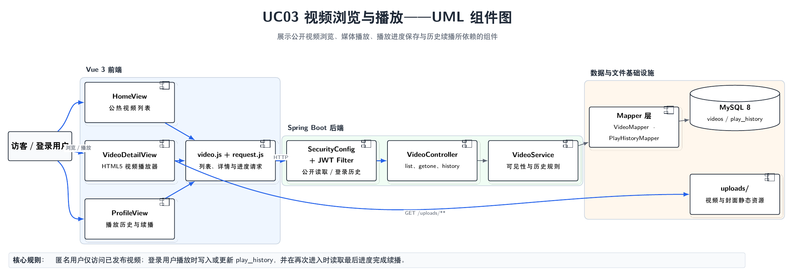
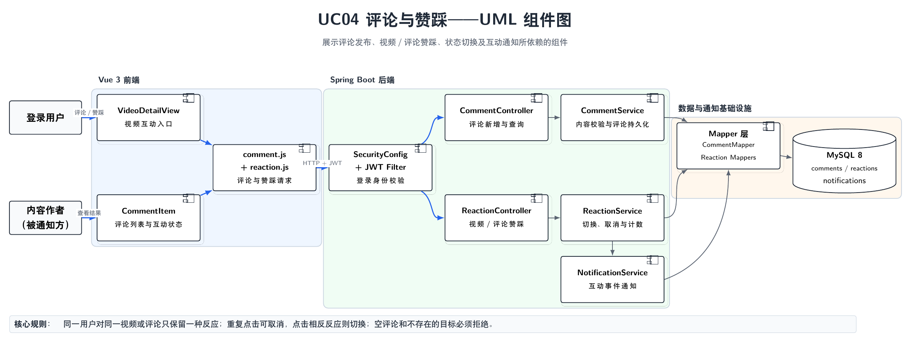
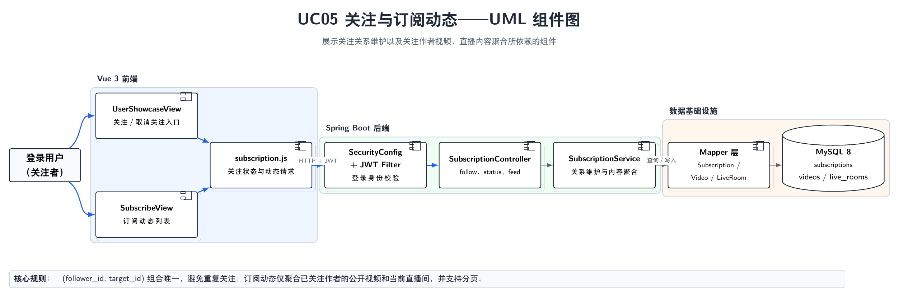
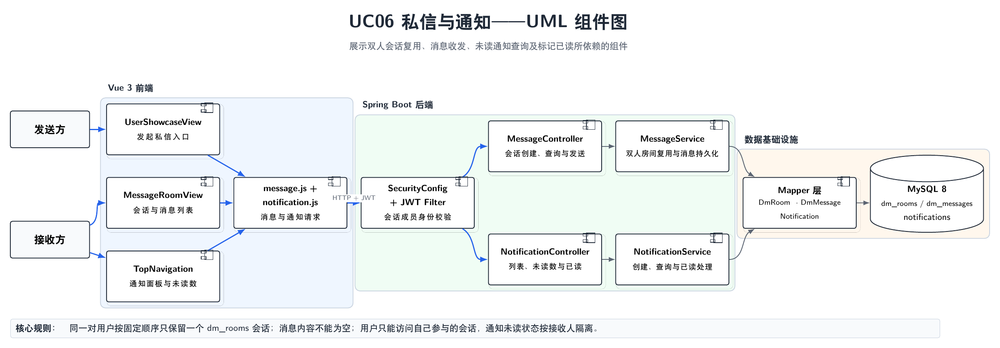
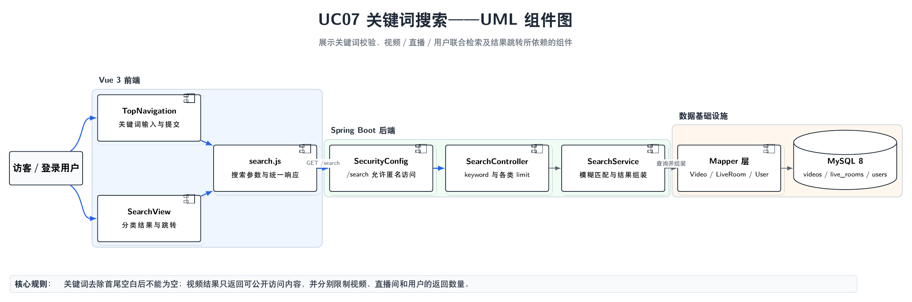
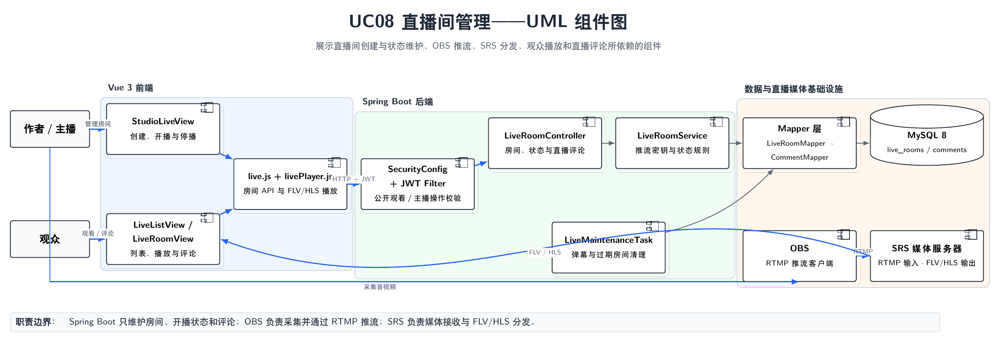
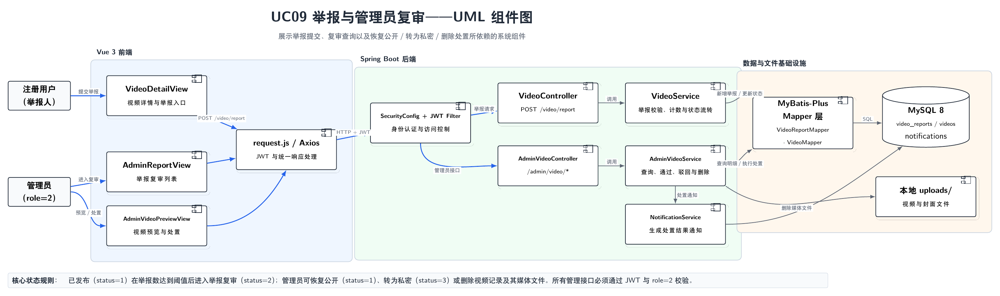
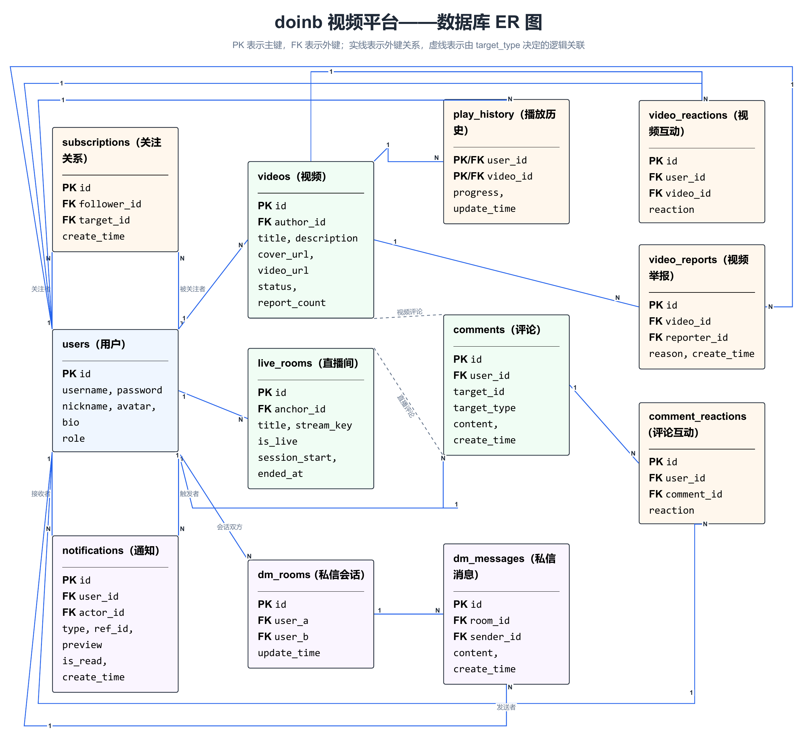

# 软件概要设计说明书

## 1 引言

### 1.1 编写目的
本文档旨在说明“doinb”视频播放与内容服务平台的概要设计，包括系统的基本处理流程、组织结构、模块划分、接口设计、数据结构及数据库设计等。  
本文档为后续的详细设计和编码实现提供指导基础。预期读者包括项目开发人员、测试人员及项目管理人员。

### 1.2 背景
- **软件系统名称**：doinb 视频播放与内容服务平台
- **任务提出者**：课程组
- **开发者**：项目开发小组
- **用户**：普通视频观众、内容发布者、系统管理员
- **运行中心**：课程组提供的云主机或实验室服务器

### 1.3 定义
- **B/S 架构**：Browser/Server，浏览器/服务器架构。
- **HTTP API**：前后端通过 HTTP 接口交换 JSON、表单及文件数据，接口统一返回业务状态码、消息和数据。
- **JWT**：JSON Web Token，用于身份验证的开放标准。
- **MyBatis-Plus**：后端使用的数据访问框架，负责实体映射、条件查询和分页。
- **SRS**：Simple Realtime Server，本项目用于接收 RTMP 推流并提供 FLV/HLS 直播播放能力。

### 1.4 参考设计
- 《软件需求规格说明书（2）》
- 《软件开发计划》
- 《需求追溯矩阵》
- 《微服务划分、服务接口清单与数据表归属方案》
- 《软件工程基础实践》课程任务书
- GB/T 8567-2006 计算机软件文档编制规范

### 1.5 设计范围与基线
本文档描述当前可运行的前后端分离单体系统。业务场景编号与《需求追溯矩阵》一致，为 `UC-01`～`UC-15`。  
各用例的参与者、前置条件、主流程和异常流程由需求规格说明书统一说明；接口明细、测试用例和完整追溯关系分别在接口/追溯材料和测试文档中维护，本文档不重复展开。  
后续微服务改造按《微服务划分、服务接口清单与数据表归属方案》中的服务边界执行，不与当前单体基线混写。

## 2 系统需求概述

### 2.1 需求规定
本系统主要面向普通用户、内容发布者和管理员，提供视频点播、直播观看与管理、视频发布与审核、订阅互动、评论赞踩、通知私信和内容举报复审等功能。  
系统需具备良好的响应速度、稳定的播放体验以及安全的权限管理。

### 2.2 业务目标
构建一个集视频观看、直播互动、内容管理于一体的综合性视频服务平台，解决功能分散、流程不连贯的问题，提供一站式的内容消费与创作体验。

### 2.3 运行环境

#### 2.3.1 设备
- **服务端**：云服务器或高性能虚拟机（建议配置：4核CPU、8GB内存以上），需具备足够的磁盘空间存储媒体资源。
- **客户端**：支持现代浏览器的PC、平板电脑或智能手机。

#### 2.3.2 支持软件
- **操作系统**：Linux (Ubuntu/CentOS) 或 Windows Server。  
- **数据库**：MySQL 8.0+。  
- **可选部署组件**：正式部署时可使用 Nginx 进行反向代理，也可将本地文件存储替换为 MinIO 等对象存储；两者均不是当前单体基线的必需组件。  
- **本项目具体实现**：前端使用 Node.js 20.19+ 或 22.12+、Vue 3、Vite、Vue Router、Element Plus 和 Axios；后端使用 JDK 25、Spring Boot、Spring Security、MyBatis-Plus 和 JWT；业务数据存储于 MySQL 8.0，上传的视频、封面和头像存储于本地 `uploads/` 目录，直播推流与播放使用 SRS、RTMP、FLV 和 HLS。  
- **浏览器**：Chrome, Edge, Firefox, Safari 等主流浏览器。  

### 2.4 设计约束
- 采用 B/S 架构和前后端分离模式，浏览器端通过 HTTP API 调用后端服务。  
- 后端接口采用统一响应结构，并通过 JWT 和角色信息控制受保护资源与管理功能的访问。  
- 结构化业务数据存储于 MySQL，上传视频、封面和头像存储于本地文件目录，直播媒体流由 SRS 处理。  
- 数据库通过主键、外键、唯一约束及业务校验保证核心数据的一致性与完整性。  

### 2.5 功能需求
根据业务场景清单和当前单体基线实现，系统包含以下九个业务场景。本节仅说明各场景的设计范围，详细流程以用例清单为准。
1. **UC01 用户注册与登录**：访客可以注册和登录；登录用户可以维护昵称、简介和头像，修改密码、退出登录，并在前端进行本地多账号切换。

*图 2-1 UC01 用户注册与登录组件图*

2. **UC02 视频上传与审核发布**：作者上传视频和封面、维护元数据及可见性；管理员审核新投稿，通过后视频公开并通知作者，驳回后视频转为私密状态。

*图 2-2 UC02 视频上传与审核发布组件图*

3. **UC03 视频浏览与播放**：访客或登录用户可以浏览公开视频列表和详情并在线播放；登录用户还可以保存播放进度、查询历史并从上次进度继续观看。

*图 2-3 UC03 视频浏览与播放组件图*

4. **UC04 评论与赞踩**：登录用户可以在视频下发表评论，对视频或评论执行点赞、点踩、切换或取消操作，相关点赞事件按业务规则生成通知。

*图 2-4 UC04 评论与赞踩组件图*

5. **UC05 关注与订阅动态**：登录用户可以关注或取消关注其他用户，并在订阅动态中查看关注作者的公开视频和正在进行的直播。

*图 2-5 UC05 关注与订阅动态组件图*

6. **UC06 私信与通知**：登录用户可以打开或复用双人私信会话、分页查看和发送消息，并查询通知、未读数量及将通知标记为已读。

*图 2-6 UC06 私信与通知组件图*

7. **UC07 关键词搜索**：访客或登录用户可以按关键词搜索已发布视频、直播间和用户，并进入相应详情或公开主页。

*图 2-7 UC07 关键词搜索组件图*

8. **UC08 直播间管理**：作者可以创建直播间并执行开播、停播，OBS 通过 RTMP 向 SRS 推流；观众可以浏览直播间、通过 FLV/HLS 观看直播并发表评论。

*图 2-8 UC08 直播间管理组件图*

9. **UC09 举报与管理员复审**：登录用户可以举报视频；达到复审条件的视频进入举报复核状态，管理员可将其恢复为公开、转为私密或删除。

*图 2-9 UC09 举报与管理员复审组件图*

### 2.6 非功能需求
- **安全性**：用户密码加密存储，关键接口需鉴权访问。
- **易用性**：界面简洁直观，操作路径短，错误提示明确。
- **稳定性**：在课程演示环境下需保证核心流程（播放、上传）的连续可用。
- **可维护性**：前后端按业务模块组织代码，统一封装接口调用、鉴权和错误处理。
- **可测试性**：主要业务规则和接口应能够通过单元测试、集成/API 测试及端到端测试进行验证。

### 2.7 系统总体架构
当前基线系统采用前后端分离的单体架构，并按职责划分为以下层次：
- **表示层**：Vue 3 页面和公共组件负责用户交互、路由导航及媒体播放。
- **前端访问层**：按业务模块封装 HTTP API，Axios 请求拦截器统一附加 JWT 并处理业务错误。
- **接口与安全层**：Spring MVC Controller 接收请求，Spring Security 和 JWT 过滤器完成身份认证。
- **业务逻辑层**：Service 负责参数校验、权限判断、状态流转、分页查询和 DTO 组装。
- **数据访问层**：MyBatis-Plus Mapper 负责访问 MySQL，静态资源映射负责读取本地 `uploads/` 文件。
- **直播媒体层**：SRS 接收 OBS 的 RTMP 推流，并向观众端提供 FLV/HLS 媒体流；Spring Boot 仅管理直播间和开播状态等业务数据。

---

## 3 系统接口设计

### 3.1 接口设计原则
- 前端统一以 `/api` 作为后端业务接口前缀，开发环境由 Vite 代理到 Spring Boot 服务；后端控制器按用户、视频、直播、评论、订阅、消息和管理等业务划分接口。
- 后端接口统一返回 `code`、`message` 和 `data` 三部分，前端根据业务状态码显示结果或错误信息。
- 登录成功后由后端签发 JWT。公开浏览接口允许匿名访问，个人资料修改、内容发布、互动、私信及管理操作需要携带有效令牌，并按用户角色进行权限校验。

### 3.2 接口设计

#### 3.2.1 用户接口
用户接口主要通过 Web 页面呈现。概要设计仅按业务场景说明主要输入输出，具体路径、HTTP 方法和测试编号由接口清单及追溯矩阵维护。

| 关联用例 | 主要操作 | 输入数据 | 输出/响应信息 |
| :--- | :--- | :--- | :--- |
| **UC01** | 注册、登录、退出、查询或修改资料、上传头像、修改密码 | 用户名、密码、昵称、简介、头像文件 | JWT、用户信息或操作结果 |
| **UC02** | 上传或编辑视频、设置可见性、查询投稿、审核投稿 | 视频和封面文件、标题、描述、视频ID、审核操作 | 投稿信息、审核状态或处理结果 |
| **UC03** | 查询视频列表或详情、记录播放进度、查看历史 | 视频ID、分页参数、播放进度 | 视频信息、媒体地址、观看历史或操作结果 |
| **UC04** | 发表评论、查询评论、对视频或评论赞踩 | 目标ID、评论内容、互动类型 | 评论列表、互动状态、统计值或操作结果 |
| **UC05** | 关注、取消关注、查询关注状态或订阅动态 | 目标用户ID、分页参数 | 关注状态、关注列表或订阅内容列表 |
| **UC06** | 打开会话、查询或发送消息、查询或已读通知 | 对方用户ID、会话ID、消息内容、通知ID | 会话、消息、未读数或通知列表 |
| **UC07** | 按关键词搜索 | 搜索关键词、结果数量参数 | 视频、直播和用户搜索结果 |
| **UC08** | 查询、创建、开始或结束直播，发表直播评论 | 直播间ID、标题、评论内容 | 直播间信息、推流密钥、播放地址和直播状态 |
| **UC09** | 举报视频、查询举报复核列表、执行复核处置 | 视频ID、举报原因、处置操作 | 举报状态、复核列表或处理结果 |

#### 3.2.2 与其他软件、硬件接口
1. **软件接口**：
   - **数据库接口**：后端通过 JDBC、MyBatis-Plus 和 MySQL 8.0 完成结构化业务数据的持久化与查询。
   - **文件存储接口**：上传的视频、封面和头像保存到后端本地 `uploads/` 目录，并通过 `/uploads/**` 静态资源路径提供访问。
   - **直播媒体接口**：OBS 等推流软件通过 RTMP 向 SRS 推流，SRS 通过 FLV/HLS 向观看端提供直播媒体，并通过 HTTP API 提供必要的直播服务信息。
   - **认证接口**：浏览器在受保护请求中携带 JWT，由 Spring Security 过滤器完成身份识别和权限校验。
2. **硬件接口**：
   - 本系统不直接控制专用硬件。摄像头、麦克风等采集设备由 OBS 和操作系统驱动管理，浏览器通过计算机或移动终端的常规音视频能力完成播放。

### 3.3 系统数据结构设计

#### 3.3.1 逻辑结构设计要点
参考需求规格说明书 3.7，系统核心数据结构定义如下：

| 数据结构名称 | 标识符 | 主要数据项定义 | 关系/层次 |
| :--- | :--- | :--- | :--- |
| **用户信息** | User | ID, Username, Password, Nickname, Avatar, Bio, Role | 核心实体，关联发布、互动、通知和私信 |
| **视频信息** | Video | ID, Title, Description, AuthorID, CoverUrl, VideoUrl, Status, ReportCount | 关联作者、历史、互动及举报记录 |
| **直播间信息** | LiveRoom | ID, Title, AnchorID, StreamKey, IsLive, SessionStart, EndedAt | 关联主播，由 SRS 承载媒体流 |
| **订阅关系** | Subscription | ID, FollowerID, TargetID, CreateTime | 用户之间的关注关系 |
| **评论信息** | Comment | ID, UserID, TargetID, TargetType, Content, CreateTime | 通过目标类型关联视频或直播 |
| **播放历史** | PlayHistory | UserID, VideoID, Progress, UpdateTime | 用户与视频之间的观看记录 |
| **视频互动** | VideoReaction | ID, UserID, VideoID, Reaction | 用户对视频的点赞或点踩记录 |
| **评论互动** | CommentReaction | ID, UserID, CommentID, Reaction | 用户对评论的点赞或点踩记录 |
| **通知信息** | Notification | ID, UserID, Type, ActorID, RefID, Preview, IsRead, CreateTime | 保存接收人、触发人和业务引用 |
| **私信会话** | DmRoom | ID, UserA, UserB, UpdateTime | 两名用户之间的唯一会话 |
| **私信消息** | DmMessage | ID, RoomID, SenderID, Content, CreateTime | 隶属于私信会话 |
| **视频举报** | VideoReport | ID, VideoID, ReporterID, Reason, CreateTime | 用户对视频的举报记录 |

#### 3.3.2 物理结构设计要点
- **存储要求**：结构化业务数据存储于 MySQL；上传的视频、封面和头像存储于本地文件系统；直播媒体流由 SRS 接收和分发。
- **访问方法**：数据主要按主键、外键和业务条件查询；用户名及关注、互动、私信、举报等组合关系通过唯一约束避免重复数据。
- **保密条件**：用户密码使用 BCrypt 哈希后存储，敏感接口需携带有效 JWT，后台管理接口还需校验管理员角色。

#### 3.3.3 数据结构与程序关系
各业务场景与主要程序组件、数据结构的关系如下。这里只描述组件级职责，不展开到具体方法和测试步骤。

| 用例 | 主要协作组件 | 主要数据结构 |
| :--- | :--- | :--- |
| **UC01** | 用户页面、用户/账号控制器、认证服务、JWT 安全过滤器 | User |
| **UC02** | 创作中心、视频控制器、视频服务、管理端视频控制器、通知服务、文件存储 | Video、Notification |
| **UC03** | 视频列表/播放页面、视频控制器、视频服务、静态资源映射 | Video、PlayHistory |
| **UC04** | 视频互动页面、评论控制器、互动控制器、通知服务 | Comment、VideoReaction、CommentReaction、Notification |
| **UC05** | 用户主页/订阅页、订阅控制器、订阅服务 | Subscription、Video、LiveRoom |
| **UC06** | 私信/通知页面、消息控制器、通知控制器及对应服务 | DmRoom、DmMessage、Notification |
| **UC07** | 搜索页面、搜索控制器、搜索服务 | Video、LiveRoom、User |
| **UC08** | 直播页面、直播控制器、直播服务、SRS、OBS | LiveRoom、Comment |
| **UC09** | 视频详情/管理页面、视频控制器、管理端视频控制器及对应服务 | VideoReport、Video |

---

## 4 系统数据库设计

### 4.1 数据库环境说明
- **数据库类型**：关系型数据库 MySQL 8.0。
- **字符集**：utf8mb4。

### 4.2 数据表设计

#### 1. 用户表 (users)
| 字段名 | 类型 | 约束 | 说明 |
| :--- | :--- | :--- | :--- |
| id | int | PK, AI | 用户唯一标识 |
| username | varchar(50) | Unique, Not Null | 登录账号 |
| password | varchar(255) | Not Null | 加密密码 |
| nickname | varchar(50) | | 用户昵称 |
| avatar | varchar(255) | | 头像 URL |
| bio | text | | 个人简介 |
| role | int | Default 1 | 角色（0:历史普通用户，1:发布者，2:管理员） |

#### 2. 视频表 (videos)
| 字段名 | 类型 | 约束 | 说明 |
| :--- | :--- | :--- | :--- |
| id | int | PK, AI | 视频唯一标识 |
| title | varchar(100) | Not Null | 视频标题 |
| description | text | | 视频描述 |
| author_id | int | FK(users.id) | 作者ID |
| cover_url | varchar(255) | | 封面图路径 |
| video_url | varchar(255) | | 视频文件路径 |
| status | int | Default 0 | 状态（0:待审核，1:已发布，2:举报复核，3:私密） |
| report_count | int | Default 0 | 举报次数 |
| create_time | datetime | Default Current Timestamp | 上传时间 |

#### 3. 直播间表 (live_rooms)
| 字段名 | 类型 | 约束 | 说明 |
| :--- | :--- | :--- | :--- |
| id | int | PK, AI | 直播间唯一标识 |
| title | varchar(100) | Not Null | 直播标题 |
| anchor_id | int | FK(users.id) | 主播ID |
| stream_key | varchar(100) | | 推流密钥 |
| is_live | boolean | Default false | 是否正在直播 |
| session_start | datetime | | 本次开播时间 |
| ended_at | datetime | | 最近结束时间 |
| create_time | datetime | Default Current Timestamp | 直播间创建时间 |

#### 4. 订阅关系表 (subscriptions)
| 字段名 | 类型 | 约束 | 说明 |
| :--- | :--- | :--- | :--- |
| id | int | PK, AI | 关系唯一标识 |
| follower_id | int | FK(users.id) | 关注者ID |
| target_id | int | FK(users.id) | 被关注者ID |
| create_time | datetime | Default Current Timestamp | 关注时间 |

约束：同一用户对同一目标只能保留一条关注关系，即 `(follower_id, target_id)` 唯一。

#### 5. 评论表 (comments)
| 字段名 | 类型 | 约束 | 说明 |
| :--- | :--- | :--- | :--- |
| id | int | PK, AI | 评论唯一标识 |
| user_id | int | FK(users.id) | 评论者ID |
| target_id | int | Not Null | 目标ID(视频/直播) |
| target_type | int | Not Null | 目标类型（1:视频，2:直播） |
| content | text | Not Null | 评论内容 |
| create_time | datetime | Default Current Timestamp | 发表时间 |

#### 6. 播放历史表 (play_history)
| 字段名 | 类型 | 约束 | 说明 |
| :--- | :--- | :--- | :--- |
| user_id | int | PK, FK(users.id) | 用户ID |
| video_id | int | PK, FK(videos.id) | 视频ID |
| progress | int | Default 0 | 播放进度(秒) |
| update_time | datetime | 自动更新 | 最后观看时间 |

#### 7. 视频互动表 (video_reactions)
| 字段名 | 类型 | 约束 | 说明 |
| :--- | :--- | :--- | :--- |
| id | int | PK, AI | 互动记录唯一标识 |
| user_id | int | FK(users.id), Not Null | 操作用户ID |
| video_id | int | FK(videos.id), Not Null | 视频ID |
| reaction | tinyint | Not Null | 互动类型（1:点赞，-1:点踩） |

约束：同一用户对同一视频只能保留一种互动状态，即 `(user_id, video_id)` 唯一。

#### 8. 评论互动表 (comment_reactions)
| 字段名 | 类型 | 约束 | 说明 |
| :--- | :--- | :--- | :--- |
| id | int | PK, AI | 互动记录唯一标识 |
| user_id | int | FK(users.id), Not Null | 操作用户ID |
| comment_id | int | FK(comments.id), Not Null | 评论ID |
| reaction | tinyint | Not Null | 互动类型（1:点赞，-1:点踩） |

约束：同一用户对同一评论只能保留一种互动状态，即 `(user_id, comment_id)` 唯一。

#### 9. 通知表 (notifications)
| 字段名 | 类型 | 约束 | 说明 |
| :--- | :--- | :--- | :--- |
| id | int | PK, AI | 通知唯一标识 |
| user_id | int | FK(users.id), Not Null | 通知接收用户ID |
| type | int | Not Null | 通知类型（1:视频互动，2:评论互动，3:私信，4:视频审核通过） |
| actor_id | int | FK(users.id), Not Null | 触发通知的用户ID |
| ref_id | int | | 关联业务数据ID |
| preview | varchar(255) | | 通知摘要 |
| is_read | boolean | Default false | 是否已读 |
| create_time | datetime | Default Current Timestamp | 通知创建时间 |

#### 10. 私信会话表 (dm_rooms)
| 字段名 | 类型 | 约束 | 说明 |
| :--- | :--- | :--- | :--- |
| id | int | PK, AI | 会话唯一标识 |
| user_a | int | FK(users.id), Not Null | 会话用户A |
| user_b | int | FK(users.id), Not Null | 会话用户B |
| update_time | datetime | 自动更新 | 最近活动时间 |

约束：按系统约定的用户顺序保存会话双方，且 `(user_a, user_b)` 唯一，避免重复会话。

#### 11. 私信消息表 (dm_messages)
| 字段名 | 类型 | 约束 | 说明 |
| :--- | :--- | :--- | :--- |
| id | int | PK, AI | 消息唯一标识 |
| room_id | int | FK(dm_rooms.id), Not Null | 所属会话ID |
| sender_id | int | FK(users.id), Not Null | 发送者ID |
| content | text | Not Null | 消息内容 |
| create_time | datetime | Default Current Timestamp | 发送时间 |

#### 12. 视频举报表 (video_reports)
| 字段名 | 类型 | 约束 | 说明 |
| :--- | :--- | :--- | :--- |
| id | int | PK, AI | 举报记录唯一标识 |
| video_id | int | FK(videos.id), Not Null | 被举报视频ID |
| reporter_id | int | FK(users.id), Not Null | 举报用户ID |
| reason | varchar(500) | | 举报原因 |
| create_time | datetime | Default Current Timestamp | 举报时间 |

约束：同一用户对同一视频只能保留一条举报记录，即 `(video_id, reporter_id)` 唯一。

### 4.3 数据库关系图 (ER 简述)

*图 4-1 系统数据库 ER 图*

- **用户与内容**：一个用户可以发布多个视频、创建一个或多个直播间、发表评论并提交视频举报。
- **用户关注关系**：用户之间通过 `subscriptions` 建立自关联的多对多关注关系。
- **用户与视频**：用户与视频通过 `play_history`、`video_reactions` 和 `video_reports` 分别形成观看、互动和举报关系。
- **评论与互动**：一条评论属于一名用户；`target_id` 配合 `target_type` 指向视频或直播。用户与评论通过 `comment_reactions` 建立互动关系。
- **通知关系**：每条通知包含接收用户和触发用户，`ref_id` 根据通知类型关联相应的业务记录。
- **私信关系**：两个用户组成一条 `dm_rooms` 会话，一条会话可以包含多条 `dm_messages`，每条消息对应一名发送者。

---

## 5 运行设计

### 5.1 运行模块组合
开发环境下，Vue 前端由 Vite 启动，页面中的 `/api` 请求被代理到运行在 8081 端口的 Spring Boot 后端；后端初始化数据库连接并访问 MySQL，同时将本地 `uploads/` 目录映射为静态资源。直播时，OBS 向 SRS 的 RTMP 服务推流，观看端通过 SRS 提供的 FLV/HLS 地址播放。Nginx 仅作为正式部署时可选的统一入口，不是当前开发环境的启动前提。

### 5.2 运行控制
- **身份校验**：公开浏览接口允许匿名访问；个人操作、内容发布、互动和私信等接口需通过 JWT 校验；后台接口还需校验管理员角色。
- **数据一致性**：通过数据库主外键、组合唯一约束和业务层校验，避免重复关注、重复互动、重复会话及重复举报。
- **异常处理**：后端将业务错误和系统异常转换为统一响应结构，前端根据响应结果进行提示。
- **直播状态维护**：后端负责直播间创建、开播和结束状态，SRS 负责媒体流传输；运行中的定时任务每日清理直播评论，并定期删除已结束或长期未开播的过期直播间。

### 5.3 运行时间
- **响应时间**：普通查询接口以 200ms 内完成为性能目标，最终结果需在指定测试环境中通过性能测试确认。
- **文件上传**：后端单个请求的文件大小上限为 500MB，请求超时时间为 5 分钟；实际上传耗时取决于文件大小、磁盘性能和网络带宽，前端应显示处理中及成功或失败状态。
- **直播延迟**：直播启动和播放延迟受推流端、SRS 配置及网络条件影响，应在联调和验收环境中实际测量。
