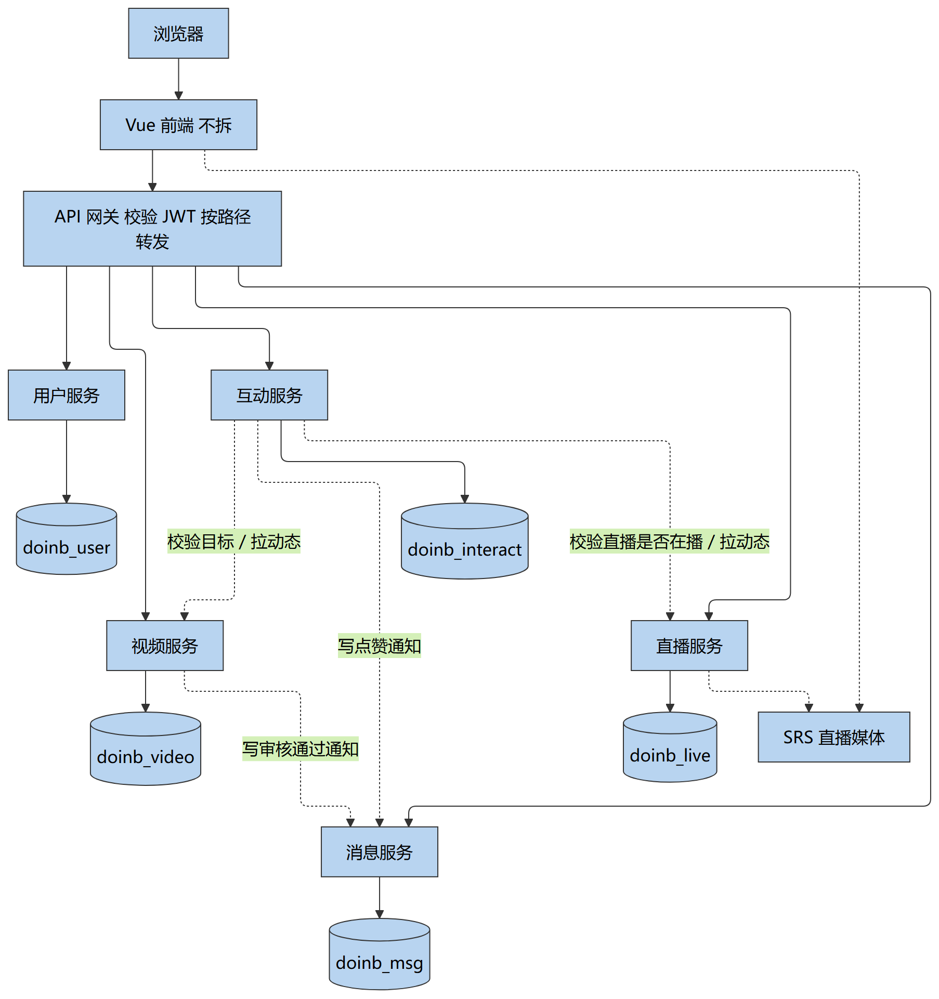

# doinb 微服务划分图

| 项目 | 内容 |
|---|---|
| 文档版本 | v1.0 |
| 编制日期 | 2026-08-28 |
| 用途 | 中期检查「微服务划分图」；后续拆进程按本边界执行 |
| 用例编号 | 与《需求追溯矩阵》《软件需求规格说明书》《测试报告》一致（UC-01～UC-15） |
| 配套文档 | [服务接口清单](./服务接口清单.md) · [数据表归属方案](./数据表归属方案.md) |

## 1 现状与目标

**现状**：前后端分离单体。浏览器访问一份 Vue；业务接口由一个 Spring Boot 进程提供；结构化数据在一台 MySQL；直播媒体由 SRS 接收与分发。

**目标**：前端不拆。后端按数据归属拆成 5 个业务服务，经 API 网关对外。搜索不单独建服务，由网关聚合。

**本期交付范围**：只给出逻辑拆分与接口/表归属。运行时代码仍为单体，路径保持不变，后续拆进程时前端尽量不改调用地址。

---

## 2 微服务划分图

*图 2-1 微服务划分图（源文件：`img/微服务划分图.mmd`）*

图注：实线为同步请求与数据归属；虚线为服务间协作或媒体面。JWT 由用户服务签发，网关用同一密钥校验，下游服务信任网关注入的 userId，不必每次回问用户服务。

### 2.1 服务与用例、模块对照

| 服务 | 测试模块 | 用例 | 现有代码入口 |
|---|---|---|---|
| 用户服务 | M1 用户与权限 | UC-01 注册、UC-02 登录/登出、UC-03 资料 | `UserAccountController`、`UserController` |
| 视频服务 | M2 视频、M10 管理员审核 | UC-04 浏览播放、UC-05 播放历史、UC-06 上传编辑、UC-07 举报、UC-15 审核 | `VideoController`、`AdminVideoController` |
| 直播服务 | M7 直播 | UC-08 直播间管理 | `LiveRoomController` |
| 互动服务 | M3 评论、M4 赞踩、M5 关注订阅 | UC-10 评论、UC-11 赞踩、UC-09 关注与订阅动态 | `CommentController`、`ReactionController`、`SubscriptionController` |
| 消息服务 | M8 通知、M9 私信 | UC-13 通知、UC-14 私信 | `NotificationController`、`MessageController` |
| 网关聚合 | M6 搜索 | UC-12 关键词搜索 | `SearchController`（拆分后放到网关） |

说明：

- 不按 15 个用例拆成 15 个服务。一个模块对应多个用例是正常的。
- UC-15 管理后台仍归视频服务：待审、通过、驳回、举报复审都写 `videos` / `video_reports`。
- 每个服务提供 `GET /health`。媒体流不进入 Java 服务，仍由 SRS 处理。

### 2.2 服务间协作

| 发生的事 | 调用关系 |
|---|---|
| 管理员审核通过 | 视频服务 → 消息服务：创建「审核通过」通知 |
| 视频/评论点赞 | 互动服务 → 消息服务：创建「赞了你」通知 |
| 发送私信 | 消息服务内部写入会话，并写「发来私信」通知 |
| 发表评论 | 互动服务 → 视频服务或直播服务：确认目标存在；直播弹幕还需确认开播 |
| 订阅动态 | 互动服务读取关注关系，再向视频服务、直播服务查询作者新内容 |
| 关键词搜索 | 网关并行调用用户、视频、直播三个服务后合并为现有 `/search` 结构 |

接口明细见《服务接口清单》；表与库归属见《数据表归属方案》。服务间路径、请求头与任务分工见《内部接口契约》和 `任务卡片/`。骨架工程在仓库 `services/`（网关 8080，业务 8082～8086）。

---
