# 软件详细设计说明书

[TOC]

## 1 引言

### 1.1 编写目的

本文档在《软件概要设计说明书》的基础上，细化了 **doinb 视频播放与内容服务平台** 各子系统与功能模块的设计，便于开发团队理解系统各部分的详细功能、处理逻辑与界面交互，并作为编码实现与测试的依据。

预期读者：项目开发小组的开发人员、测试人员及项目管理人员。

### 1.2 背景

- **待开发软件系统名称**：doinb 视频播放与内容服务平台  
- **任务提出者**：软件工程课程组  
- **开发者**：第 9 组项目开发小组  
- **用户**：普通视频观众、内容发布者、系统管理员  
- **运行该软件的计算站（中心）**：课程组提供的云主机或实验室服务器；用户通过 PC、平板、智能手机上的现代浏览器以 Web 方式访问  

### 1.3 术语表

| 术语 | 定义 |
| :--- | :--- |
| doinb | 本课程项目开发的视频播放与内容服务类 Web 系统 |
| 用户 | 系统的最终使用者，包括普通观众与内容发布者 |
| B/S 架构 | Browser/Server，浏览器/服务器架构 |
| RESTful API | 基于 HTTP 协议、以资源为中心的接口风格 |
| JWT | JSON Web Token，用于身份验证与授权的令牌机制 |
| 点播（VOD） | 用户按视频 ID 拉取已上传视频流进行观看 |
| 直播 | 主播推流、观众实时拉流观看的在线场景 |
| 订阅 | 用户关注某发布者或频道后，在订阅视图中获取其内容更新 |
| MinIO | 可选的对象存储服务，用于存放视频、封面等大文件 |

### 1.4 参考文档

- 《软件开发计划书》  
- 《软件需求规格说明书》  
- 《软件概要设计说明书》  
- B站官网https://www.bilibili.com/
- 抖音官网https://www.douyin.com/

---

## 2 系统结构设计及子系统划分

### 2.1 用户与权限管理子系统

负责注册、登录、退出、个人资料维护及基于角色的访问控制。

**活动图：**

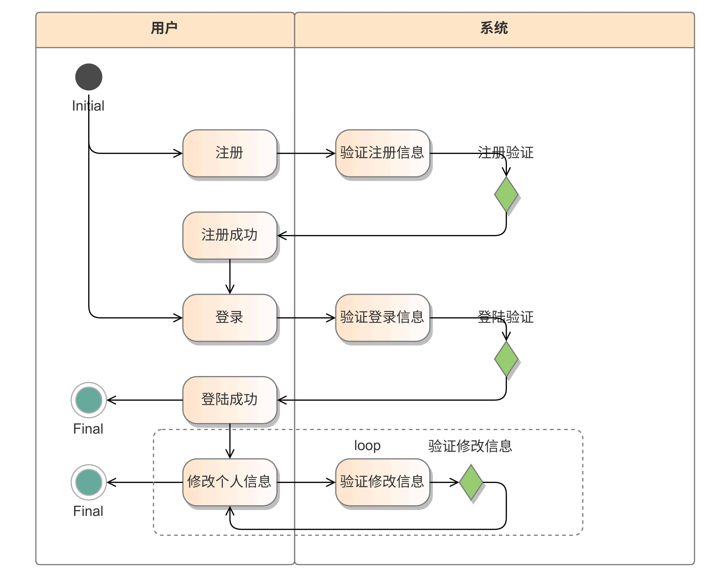

*图 2-1 用户与权限管理子系统活动图*

**顺序图：**

用户注册时的顺序图：

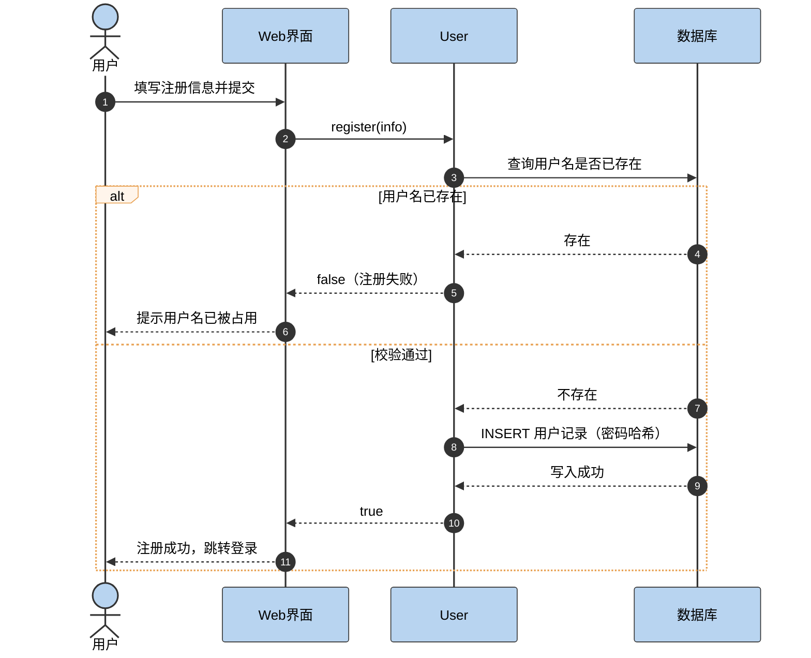
```mermaid
%%{init: {"theme":"base","sequence":{"showSequenceNumbers":true},"themeVariables":{"fontFamily":"Microsoft YaHei, sans-serif","background":"#ffffff","mainBkg":"#ffffff","primaryColor":"#b8d4f0","primaryTextColor":"#000000","primaryBorderColor":"#333333","secondaryColor":"#d4e8f8","secondaryTextColor":"#000000","secondaryBorderColor":"#333333","tertiaryColor":"#e8f4fc","lineColor":"#333333","textColor":"#000000","actorBkg":"#b8d4f0","actorBorder":"#333333","actorTextColor":"#000000","actorLineColor":"#333333","signalColor":"#333333","signalTextColor":"#000000","labelBoxBkgColor":"#fff5eb","labelBoxBorderColor":"#e8a050","labelTextColor":"#000000","loopTextColor":"#000000","noteBkgColor":"#fffef0","noteBorderColor":"#333333","noteTextColor":"#000000","activationBkgColor":"#8ec5eb","activationBorderColor":"#333333","sequenceNumberColor":"#ffffff"}}}%%
sequenceDiagram
    autonumber
    actor U as 用户
    participant UI as Web界面
    participant User as User
    participant DB as 数据库

    U->>UI: 填写注册信息并提交
    UI->>User: register(info)
    User->>DB: 查询用户名是否已存在
    alt 用户名已存在
        DB-->>User: 存在
        User-->>UI: false（注册失败）
        UI-->>U: 提示用户名已被占用
    else 校验通过
        DB-->>User: 不存在
        User->>DB: INSERT 用户记录（密码哈希）
        DB-->>User: 写入成功
        User-->>UI: true
        UI-->>U: 注册成功，跳转登录
    end
```

*图 2-2 用户注册顺序图*

用户登录时的顺序图：

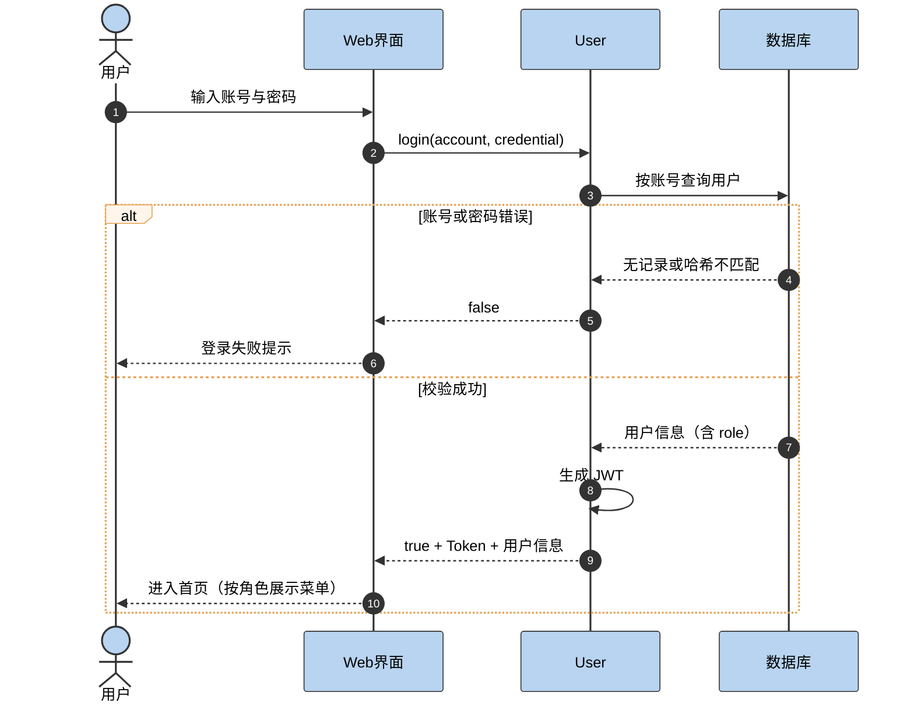
```mermaid
%%{init: {"theme":"base","sequence":{"showSequenceNumbers":true},"themeVariables":{"fontFamily":"Microsoft YaHei, sans-serif","background":"#ffffff","mainBkg":"#ffffff","primaryColor":"#b8d4f0","primaryTextColor":"#000000","primaryBorderColor":"#333333","secondaryColor":"#d4e8f8","secondaryTextColor":"#000000","secondaryBorderColor":"#333333","tertiaryColor":"#e8f4fc","lineColor":"#333333","textColor":"#000000","actorBkg":"#b8d4f0","actorBorder":"#333333","actorTextColor":"#000000","actorLineColor":"#333333","signalColor":"#333333","signalTextColor":"#000000","labelBoxBkgColor":"#fff5eb","labelBoxBorderColor":"#e8a050","labelTextColor":"#000000","loopTextColor":"#000000","noteBkgColor":"#fffef0","noteBorderColor":"#333333","noteTextColor":"#000000","activationBkgColor":"#8ec5eb","activationBorderColor":"#333333","sequenceNumberColor":"#ffffff"}}}%%
sequenceDiagram
    autonumber
    actor U as 用户
    participant UI as Web界面
    participant User as User
    participant DB as 数据库

    U->>UI: 输入账号与密码
    UI->>User: login(account, credential)
    User->>DB: 按账号查询用户
    alt 账号或密码错误
        DB-->>User: 无记录或哈希不匹配
        User-->>UI: false
        UI-->>U: 登录失败提示
    else 校验成功
        DB-->>User: 用户信息（含 role）
        User->>User: 生成 JWT
        User-->>UI: true + Token + 用户信息
        UI-->>U: 进入首页（按角色展示菜单）
    end
```

*图 2-3 用户登录顺序图*

个人信息修改时的顺序图：

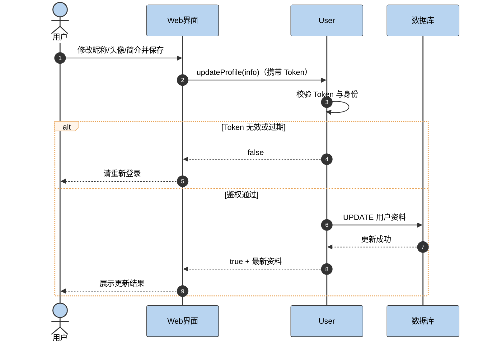
```mermaid
%%{init: {"theme":"base","sequence":{"showSequenceNumbers":true},"themeVariables":{"fontFamily":"Microsoft YaHei, sans-serif","background":"#ffffff","mainBkg":"#ffffff","primaryColor":"#b8d4f0","primaryTextColor":"#000000","primaryBorderColor":"#333333","secondaryColor":"#d4e8f8","secondaryTextColor":"#000000","secondaryBorderColor":"#333333","tertiaryColor":"#e8f4fc","lineColor":"#333333","textColor":"#000000","actorBkg":"#b8d4f0","actorBorder":"#333333","actorTextColor":"#000000","actorLineColor":"#333333","signalColor":"#333333","signalTextColor":"#000000","labelBoxBkgColor":"#fff5eb","labelBoxBorderColor":"#e8a050","labelTextColor":"#000000","loopTextColor":"#000000","noteBkgColor":"#fffef0","noteBorderColor":"#333333","noteTextColor":"#000000","activationBkgColor":"#8ec5eb","activationBorderColor":"#333333","sequenceNumberColor":"#ffffff"}}}%%
sequenceDiagram
    autonumber
    actor U as 用户
    participant UI as Web界面
    participant User as User
    participant DB as 数据库

    U->>UI: 修改昵称/头像/简介并保存
    UI->>User: updateProfile(info)（携带 Token）
    User->>User: 校验 Token 与身份
    alt Token 无效或过期
        User-->>UI: false
        UI-->>U: 请重新登录
    else 鉴权通过
        User->>DB: UPDATE 用户资料
        DB-->>User: 更新成功
        User-->>UI: true + 最新资料
        UI-->>U: 展示更新结果
    end
```

*图 2-4 个人信息修改顺序图*

### 2.2 视频播放子系统

负责视频列表与推荐展示、在线播放、播放控制及播放历史记录。

**活动图：**

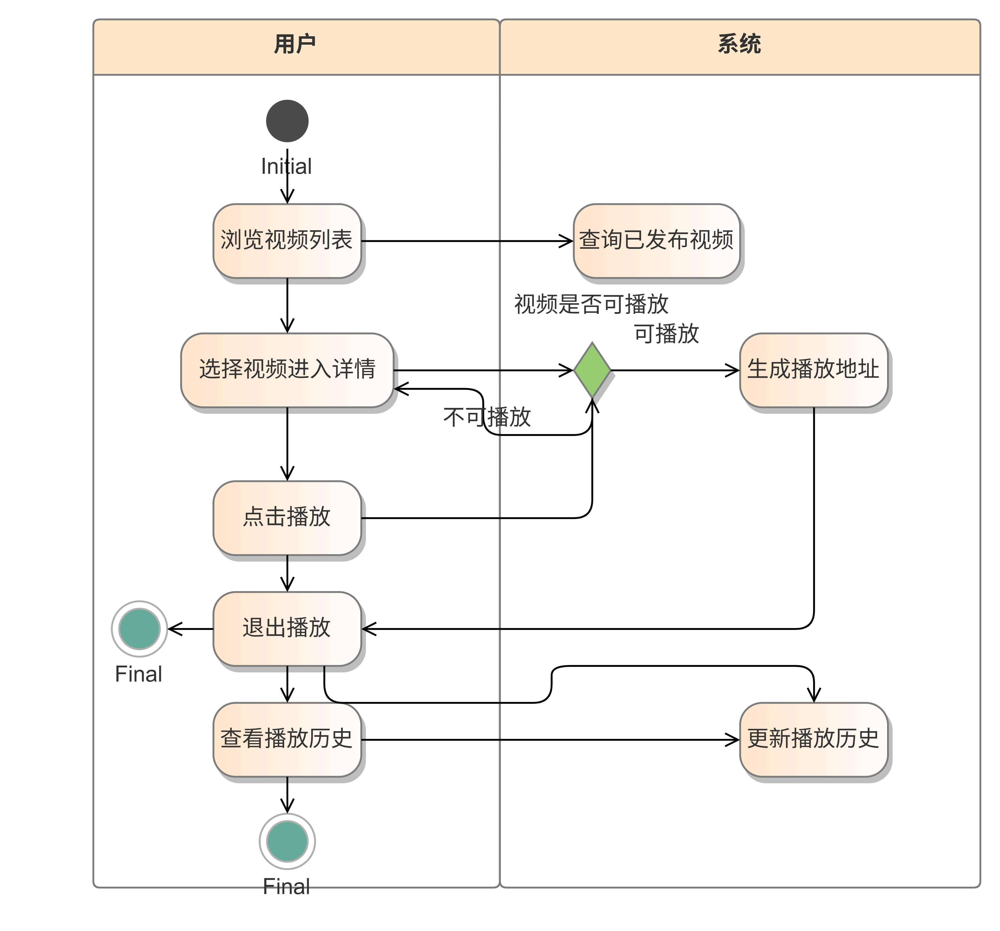

*图 2-5 视频播放子系统活动图*

**顺序图：**

浏览与进入播放的顺序图：

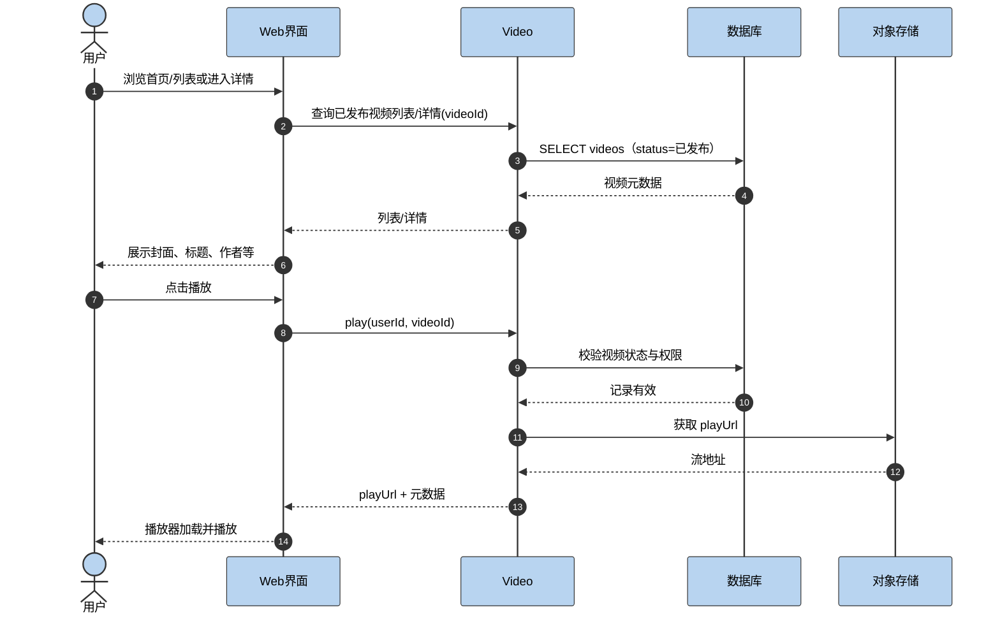
```mermaid
%%{init: {"theme":"base","sequence":{"showSequenceNumbers":true},"themeVariables":{"fontFamily":"Microsoft YaHei, sans-serif","background":"#ffffff","mainBkg":"#ffffff","primaryColor":"#b8d4f0","primaryTextColor":"#000000","primaryBorderColor":"#333333","secondaryColor":"#d4e8f8","secondaryTextColor":"#000000","secondaryBorderColor":"#333333","tertiaryColor":"#e8f4fc","lineColor":"#333333","textColor":"#000000","actorBkg":"#b8d4f0","actorBorder":"#333333","actorTextColor":"#000000","actorLineColor":"#333333","signalColor":"#333333","signalTextColor":"#000000","labelBoxBkgColor":"#fff5eb","labelBoxBorderColor":"#e8a050","labelTextColor":"#000000","loopTextColor":"#000000","noteBkgColor":"#fffef0","noteBorderColor":"#333333","noteTextColor":"#000000","activationBkgColor":"#8ec5eb","activationBorderColor":"#333333","sequenceNumberColor":"#ffffff"}}}%%
sequenceDiagram
    autonumber
    actor U as 用户
    participant UI as Web界面
    participant Video as Video
    participant DB as 数据库
    participant Store as 对象存储

    U->>UI: 浏览首页/列表或进入详情
    UI->>Video: 查询已发布视频列表/详情(videoId)
    Video->>DB: SELECT videos（status=已发布）
    DB-->>Video: 视频元数据
    Video-->>UI: 列表/详情
    UI-->>U: 展示封面、标题、作者等

    U->>UI: 点击播放
    UI->>Video: play(userId, videoId)
    Video->>DB: 校验视频状态与权限
    DB-->>Video: 记录有效
    Video->>Store: 获取 playUrl
    Store-->>Video: 流地址
    Video-->>UI: playUrl + 元数据
    UI-->>U: 播放器加载并播放
```

*图 2-6 浏览与进入播放顺序图*

记录播放历史的顺序图：

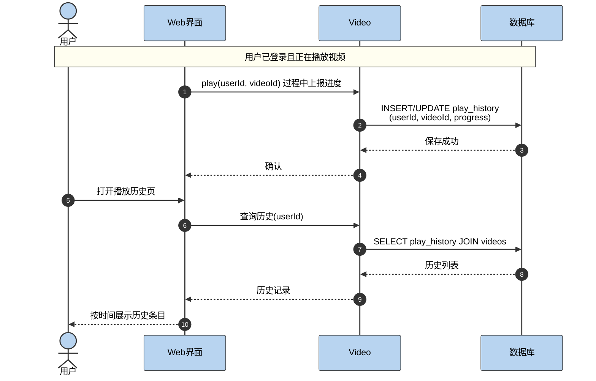
```mermaid
%%{init: {"theme":"base","sequence":{"showSequenceNumbers":true},"themeVariables":{"fontFamily":"Microsoft YaHei, sans-serif","background":"#ffffff","mainBkg":"#ffffff","primaryColor":"#b8d4f0","primaryTextColor":"#000000","primaryBorderColor":"#333333","secondaryColor":"#d4e8f8","secondaryTextColor":"#000000","secondaryBorderColor":"#333333","tertiaryColor":"#e8f4fc","lineColor":"#333333","textColor":"#000000","actorBkg":"#b8d4f0","actorBorder":"#333333","actorTextColor":"#000000","actorLineColor":"#333333","signalColor":"#333333","signalTextColor":"#000000","labelBoxBkgColor":"#fff5eb","labelBoxBorderColor":"#e8a050","labelTextColor":"#000000","loopTextColor":"#000000","noteBkgColor":"#fffef0","noteBorderColor":"#333333","noteTextColor":"#000000","activationBkgColor":"#8ec5eb","activationBorderColor":"#333333","sequenceNumberColor":"#ffffff"}}}%%
sequenceDiagram
    autonumber
    actor U as 用户
    participant UI as Web界面
    participant Video as Video
    participant DB as 数据库

    Note over U,DB: 用户已登录且正在播放视频

    UI->>Video: play(userId, videoId) 过程中上报进度
    Video->>DB: INSERT/UPDATE play_history<br/>(userId, videoId, progress)
    DB-->>Video: 保存成功
    Video-->>UI: 确认

    U->>UI: 打开播放历史页
    UI->>Video: 查询历史(userId)
    Video->>DB: SELECT play_history JOIN videos
    DB-->>Video: 历史列表
    Video-->>UI: 历史记录
    UI-->>U: 按时间展示历史条目
```

*图 2-7 记录播放历史顺序图*

### 2.3 直播子系统

负责直播列表、进入直播间观看及课程范围内允许的基础互动。

**活动图：**

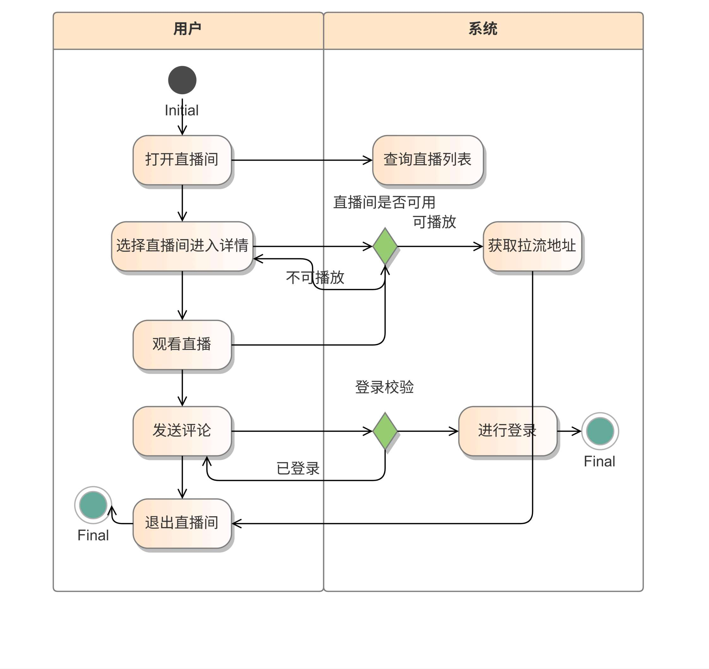

*图 2-8 直播子系统活动图*

**顺序图：**

获取直播列表的顺序图：

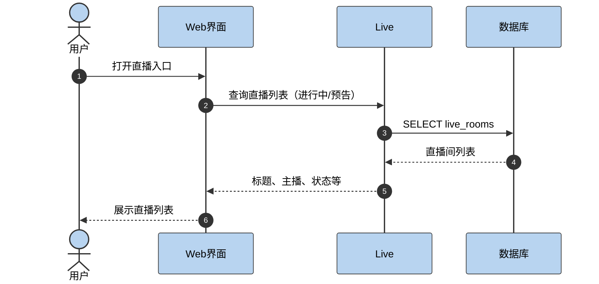
```mermaid
%%{init: {"theme":"base","sequence":{"showSequenceNumbers":true},"themeVariables":{"fontFamily":"Microsoft YaHei, sans-serif","background":"#ffffff","mainBkg":"#ffffff","primaryColor":"#b8d4f0","primaryTextColor":"#000000","primaryBorderColor":"#333333","secondaryColor":"#d4e8f8","secondaryTextColor":"#000000","secondaryBorderColor":"#333333","tertiaryColor":"#e8f4fc","lineColor":"#333333","textColor":"#000000","actorBkg":"#b8d4f0","actorBorder":"#333333","actorTextColor":"#000000","actorLineColor":"#333333","signalColor":"#333333","signalTextColor":"#000000","labelBoxBkgColor":"#fff5eb","labelBoxBorderColor":"#e8a050","labelTextColor":"#000000","loopTextColor":"#000000","noteBkgColor":"#fffef0","noteBorderColor":"#333333","noteTextColor":"#000000","activationBkgColor":"#8ec5eb","activationBorderColor":"#333333","sequenceNumberColor":"#ffffff"}}}%%
sequenceDiagram
    autonumber
    actor U as 用户
    participant UI as Web界面
    participant Live as Live
    participant DB as 数据库

    U->>UI: 打开直播入口
    UI->>Live: 查询直播列表（进行中/预告）
    Live->>DB: SELECT live_rooms
    DB-->>Live: 直播间列表
    Live-->>UI: 标题、主播、状态等
    UI-->>U: 展示直播列表
```

*图 2-9 获取直播列表顺序图*

进入直播间观看的顺序图：

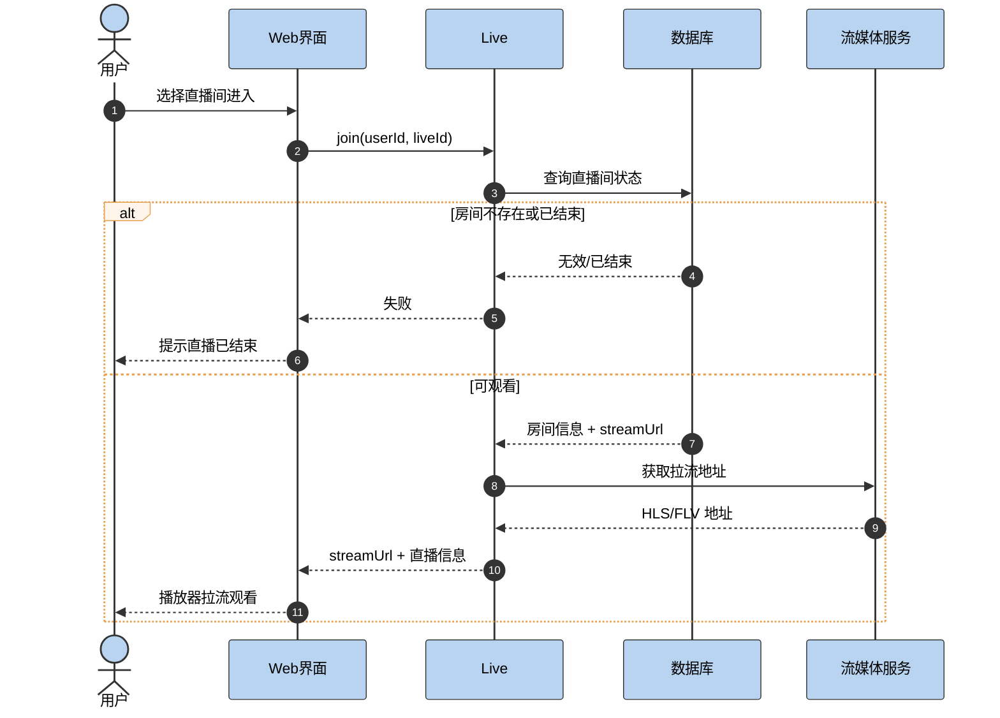
```mermaid
%%{init: {"theme":"base","sequence":{"showSequenceNumbers":true},"themeVariables":{"fontFamily":"Microsoft YaHei, sans-serif","background":"#ffffff","mainBkg":"#ffffff","primaryColor":"#b8d4f0","primaryTextColor":"#000000","primaryBorderColor":"#333333","secondaryColor":"#d4e8f8","secondaryTextColor":"#000000","secondaryBorderColor":"#333333","tertiaryColor":"#e8f4fc","lineColor":"#333333","textColor":"#000000","actorBkg":"#b8d4f0","actorBorder":"#333333","actorTextColor":"#000000","actorLineColor":"#333333","signalColor":"#333333","signalTextColor":"#000000","labelBoxBkgColor":"#fff5eb","labelBoxBorderColor":"#e8a050","labelTextColor":"#000000","loopTextColor":"#000000","noteBkgColor":"#fffef0","noteBorderColor":"#333333","noteTextColor":"#000000","activationBkgColor":"#8ec5eb","activationBorderColor":"#333333","sequenceNumberColor":"#ffffff"}}}%%
sequenceDiagram
    autonumber
    actor U as 用户
    participant UI as Web界面
    participant Live as Live
    participant DB as 数据库
    participant Stream as 流媒体服务

    U->>UI: 选择直播间进入
    UI->>Live: join(userId, liveId)
    Live->>DB: 查询直播间状态
    alt 房间不存在或已结束
        DB-->>Live: 无效/已结束
        Live-->>UI: 失败
        UI-->>U: 提示直播已结束
    else 可观看
        DB-->>Live: 房间信息 + streamUrl
        Live->>Stream: 获取拉流地址
        Stream-->>Live: HLS/FLV 地址
        Live-->>UI: streamUrl + 直播信息
        UI-->>U: 播放器拉流观看
    end
```

*图 2-10 进入直播间观看顺序图*

发送互动消息的顺序图：

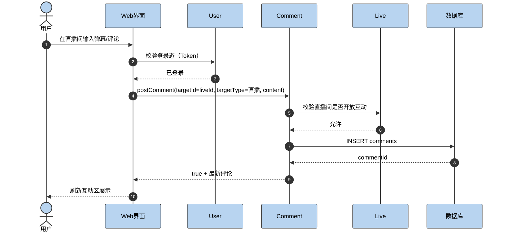
```mermaid
%%{init: {"theme":"base","sequence":{"showSequenceNumbers":true},"themeVariables":{"fontFamily":"Microsoft YaHei, sans-serif","background":"#ffffff","mainBkg":"#ffffff","primaryColor":"#b8d4f0","primaryTextColor":"#000000","primaryBorderColor":"#333333","secondaryColor":"#d4e8f8","secondaryTextColor":"#000000","secondaryBorderColor":"#333333","tertiaryColor":"#e8f4fc","lineColor":"#333333","textColor":"#000000","actorBkg":"#b8d4f0","actorBorder":"#333333","actorTextColor":"#000000","actorLineColor":"#333333","signalColor":"#333333","signalTextColor":"#000000","labelBoxBkgColor":"#fff5eb","labelBoxBorderColor":"#e8a050","labelTextColor":"#000000","loopTextColor":"#000000","noteBkgColor":"#fffef0","noteBorderColor":"#333333","noteTextColor":"#000000","activationBkgColor":"#8ec5eb","activationBorderColor":"#333333","sequenceNumberColor":"#ffffff"}}}%%
sequenceDiagram
    autonumber
    actor U as 用户
    participant UI as Web界面
    participant User as User
    participant Comment as Comment
    participant Live as Live
    participant DB as 数据库

    U->>UI: 在直播间输入弹幕/评论
    UI->>User: 校验登录态（Token）
    User-->>UI: 已登录
    UI->>Comment: postComment(targetId=liveId, targetType=直播, content)
    Comment->>Live: 校验直播间是否开放互动
    Live-->>Comment: 允许
    Comment->>DB: INSERT comments
    DB-->>Comment: commentId
    Comment-->>UI: true + 最新评论
    UI-->>U: 刷新互动区展示
```

*图 2-11 发送互动消息顺序图*

### 2.4 订阅子系统

负责用户对发布者或频道的订阅/取消，以及订阅动态列表展示。

**活动图：**

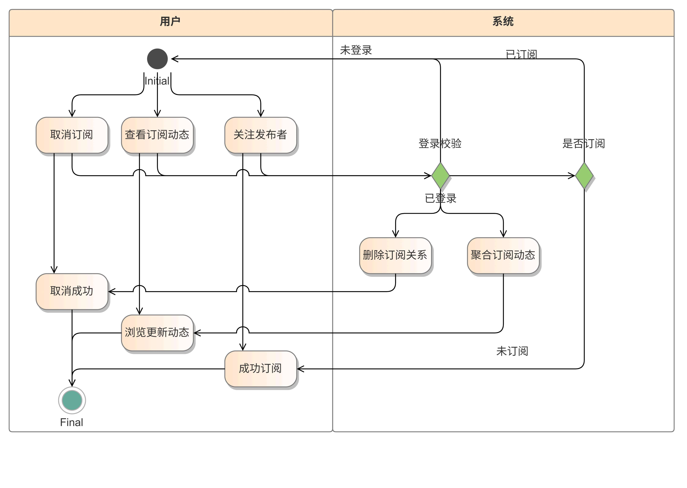

*图 2-12 订阅子系统活动图*

**顺序图：**

订阅/取消订阅的顺序图：

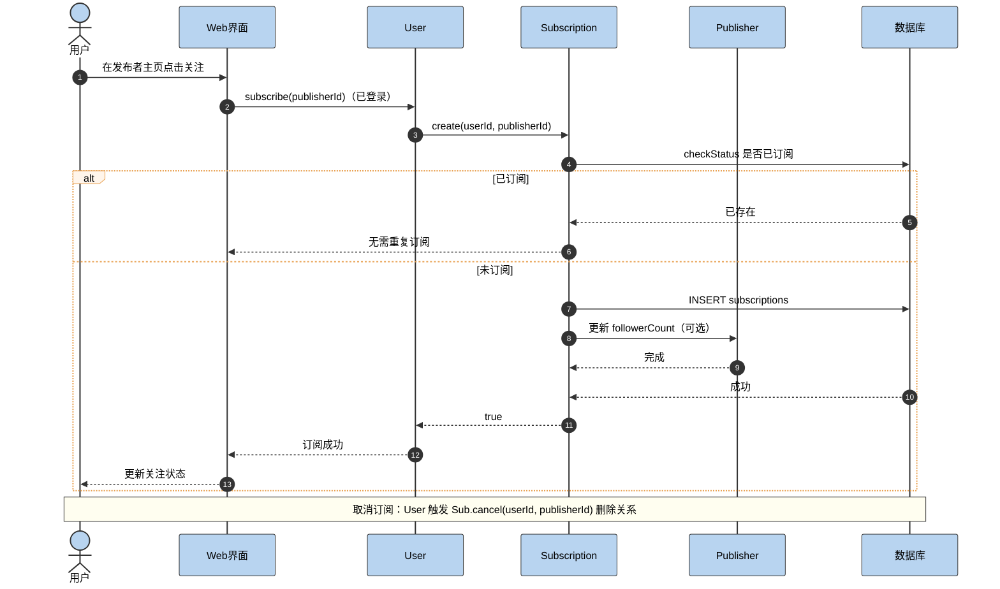
```mermaid
%%{init: {"theme":"base","sequence":{"showSequenceNumbers":true},"themeVariables":{"fontFamily":"Microsoft YaHei, sans-serif","background":"#ffffff","mainBkg":"#ffffff","primaryColor":"#b8d4f0","primaryTextColor":"#000000","primaryBorderColor":"#333333","secondaryColor":"#d4e8f8","secondaryTextColor":"#000000","secondaryBorderColor":"#333333","tertiaryColor":"#e8f4fc","lineColor":"#333333","textColor":"#000000","actorBkg":"#b8d4f0","actorBorder":"#333333","actorTextColor":"#000000","actorLineColor":"#333333","signalColor":"#333333","signalTextColor":"#000000","labelBoxBkgColor":"#fff5eb","labelBoxBorderColor":"#e8a050","labelTextColor":"#000000","loopTextColor":"#000000","noteBkgColor":"#fffef0","noteBorderColor":"#333333","noteTextColor":"#000000","activationBkgColor":"#8ec5eb","activationBorderColor":"#333333","sequenceNumberColor":"#ffffff"}}}%%
sequenceDiagram
    autonumber
    actor U as 用户
    participant UI as Web界面
    participant User as User
    participant Sub as Subscription
    participant Pub as Publisher
    participant DB as 数据库

    U->>UI: 在发布者主页点击关注
    UI->>User: subscribe(publisherId)（已登录）
    User->>Sub: create(userId, publisherId)
    Sub->>DB: checkStatus 是否已订阅
    alt 已订阅
        DB-->>Sub: 已存在
        Sub-->>UI: 无需重复订阅
    else 未订阅
        Sub->>DB: INSERT subscriptions
        Sub->>Pub: 更新 followerCount（可选）
        Pub-->>Sub: 完成
        DB-->>Sub: 成功
        Sub-->>User: true
        User-->>UI: 订阅成功
        UI-->>U: 更新关注状态
    end

    Note over U,DB: 取消订阅：User 触发 Sub.cancel(userId, publisherId) 删除关系
```

*图 2-13 订阅/取消订阅顺序图*

查看订阅动态的顺序图：

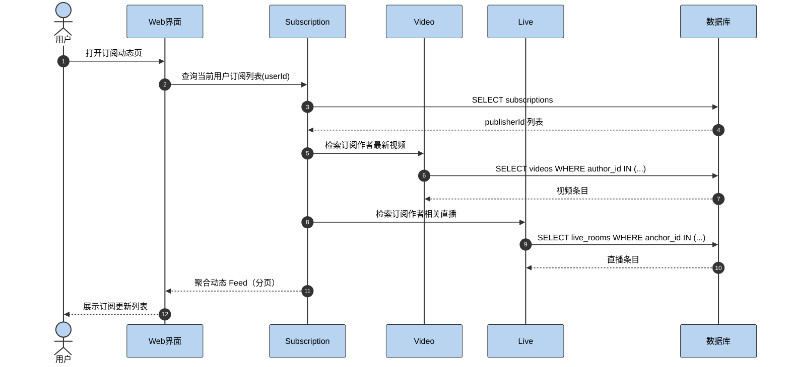
```mermaid
%%{init: {"theme":"base","sequence":{"showSequenceNumbers":true},"themeVariables":{"fontFamily":"Microsoft YaHei, sans-serif","background":"#ffffff","mainBkg":"#ffffff","primaryColor":"#b8d4f0","primaryTextColor":"#000000","primaryBorderColor":"#333333","secondaryColor":"#d4e8f8","secondaryTextColor":"#000000","secondaryBorderColor":"#333333","tertiaryColor":"#e8f4fc","lineColor":"#333333","textColor":"#000000","actorBkg":"#b8d4f0","actorBorder":"#333333","actorTextColor":"#000000","actorLineColor":"#333333","signalColor":"#333333","signalTextColor":"#000000","labelBoxBkgColor":"#fff5eb","labelBoxBorderColor":"#e8a050","labelTextColor":"#000000","loopTextColor":"#000000","noteBkgColor":"#fffef0","noteBorderColor":"#333333","noteTextColor":"#000000","activationBkgColor":"#8ec5eb","activationBorderColor":"#333333","sequenceNumberColor":"#ffffff"}}}%%
sequenceDiagram
    autonumber
    actor U as 用户
    participant UI as Web界面
    participant Sub as Subscription
    participant Video as Video
    participant Live as Live
    participant DB as 数据库

    U->>UI: 打开订阅动态页
    UI->>Sub: 查询当前用户订阅列表(userId)
    Sub->>DB: SELECT subscriptions
    DB-->>Sub: publisherId 列表
    Sub->>Video: 检索订阅作者最新视频
    Video->>DB: SELECT videos WHERE author_id IN (...)
    DB-->>Video: 视频条目
    Sub->>Live: 检索订阅作者相关直播
    Live->>DB: SELECT live_rooms WHERE anchor_id IN (...)
    DB-->>Live: 直播条目
    Sub-->>UI: 聚合动态 Feed（分页）
    UI-->>U: 展示订阅更新列表
```

*图 2-14 查看订阅动态顺序图*

### 2.5 视频发布与编辑子系统

负责授权用户上传视频、维护元数据及对已发布内容进行管理。

**活动图：**

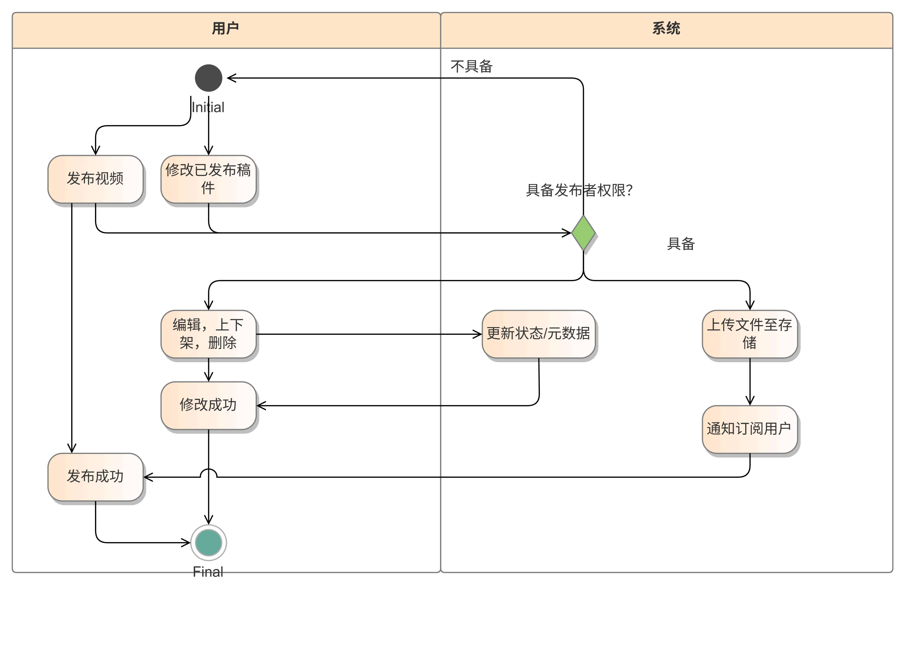

*图 2-15 视频发布与编辑子系统活动图*

**顺序图：**

上传视频的顺序图：

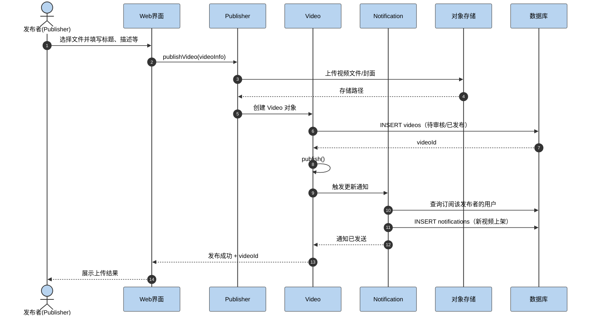
```mermaid
%%{init: {"theme":"base","sequence":{"showSequenceNumbers":true},"themeVariables":{"fontFamily":"Microsoft YaHei, sans-serif","background":"#ffffff","mainBkg":"#ffffff","primaryColor":"#b8d4f0","primaryTextColor":"#000000","primaryBorderColor":"#333333","secondaryColor":"#d4e8f8","secondaryTextColor":"#000000","secondaryBorderColor":"#333333","tertiaryColor":"#e8f4fc","lineColor":"#333333","textColor":"#000000","actorBkg":"#b8d4f0","actorBorder":"#333333","actorTextColor":"#000000","actorLineColor":"#333333","signalColor":"#333333","signalTextColor":"#000000","labelBoxBkgColor":"#fff5eb","labelBoxBorderColor":"#e8a050","labelTextColor":"#000000","loopTextColor":"#000000","noteBkgColor":"#fffef0","noteBorderColor":"#333333","noteTextColor":"#000000","activationBkgColor":"#8ec5eb","activationBorderColor":"#333333","sequenceNumberColor":"#ffffff"}}}%%
sequenceDiagram
    autonumber
    actor P as 发布者(Publisher)
    participant UI as Web界面
    participant Pub as Publisher
    participant Video as Video
    participant Noti as Notification
    participant Store as 对象存储
    participant DB as 数据库

    P->>UI: 选择文件并填写标题、描述等
    UI->>Pub: publishVideo(videoInfo)
    Pub->>Store: 上传视频文件/封面
    Store-->>Pub: 存储路径
    Pub->>Video: 创建 Video 对象
    Video->>DB: INSERT videos（待审核/已发布）
    DB-->>Video: videoId
    Video->>Video: publish()
    Video->>Noti: 触发更新通知
    Noti->>DB: 查询订阅该发布者的用户
    Noti->>DB: INSERT notifications（新视频上架）
    Noti-->>Video: 通知已发送
    Video-->>UI: 发布成功 + videoId
    UI-->>P: 展示上传结果
```

*图 2-16 上传视频顺序图*

编辑与管理视频的顺序图：

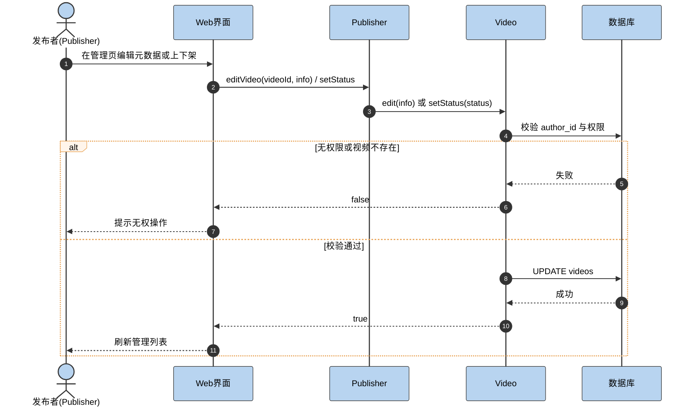
```mermaid
%%{init: {"theme":"base","sequence":{"showSequenceNumbers":true},"themeVariables":{"fontFamily":"Microsoft YaHei, sans-serif","background":"#ffffff","mainBkg":"#ffffff","primaryColor":"#b8d4f0","primaryTextColor":"#000000","primaryBorderColor":"#333333","secondaryColor":"#d4e8f8","secondaryTextColor":"#000000","secondaryBorderColor":"#333333","tertiaryColor":"#e8f4fc","lineColor":"#333333","textColor":"#000000","actorBkg":"#b8d4f0","actorBorder":"#333333","actorTextColor":"#000000","actorLineColor":"#333333","signalColor":"#333333","signalTextColor":"#000000","labelBoxBkgColor":"#fff5eb","labelBoxBorderColor":"#e8a050","labelTextColor":"#000000","loopTextColor":"#000000","noteBkgColor":"#fffef0","noteBorderColor":"#333333","noteTextColor":"#000000","activationBkgColor":"#8ec5eb","activationBorderColor":"#333333","sequenceNumberColor":"#ffffff"}}}%%
sequenceDiagram
    autonumber
    actor P as 发布者(Publisher)
    participant UI as Web界面
    participant Pub as Publisher
    participant Video as Video
    participant DB as 数据库

    P->>UI: 在管理页编辑元数据或上下架
    UI->>Pub: editVideo(videoId, info) / setStatus
    Pub->>Video: edit(info) 或 setStatus(status)
    Video->>DB: 校验 author_id 与权限
    alt 无权限或视频不存在
        DB-->>Video: 失败
        Video-->>UI: false
        UI-->>P: 提示无权操作
    else 校验通过
        Video->>DB: UPDATE videos
        DB-->>Video: 成功
        Video-->>UI: true
        UI-->>P: 刷新管理列表
    end
```

*图 2-17 编辑与管理视频顺序图*

### 2.6 评论与搜索子系统

负责对视频/直播相关内容发表评论、展示评论列表，以及关键词检索。

**活动图：**

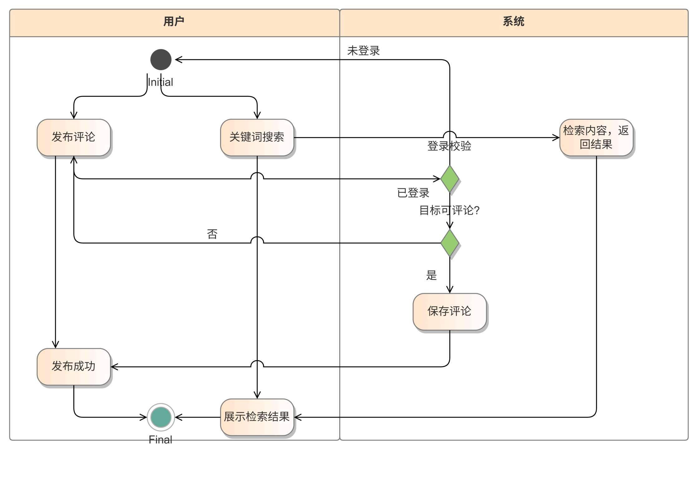

*图 2-18 评论与搜索子系统活动图*

**顺序图：**

发表评论的顺序图：

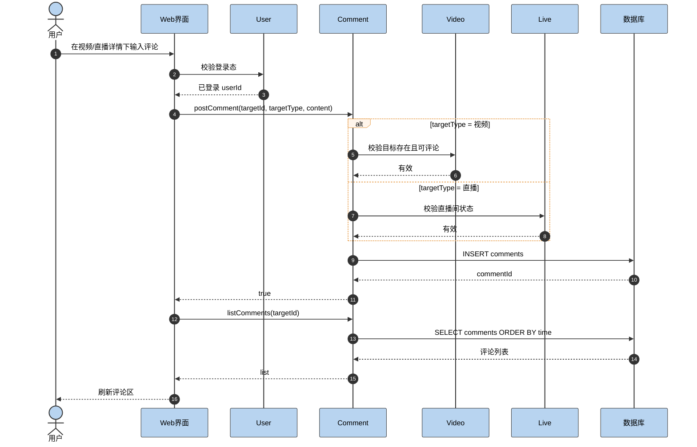
```mermaid
%%{init: {"theme":"base","sequence":{"showSequenceNumbers":true},"themeVariables":{"fontFamily":"Microsoft YaHei, sans-serif","background":"#ffffff","mainBkg":"#ffffff","primaryColor":"#b8d4f0","primaryTextColor":"#000000","primaryBorderColor":"#333333","secondaryColor":"#d4e8f8","secondaryTextColor":"#000000","secondaryBorderColor":"#333333","tertiaryColor":"#e8f4fc","lineColor":"#333333","textColor":"#000000","actorBkg":"#b8d4f0","actorBorder":"#333333","actorTextColor":"#000000","actorLineColor":"#333333","signalColor":"#333333","signalTextColor":"#000000","labelBoxBkgColor":"#fff5eb","labelBoxBorderColor":"#e8a050","labelTextColor":"#000000","loopTextColor":"#000000","noteBkgColor":"#fffef0","noteBorderColor":"#333333","noteTextColor":"#000000","activationBkgColor":"#8ec5eb","activationBorderColor":"#333333","sequenceNumberColor":"#ffffff"}}}%%
sequenceDiagram
    autonumber
    actor U as 用户
    participant UI as Web界面
    participant User as User
    participant Comment as Comment
    participant Video as Video
    participant Live as Live
    participant DB as 数据库

    U->>UI: 在视频/直播详情下输入评论
    UI->>User: 校验登录态
    User-->>UI: 已登录 userId
    UI->>Comment: postComment(targetId, targetType, content)
    alt targetType = 视频
        Comment->>Video: 校验目标存在且可评论
        Video-->>Comment: 有效
    else targetType = 直播
        Comment->>Live: 校验直播间状态
        Live-->>Comment: 有效
    end
    Comment->>DB: INSERT comments
    DB-->>Comment: commentId
    Comment-->>UI: true
    UI->>Comment: listComments(targetId)
    Comment->>DB: SELECT comments ORDER BY time
    DB-->>Comment: 评论列表
    Comment-->>UI: list
    UI-->>U: 刷新评论区
```

*图 2-19 发表评论顺序图*

关键词搜索的顺序图：

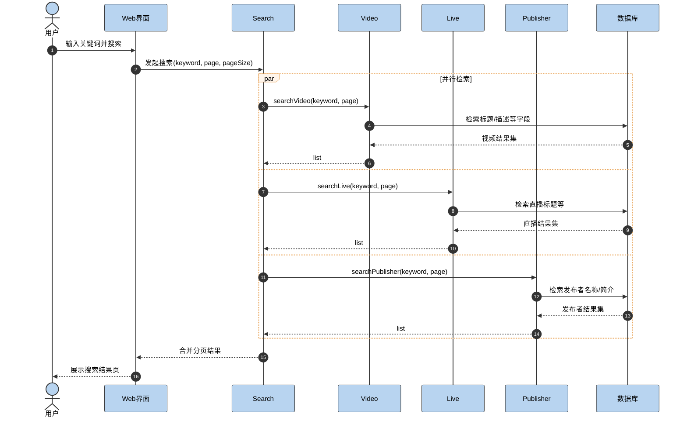
```mermaid
%%{init: {"theme":"base","sequence":{"showSequenceNumbers":true},"themeVariables":{"fontFamily":"Microsoft YaHei, sans-serif","background":"#ffffff","mainBkg":"#ffffff","primaryColor":"#b8d4f0","primaryTextColor":"#000000","primaryBorderColor":"#333333","secondaryColor":"#d4e8f8","secondaryTextColor":"#000000","secondaryBorderColor":"#333333","tertiaryColor":"#e8f4fc","lineColor":"#333333","textColor":"#000000","actorBkg":"#b8d4f0","actorBorder":"#333333","actorTextColor":"#000000","actorLineColor":"#333333","signalColor":"#333333","signalTextColor":"#000000","labelBoxBkgColor":"#fff5eb","labelBoxBorderColor":"#e8a050","labelTextColor":"#000000","loopTextColor":"#000000","noteBkgColor":"#fffef0","noteBorderColor":"#333333","noteTextColor":"#000000","activationBkgColor":"#8ec5eb","activationBorderColor":"#333333","sequenceNumberColor":"#ffffff"}}}%%
sequenceDiagram
    autonumber
    actor U as 用户
    participant UI as Web界面
    participant Search as Search
    participant Video as Video
    participant Live as Live
    participant Pub as Publisher
    participant DB as 数据库

    U->>UI: 输入关键词并搜索
    UI->>Search: 发起搜索(keyword, page, pageSize)
    par 并行检索
        Search->>Video: searchVideo(keyword, page)
        Video->>DB: 检索标题/描述等字段
        DB-->>Video: 视频结果集
        Video-->>Search: list
    and
        Search->>Live: searchLive(keyword, page)
        Live->>DB: 检索直播标题等
        DB-->>Live: 直播结果集
        Live-->>Search: list
    and
        Search->>Pub: searchPublisher(keyword, page)
        Pub->>DB: 检索发布者名称/简介
        DB-->>Pub: 发布者结果集
        Pub-->>Search: list
    end
    Search-->>UI: 合并分页结果
    UI-->>U: 展示搜索结果页
```

*图 2-20 关键词搜索顺序图*

---

## 3 功能模块设计

> **模块编号说明**：本节模块编号 M1～M6 沿用《软件概要设计说明书》的设计模块编号；实现阶段按代码组织进一步细分为 M1～M10（新增评论、赞踩、搜索、通知、私信、管理员审核等独立模块），两者对应关系见《需求追溯矩阵》2.2 节。

### 3.1 用户与权限管理模块

| 项目 | 说明 |
| :--- | :--- |
| **模块编号** | M1 |
| **模块名称** | 用户与权限管理模块 |
| **输入** | 用户注册信息（用户名、密码、邮箱/手机号等）；登录凭据；个人资料修改请求；退出登录请求 |
| **处理** | **注册**：校验用户名唯一性、密码强度及必填项，通过后写入 `users` 表。**登录**：校验凭据，成功后签发 JWT 并返回用户信息与角色。**资料修改**：鉴权后更新昵称、头像、简介等字段。**权限控制**：按角色（普通用户、发布者、管理员）控制发布、直播、管理入口可见性 |
| **算法描述** | **注册算法**：`SELECT` 检查用户名是否存在 → 密码哈希（如 BCrypt）→ `INSERT` 用户记录。**登录算法**：按用户名查询 → 比对密码哈希 → 生成 JWT（含用户 ID、角色、过期时间）。**权限算法**：解析请求头 Token → 校验签名与有效期 → 比对路由所需角色 |
| **输出** | 注册/登录成功或失败提示；JWT 及用户基本信息；资料更新结果；与角色相关的菜单与接口可用状态 |

### 3.2 视频播放模块

| 项目 | 说明 |
| :--- | :--- |
| **模块编号** | M2 |
| **模块名称** | 视频播放模块 |
| **输入** | 列表/推荐查询参数（分页、分类）；视频 ID；播放、暂停、进度跳转、清晰度切换（若实现）；历史查询请求 |
| **处理** | **浏览**：按条件查询 `videos` 表中已发布记录并分页返回。**播放**：校验视频状态与访问权限，返回可播放 URL 或流地址及元数据。**历史**：登录用户播放时更新或插入 `play_history`（用户 ID、视频 ID、进度、时间） |
| **算法描述** | **列表算法**：`WHERE status = 已发布` + 排序（时间/热度）+ `LIMIT/OFFSET`。**播放算法**：根据 `video_url` 或对象存储路径生成访问地址；可选 CDN/签名 URL。**历史算法**：`INSERT ... ON DUPLICATE KEY UPDATE` 更新进度与 `update_time` |
| **输出** | 视频列表与详情；播放地址或错误说明；播放历史列表 |

### 3.3 直播模块

| 项目 | 说明 |
| :--- | :--- |
| **模块编号** | M3 |
| **模块名称** | 直播模块 |
| **输入** | 直播列表查询；直播间 ID；进入/离开直播间事件；互动内容（弹幕/评论，以实现为准） |
| **处理** | **列表**：查询 `live_rooms`，按 `is_live`、计划时间等返回。**观看**：加载直播间信息与拉流地址，前端播放器拉流。**互动**：鉴权后校验内容长度与频率，写入评论或弹幕表并供前端轮询/推送刷新 |
| **算法描述** | **列表算法**：查询正在直播与预告房间，按状态排序。**拉流算法**：根据 `stream_key` 或配置的推流服务生成 HLS/FLV 等播放地址。**互动算法**：敏感词简单过滤 → 落库 → 返回最新 N 条互动记录 |
| **输出** | 直播列表与房间详情；媒体流地址或不可用提示；互动发送结果与更新后的互动区 |

### 3.4 订阅模块

| 项目 | 说明 |
| :--- | :--- |
| **模块编号** | M4 |
| **模块名称** | 订阅模块 |
| **输入** | 被关注发布者/频道 ID；订阅或取消操作；订阅列表与动态查询（含分页） |
| **处理** | **订阅/取消**：在 `subscriptions` 表中插入或删除关注关系，保证同一用户对同一目标不重复订阅。**动态展示**：根据当前用户订阅列表，关联查询被关注者最新视频或直播并分页返回 |
| **算法描述** | **订阅算法**：`INSERT` 前检查是否已存在 `(follower_id, target_id)`；取消时 `DELETE`。**动态算法**：`JOIN subscriptions` 与 `videos`/`live_rooms`，按 `create_time` 降序分页 |
| **输出** | 订阅/取消成功状态；订阅列表；订阅动态 Feed |

### 3.5 视频发布与编辑模块

| 项目 | 说明 |
| :--- | :--- |
| **模块编号** | M5 |
| **模块名称** | 视频发布与编辑模块 |
| **输入** | 视频文件、封面图；标题、描述等元数据；编辑/删除/上下架请求及视频 ID |
| **处理** | **上传**：校验角色与文件类型、大小 → 上传至文件系统或 MinIO → 写入 `videos`（状态可为待审核/已发布）。**编辑**：鉴权后更新元数据或替换封面。**管理**：删除记录或修改 `status` 实现上下架 |
| **算法描述** | **上传算法**：分片或直传至存储 → 返回存储路径 → 事务写入元数据。**编辑算法**：校验 `author_id` 与当前用户一致或管理员 → `UPDATE`。**状态算法**：`status` 字段流转：审核中 → 已发布 → 已下架 |
| **输出** | 上传进度与结果；视频管理列表；保存/删除/上下架操作反馈 |

### 3.6 评论与搜索模块

| 项目 | 说明 |
| :--- | :--- |
| **模块编号** | M6 |
| **模块名称** | 评论与搜索模块 |
| **输入** | 评论正文、目标 ID（视频/直播）、目标类型；搜索关键词、分页与筛选参数 |
| **处理** | **评论**：登录鉴权 → 内容长度与基本过滤 → 写入 `comments` → 列表接口按时间倒序返回。**搜索**：对标题、描述、作者名等字段执行 `LIKE` 或全文索引查询，合并视频与直播结果并分页 |
| **算法描述** | **评论算法**：`INSERT INTO comments` → 可选缓存最新评论列表。**搜索算法**：关键词分词或整词匹配 → 多表 `UNION` 或分别查询后合并排序 → 分页返回 |
| **输出** | 评论列表与发表结果；搜索结果页（视频/直播/频道等）及空结果提示 |

---

## 4 界面设计

### 4.1 外部界面设计

本节描述系统与外部实体（用户浏览器、数据库、对象存储等）之间的功能与数据接口。

#### 4.1.1 视频播放页面

**功能接口：**

- **浏览视频**：用户通过首页、推荐区或分类入口请求视频列表。  
- **播放视频**：用户点击某视频进入详情页并发起播放，系统返回流地址与元数据。  
- **记录历史**：登录用户在播放过程中上报进度，系统更新播放历史。

**数据接口：**

- **视频信息库（`videos`）**：提供标题、封面、作者、状态、存储路径等。  
- **播放历史库（`play_history`）**：存储用户 ID、视频 ID、进度与更新时间。  
- **对象存储/文件系统**：提供视频文件与封面的实际读写。

#### 4.1.2 直播观看页面

**功能接口：**

- **直播列表**：用户打开直播入口，获取当前或计划中的直播间列表。  
- **进入观看**：用户选择直播间，加载直播信息与拉流地址。  
- **基础互动**：在允许场景下发送弹幕或评论类互动信息。

**数据接口：**

- **直播间库（`live_rooms`）**：提供标题、主播、流密钥、是否直播中。  
- **评论/互动库（`comments` 或扩展表）**：存储直播场景下的互动记录。  
- **流媒体服务**：提供推流/拉流地址（自建或第三方，以实现为准）。

#### 4.1.3 视频发布与管理页面

**功能接口：**

- **上传视频**：发布者选择文件并填写标题、描述、封面等，提交上传。  
- **编辑元数据**：对已发布视频修改标题、描述、封面等。  
- **内容管理**：对视频执行删除或上下架操作。

**数据接口：**

- **视频信息库（`videos`）**：持久化元数据与状态。  
- **对象存储**：接收视频与封面二进制文件。  
- **用户库（`users`）**：校验发布者身份与角色。

#### 4.1.4 评论与搜索页面

**功能接口：**

- **发表评论**：用户在视频或直播详情下提交评论。  
- **查看评论**：按目标 ID 分页加载评论列表。  
- **关键词搜索**：用户输入关键词，系统返回视频、直播等相关结果。

**数据接口：**

- **评论库（`comments`）**：存储评论内容及关联目标。  
- **视频/直播元数据库**：作为搜索的数据源。  
- **用户库**：提供评论者昵称、头像等展示信息。

### 4.2 内部界面设计

#### 4.2.1 用户与权限管理模块

**调用关系：**

- 视频播放、直播观看、订阅、发布、评论与搜索等模块在执行写操作或访问个人数据前，均需调用本模块完成登录态与角色校验。  

**数据接口：**

- **用户信息库（`users`）**：提供注册信息、密码哈希、角色、个人资料。

#### 4.2.2 视频播放模块

**调用关系：**

- 依赖用户管理模块：播放历史写入、部分受限内容播放前需鉴权。  
- 可被评论与搜索模块调用：搜索命中后跳转至本模块提供的详情与播放能力。  
- 订阅模块可聚合本模块产生的最新视频条目。  

**数据接口：**

- **视频信息库**、**播放历史库**、**媒体存储接口**。

#### 4.2.3 直播模块

**调用关系：**

- 依赖用户管理模块：开播、互动等操作需校验主播或观众身份。  
- 评论与搜索模块可对直播目标发表评论或在搜索结果中展示直播间。  
- 订阅模块可将正在直播的房间纳入订阅动态。  

**数据接口：**

- **直播间库**、**互动/评论库**、**流媒体地址配置**。

#### 4.2.4 订阅模块

**调用关系：**

- 依赖用户管理模块：订阅关系绑定当前登录用户。  
- 调用视频播放与直播模块的数据查询接口，组装订阅动态 Feed。  

**数据接口：**

- **订阅关系库（`subscriptions`）**；间接访问 **视频库**、**直播间库**。

### 4.3 用户界面设计

#### 4.3.1 视频播放页面

**内容：**

- 顶部导航（首页、直播、订阅、搜索、个人中心等）。  
- 中部为推荐/列表卡片或表格，展示封面、标题、作者、播放量等。  
- 详情页含播放器区域、简介、评论入口及订阅作者按钮。  

**界面风格：**

- 简洁清晰，以卡片网格与播放器为核心；主色可采用浅底深字，强调播放与订阅按钮。  

**调用方式：**

- 列表请求调用视频播放模块列表接口；点击播放调用播放接口并异步上报历史。  

#### 4.3.2 直播观看页面

**内容：**

- 直播列表展示封面、标题、主播、在线状态。  
- 房间内为大屏播放器、直播信息与互动输入区。  

**界面风格：**

- 突出实时感，列表与房间页布局分明；互动区固定在播放器下方或侧边。  

**调用方式：**

- 进入列表调用直播模块列表接口；进入房间调用详情与拉流接口；发送互动调用互动接口并刷新展示区。  

#### 4.3.3 视频发布与管理页面

**内容：**

- 上传区（文件选择、进度条）、元数据表单（标题、描述、封面上传）。  
- 管理列表展示已发布视频及编辑、下架、删除操作入口。  

**界面风格：**

- 表单与列表结合，操作按钮分组明确，上传进度可见。  

**调用方式：**

- 提交上传调用发布模块上传接口；管理操作调用编辑/状态变更接口。  

---

## 5 异常处理设计

### 5.1 出错信息管理

系统运行中可能出现的错误与异常包括：

1. 用户输入格式错误（空字段、密码过短、非法字符等）。  
2. 鉴权失败（Token 过期、未登录访问受保护接口）。  
3. 数据库连接失败或 SQL 执行异常。  
4. 媒体资源不存在、已下架或存储服务不可用。  
5. 上传文件超限、格式不支持或网络中断。  
6. 搜索无结果、评论过于频繁等业务逻辑异常。

**处理方法和策略：**

1. 前后端双重校验输入，返回统一错误码与友好中文提示，引导用户修正。  
2. 鉴权失败返回 401/403，前端跳转登录页，不暴露堆栈信息。  
3. 数据库操作使用 try-catch，记录错误日志，向用户展示"服务暂时不可用，请稍后重试"。  
4. 播放/拉流失败时提示"无法播放"并记录资源 ID，便于运维排查。  
5. 上传模块校验大小与 MIME，失败时保留已填元数据（若可行）并支持重新选择文件。  
6. 业务异常使用明确文案（如"该视频已下架""请先登录"），关键错误写入操作日志表或文件日志。

### 5.2 故障预防与补救

**可能导致系统故障的因素：**

1. 网络波动导致接口超时或视频卡顿。  
2. 数据库存储空间不足或连接池耗尽。  
3. 对象存储或流媒体节点异常。  
4. 代码缺陷导致未捕获异常。

**预防措施：**

1. 使用 Nginx 反向代理与健康检查；前端对超时请求重试（幂等读操作）。  
2. 定期备份 MySQL，监控磁盘与连接数；为常用查询字段建立索引。  
3. 大文件与点播/直播流分离部署，课程演示环境预留足够带宽与空间。  
4. 迭代开发与分模块测试，合并前进行集成测试。

**补救措施：**

1. 网络异常时提示用户检查网络并支持手动刷新。  
2. 数据库异常时切换只读提示或重启服务，从备份恢复（严重情况）。  
3. 存储不可用时降级为"暂不可播放/上传"，避免整站崩溃。  
4. 记录异常堆栈，修复后发布补丁并执行回归测试。

### 5.3 系统维护设计

**系统维护计划：**

1. 定期备份数据库与关键配置，清理临时上传碎片。  
2. 根据访问日志评估慢查询与热点接口，优化索引与缓存策略。  
3. 在课程验收前进行安全自查（弱口令、默认密钥、HTTPS 配置等）。

**问题处理策略：**

1. 用户或测试人员反馈问题后登记（问题描述、复现步骤、模块编号）。  
2. 按严重程度分级处理：阻塞性缺陷优先修复并再测试。  
3. 对影响演示的故障（无法登录、无法播放）启动紧急修复流程，并在文档中记录变更说明。

---

## 6 性能优化和安全设计

### 6.1 数据存储安全性考虑

- **数据加密**：用户密码采用 BCrypt 等单向哈希存储，不以明文保存。  
- **访问控制**：数据库账号按最小权限配置，应用层通过连接池访问，禁止公网直接暴露数据库端口。  
- **备份**：定期备份用户与业务数据，防止误删或损坏。

### 6.2 数据传输安全性考虑

- **加密传输**：生产或演示环境宜启用 HTTPS，防止 Token 与密码在传输中被窃听。  
- **完整性**：接口采用 JSON 等格式并校验 Content-Type；重要写操作可记录请求摘要便于审计。

### 6.3 数据访问安全性考虑

- **身份验证**：除注册、登录、公开列表等接口外，敏感操作需在请求头携带有效 JWT。  
- **权限控制**：发布、编辑、直播开播等接口校验角色（发布者/管理员）。  
- **审计日志**：记录登录失败、权限拒绝、上传失败等事件，便于发现异常访问。

### 6.4 性能优化考虑

- **数据库索引**：为 `users.username`、`videos.author_id`、`videos.status`、`comments.target_id`、`subscriptions.follower_id` 等高频查询字段建立索引。  
- **数据缓存**：对首页推荐列表、热门直播列表等只读数据可使用内存缓存（如 Redis，若实现）降低数据库压力。  
- **静态资源**：视频、封面等大文件通过 Nginx 或对象存储直出，减轻应用服务器带宽压力。  
- **分页与懒加载**：列表与搜索结果统一分页，评论与互动区按需加载，避免单次返回过大数据集。  
- **响应时间目标**：普通查询接口在课程环境下力争 200ms 内返回（与概要设计一致）。

---

## 7 项目测试计划

测试安排与《软件开发计划书》进度衔接：详细设计于 2026 年 5 月 24 日前完成，实现阶段至 5 月 31 日，测试阶段至 6 月 7 日。

| 序号 | 测试类型 | 对应部分 | 测试内容 | 计划测试时间 |
| ---- | -------- | -------- | -------- | ------------ |
| 1 | 单元测试 | 用户与权限管理模块（M1） | 验证注册、登录、资料修改、角色权限校验 | 第四周 |
| 2 | 单元测试 | 视频播放模块（M2） | 验证列表查询、播放地址返回、历史记录读写 | 第四周 |
| 3 | 单元测试 | 直播模块（M3） | 验证直播列表、进入房间、拉流与基础互动 | 第四周 |
| 4 | 单元测试 | 订阅模块（M4） | 验证订阅/取消、订阅动态查询 | 第四周 |
| 5 | 单元测试 | 视频发布与编辑模块（M5） | 验证上传、元数据编辑、上下架与删除 | 第四周 |
| 6 | 单元测试 | 评论与搜索模块（M6） | 验证评论发表与列表、关键词搜索与分页 | 第四周 |
| 7 | 单元测试 | 通知、私信、赞踩、管理审核模块（M7～M10） | 验证通知已读与未读数、私信往返、赞踩计数、审核通过/驳回/删除 | 第四周 |
| 8 | 集成测试 | 模块间协作 | 验证鉴权贯穿各模块、订阅动态聚合、搜索跳转播放等数据传递 | 第五周 |
| 9 | 系统测试 | 用户界面 | 验证主要页面布局、导航与操作流程是否顺畅 | 第五周 |
| 10 | 系统测试 | 异常处理 | 验证非法输入、未登录、资源不存在等场景提示是否正确 | 第五周 |
| 11 | 系统测试 | 性能与安全 | 验证列表响应时间、HTTPS/Token、密码存储等基本安全要求 | 第五周 |
