# 软件需求规格说明书

[TOC]

## 1 简介

### 1.1 目的

该软件需求规格说明书（以下简称“说明书”）属于“doinb 视频播放与内容服务平台”项目。本说明书旨在明确并形式化项目需求，定义平台的功能和行为，以便与课程组及项目干系人进行需求确认，并指导之后的软件设计、编码实现、测试和部署等过程。

此文档的预期受众包括客户、开发人员、测试人员和其他相关利益相关者。

用例编号与《需求追溯矩阵》保持一致（UC-01～UC-15），需求、设计、代码、测试均按本编号追溯。每个业务场景均给出用例描述与系统顺序图。

### 1.2 范围

#### 1.2.1 软件名称

doinb 视频播放与内容服务平台（doinb Video Platform）

#### 1.2.2 软件描述

doinb 是一个在线视频点播与内容服务系统，旨在帮助用户在同一套界面内完成观看、互动、订阅与内容管理。本软件大致提供以下功能：

- **访客**：注册账号、登录系统。
- **注册用户**：浏览与播放视频、评论与赞踩、关注作者、搜索、私信与通知、进入直播间观看与评论。
- **作者**：在注册用户能力之上上传视频、编辑稿件、创建与开关播直播间。
- **管理员**：审核待发布视频、处理视频举报、管理平台内容。

#### 1.2.3 应用场景

该软件主要用于课程实践与小组演示，帮助解决同类小型视频产品“功能分散、流程不连贯、发布与观看体验割裂”等问题；提供一个可注册登录、上传与审核视频、在线播放、互动关注、搜索、私信通知及直播房间管理的完整业务闭环。

### 1.3 名词解释、首字母缩略词和缩写词

| 术语 | 说明 |
|---|---|
| 访客（guest） | 在系统中没有自己的账号，或已有账号但尚未登录的访问者。 |
| 注册用户（user） | 已注册并完成登录的使用者（新注册用户即具备内容发布权限，role=1；role=0 为早期遗留值，不再产生）。在事件流括号中，“用户”泛指系统的使用者。 |
| 作者（author / publisher） | 具备内容发布权限的注册用户（role=1），可上传视频、管理直播间。 |
| 管理员（administrator） | 系统后台管理人员（role=2），可审核视频、处理举报、管理内容。 |
| JWT | JSON Web Token，用于登录后的身份鉴权。 |
| CSCI | Computer Software Configuration Item，本系统作为独立软件配置项交付。 |

### 1.4 概述

本文档主要包括简介、产品整体描述和需求说明三部分。其中简介部分对本文档进行了大致说明；产品整体描述部分对 doinb 平台的功能、用户特征和约束等进行了简要介绍；需求说明部分详细描述用户的功能需求，以及包括对外接口需求、性能需求等非功能需求。每个业务场景（用例）均给出用例描述与系统顺序图。

## 2 产品整体描述

### 2.1 产品描述

本产品是一个在线视频播放与内容服务平台。一方面，用户可以在该平台上浏览、搜索和在线播放视频，并记录播放历史；另一方面，作者可以上传与维护视频、管理直播间，管理员对内容进行审核与举报复审；用户还可以评论、赞踩、关注作者、收发私信与系统通知。

本产品是一个完全独立的 Web 系统，无需依赖其他业务系统。直播真实画面依赖可选的外部推流工具与 SRS 等流媒体服务，本版本观众端直播画面为演示占位，不作为核心验收项。

### 2.2 产品功能

本产品的功能根据使用者的属性不同有所不同，各类使用者的主要功能如下：

**访客：**

- 注册用户：访客通过填写注册表单注册成为该系统的用户。
- 登录：访客通过输入用户名和密码登录，并转换为注册用户属性。

**注册用户：**

- 操作个人信息：用户可以查看或修改自己的个人信息、头像，并可修改密码、退出登录、切换本地多账号。
- 浏览与播放视频：用户可以浏览已发布视频列表、进入详情页在线播放，并查看播放历史。
- 评论与赞踩：用户可以对视频发表评论（含表情），并对视频或评论进行赞、踩。
- 关注与订阅动态：用户可以关注作者，并在订阅页查看其最新视频。
- 私信与通知：用户可以与其他用户私信，并查看系统通知（点赞、私信、审核结果等）。
- 关键词搜索：用户可以按关键词检索视频、用户和直播。
- 进入直播间：用户可以查看直播列表、进入直播间并发表直播评论。
- 举报视频：用户可以对违规视频提交举报。

**作者：**

- 上传与管理视频：作者可以上传视频与封面、填写标题简介与可见性，编辑或删除自己的稿件。
- 管理直播间：作者可以创建直播间并执行开播、停播。

**管理员：**

- 登录：通过具备管理员角色的账号登录，并获得后台权限。
- 审核视频：管理员可以查看待审列表、预览视频并执行通过或驳回。
- 举报复审：管理员可以查看举报列表并对被举报视频进行处置。
- 退出登录：管理员可以退出登录状态并变成访客属性。

### 2.3 用户特征

本产品的预期用户为具备基本电脑和网络使用能力的人群，包括课程组师生与演示观众。普通用户侧重操作路径短、页面清晰、加载与播放可接受；作者侧重上传与编辑流程稳定、权限明确；管理员侧重待审与举报处理路径清楚。整体要求界面易懂、错误提示清楚，便于课程演示与日常试用快速上手。

### 2.4 约束

本产品开发的约束如下：

a) 监管政策：本产品的存储内容以及互动内容都将遵守相关的监管政策和法律法规。  
b) 硬件限制：本产品应能在连接网络的基础上，在各种常见计算机运行。  
c) 与其他应用程序的接口：本产品目前与其他业务系统无接口需求；直播推流可选用 SRS 等外部流媒体服务。  
d) 并行操作：多名用户可同时注册登录、播放、评论、点赞；作者与管理员可同时进行上传与审核。  
e) 审核职能：新上传视频默认进入待审核，由管理员人工审核；用户可举报违规视频。  
f) 控制功能：系统按角色控制发布、直播与管理入口；上传文件大小上限为 500MB。  
g) 高级语言要求：前端主要采用 Vue 3、JavaScript；后端主要采用 Java（Spring Boot）。  
h) 信号握手协议：TCP/IP。  
i) 可靠性需求：本产品应具备一定的可靠性和稳定性，不应该在正常情况下出现崩溃现象，应确保用户正常使用。  
j) 应用的关键性：本产品为非关键应用（课程实践系统）。  
k) 安全和安保方面的考虑：本产品应保护用户个人隐私，尤其是个人密码。密码以哈希存储，管理员不能查看明文密码。

### 2.5 假设和依赖

- 该平台的主要用户群体为课程实践参与者与演示观众。
- 平台需要支持在主流浏览器（Chrome、Edge、Firefox 等）和主流电脑上运行。
- 平台需要遵守相关的网络发言规范以及上传文件的规范。
- 平台需要提供审核功能，新视频须经管理员审核后方可进入公开列表。
- 平台的服务器和设备上，需要满足一定的硬件要求，例如处理器性能、内存容量、网络带宽等。
- 直播真实推流依赖 OBS 等工具及可选的 SRS 服务，不作为本版本核心验收范围。

### 2.6 需求分配

- **1.0 版本（本版本）**：实现用户注册登录、视频上传与审核发布、视频浏览播放、评论赞踩、关注订阅、私信通知、关键词搜索、直播房间管理、举报与管理员复审。
- **2.0 版本**：完善直播真实推流与播放、AI 审核与以图搜视频等扩展能力。
- **3.0 版本**：根据用户需求做出针对性改进（推荐、第三方登录等）。

## 3 需求说明

### 3.1 功能需求

#### 3.1.1 用户需求

**访客：**

- 作为一个访客，我想要注册成为该平台的用户，以便使用登录后的完整服务。（UC-01）
- 作为一个访客，我想要登录该平台，以便使用观看、互动与发布等功能。（UC-02）

**注册用户：**

- 作为一个用户，我想要查看并修改个人信息，以确保我能够实时更新自己的资料与头像。（UC-03）
- 作为一个用户，我想要退出登录，以保证在我不使用平台时能够关闭登录态。（UC-02）
- 作为一个用户，我想要浏览并播放视频，并在历史中从上次进度续播。（UC-04、UC-05）
- 作为一个用户，我想要评论视频并对视频/评论赞踩，以表达对内容的看法。（UC-10、UC-11）
- 作为一个用户，我想要关注作者并查看订阅动态，以及时看到关注对象的新视频。（UC-09）
- 作为一个用户，我想要与其他用户私信，并接收系统通知。（UC-13、UC-14）
- 作为一个用户，我想要按关键词搜索视频、用户和直播，以便快速找到目标内容。（UC-12）
- 作为一个用户，我想要进入直播间观看并发表直播评论。（UC-08、UC-10）
- 作为一个用户，我想要举报违规视频，以维护平台内容规范。（UC-07）

**作者：**

- 作为一个作者，我想要上传视频并填写标题简介，以便分享内容。（UC-06）
- 作为一个作者，我想要编辑、设置可见性或删除自己的稿件，以保证内容不过时。（UC-06）
- 作为一个作者，我想要创建直播间并开关播，以便进行直播房间管理。（UC-08）

**管理员：**

- 作为一个管理员，我想要审核待发布视频，以保证公开内容经过人工确认。（UC-15）
- 作为一个管理员，我想要处理用户举报，以保证违规内容可被处置。（UC-07、UC-15）

#### 3.1.2 用例描述

##### 3.1.2.1 用例图

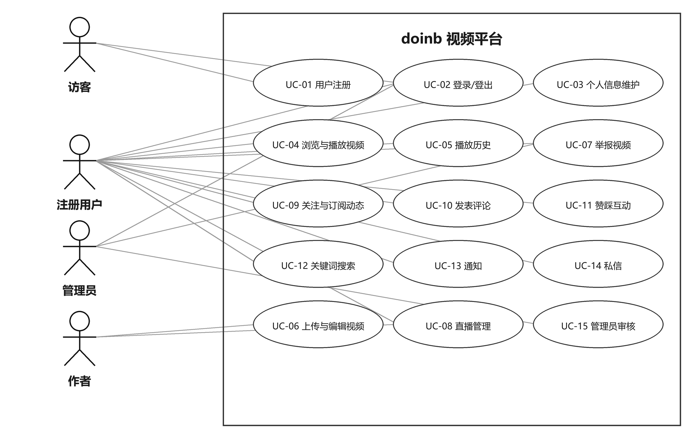

*图 3-1 系统用例图*

图中 4 类参与者（访客 A1 / 注册用户 A2 / 作者 A3 / 管理员 A4，定义见 3.1.2.2）与 15 个业务用例（UC-01～UC-15）的关联关系；用例编号与《需求追溯矩阵》保持一致，各用例说明见 3.1.2.3。

##### 3.1.2.2 参与者

**A1 - 访客**

| 项目 | 内容 |
|---|---|
| 参与者名称 | 访客 |
| 参与者ID | A1 |
| 描述 | 未注册或未登录的用户 |

| 功能需求 | 涉及用例 |
|---|---|
| 访客注册 | UC-01 |
| 访客登录 | UC-02 |

**A2 - 注册用户**

| 项目 | 内容 |
|---|---|
| 参与者名称 | 注册用户 |
| 参与者ID | A2 |
| 描述 | 已注册并登录的普通用户（新注册即具备发布权限） |

| 功能需求 | 涉及用例 |
|---|---|
| 登录/登出 | UC-02 |
| 个人信息维护 | UC-03 |
| 浏览与播放视频 | UC-04 |
| 播放历史 | UC-05 |
| 举报视频 | UC-07 |
| 关注与订阅动态 | UC-09 |
| 发表评论 | UC-10 |
| 赞踩互动 | UC-11 |
| 关键词搜索 | UC-12 |
| 通知 | UC-13 |
| 私信 | UC-14 |

**A3 - 作者（发布者）**

| 项目 | 内容 |
|---|---|
| 参与者名称 | 作者（发布者） |
| 参与者ID | A3 |
| 描述 | 具备发布权限的登录用户（role=1） |

| 功能需求 | 涉及用例 |
|---|---|
| 上传与编辑视频 | UC-06 |
| 直播管理 | UC-08 |

**A4 - 管理员**

| 项目 | 内容 |
|---|---|
| 参与者名称 | 管理员 |
| 参与者ID | A4 |
| 描述 | 管理该系统后台的人员（role=2） |

| 功能需求 | 涉及用例 |
|---|---|
| 登录/登出 | UC-02 |
| 举报复审 | UC-07、UC-15 |
| 管理员审核 | UC-15 |

##### 3.1.2.3 相关用例

用例编号组织方式：`UC-` + 两位十进制数，与《需求追溯矩阵》一致（UC-01～UC-15）。一个业务场景（用例）指由一类用户触发、为完成一个明确业务目标、从开始到产生可验证结果的一段完整流程。单个页面、按钮或接口不单独算用例。每个用例包含主成功流程、备选流程和异常流程，并给出系统顺序图与系统操作合约。

---

**UC-01 用户注册**

| 项目 | 内容 |
|---|---|
| 用例名称 | 用户注册 |
| 用例编号 | UC-01 |
| 需求ID | REQ-01 |
| 关联子系统 | M1 用户与权限管理 |
| 关联操作 | OP-002 `POST /user/account/register` |
| 参与者 | 访客 |
| 用例描述 | 访客填写账号密码，系统校验并创建用户 |
| 触发器 | 访客在登录页点击“立即注册”并提交注册信息 |
| 前置条件 | 系统正常运行；当前无登录态；用户名未被占用 |
| 后置条件 | 系统中创建了新的账号信息；提示注册成功 |

**基本事件流**

1. （用户）访客点击注册按钮。
2. （系统）系统展示注册界面。
3. （用户）访客填写用户名、密码、昵称并提交。
4. （系统）系统校验格式与用户名唯一性，通过后写入用户数据并提示注册成功。

**扩展事件流**

- （异常处理）4a、用户名已存在  
  （系统）1、提示注册冲突，停留在注册页等待修改。
- （异常处理）4b、格式不合法（用户名为空、密码过短等）  
  （系统）1、在相应输入框旁提示，不创建账号。

**补充约束**

1. 访客输入的密码应以星号等方式隐藏。
2. 密码在服务端以哈希存储，不以明文保存或回显。

**系统顺序图：**

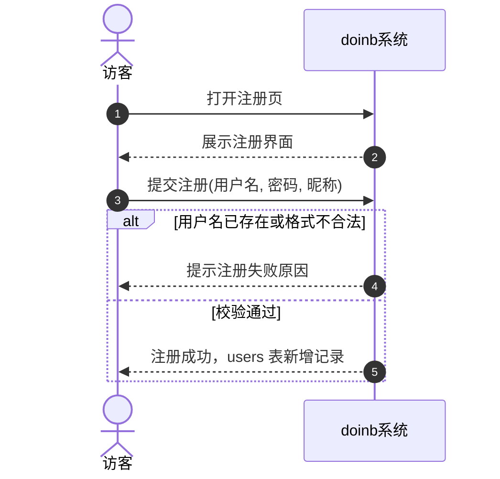
```mermaid
sequenceDiagram
    autonumber
    actor G as 访客
    participant S as doinb系统

    G->>S: 打开注册页
    S-->>G: 展示注册界面
    G->>S: 提交注册(用户名, 密码, 昵称)
    alt 用户名已存在或格式不合法
        S-->>G: 提示注册失败原因
    else 校验通过
        S-->>G: 注册成功，users 表新增记录
    end
```

**系统操作合约：**

**CompleteRegister(username, password, nickname)**

- 操作签名：CompleteRegister(username, password, nickname)
- 交叉引用：UC-01 用户注册
- 前置条件：系统处于未登录状态，当前为注册界面
- 后置条件：系统创建 User 实例并写入 users 表；提示注册成功

---

**UC-02 用户登录/登出**

| 项目 | 内容 |
|---|---|
| 用例名称 | 用户登录/登出 |
| 用例编号 | UC-02 |
| 需求ID | REQ-02 |
| 关联子系统 | M1 用户与权限管理 |
| 关联操作 | OP-003 `POST /user/account/login`；OP-004 `POST /admin/account/login`；OP-005 `GET /user/personal/info`；OP-006 `GET /user/account/logout` |
| 参与者 | 访客、注册用户、管理员 |
| 用例描述 | 校验凭据并签发 JWT；登出使会话失效 |
| 触发器 | 用户或管理员在登录页提交账号密码；或已登录用户点击退出 |
| 前置条件 | 登录时系统中已存在相应账号；登出时当前为已登录状态 |
| 后置条件 | 登录成功后进入已登录态并按角色展示入口；登出后回到未登录态 |

**基本事件流**

1. （用户）访客填写账号和密码并点击登录。
2. （系统）系统校验凭据，签发 JWT，前端保存令牌进入已登录态，按 role 展示导航。
3. （用户）用户可请求当前个人信息以确认登录态。
4. （用户）用户或管理员点击退出登录。
5. （系统）系统使令牌失效，返回未登录状态。

**扩展事件流**

- （可选）1a、管理员使用管理员登录入口  
  （系统）1、校验通过后进入管理后台权限。
- （异常处理）2a、账号或密码错误  
  （系统）1、给出明确失败提示（不泄露具体是哪一项错误），中止登录。
- （异常处理）2b、令牌过期后访问需鉴权接口  
  （系统）1、返回 401，前端引导重新登录。
- （可选）4a、用户取消退出  
  （系统）1、保持已登录状态。

**补充约束**

1. 密码输入应以星号等方式隐藏。
2. 支持本地多账号切换：当前标签页可保存多个令牌，活跃账号互不覆盖。

**系统顺序图：**

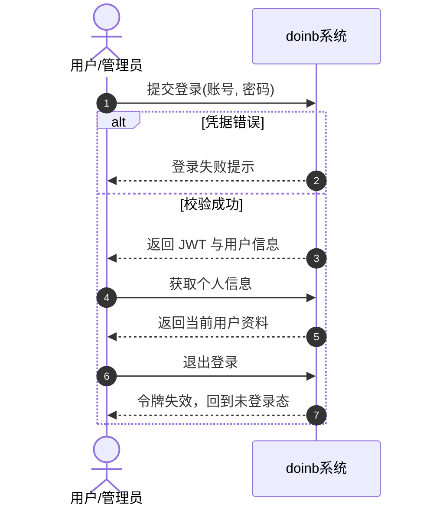
```mermaid
sequenceDiagram
    autonumber
    actor U as 用户/管理员
    participant S as doinb系统

    U->>S: 提交登录(账号, 密码)
    alt 凭据错误
        S-->>U: 登录失败提示
    else 校验成功
        S-->>U: 返回 JWT 与用户信息
        U->>S: 获取个人信息
        S-->>U: 返回当前用户资料
        U->>S: 退出登录
        S-->>U: 令牌失效，回到未登录态
    end
```

**系统操作合约：**

**CompleteLogin(account, password)**

- 操作签名：CompleteLogin(account, password)
- 交叉引用：UC-02 用户登录/登出
- 前置条件：系统中已存在相应账号，当前为登录界面
- 后置条件：系统进入已登录状态；签发 JWT；按 role 展示功能入口

**Logout()**

- 操作签名：Logout()
- 交叉引用：UC-02 用户登录/登出
- 前置条件：用户已登录（持有有效 Token）
- 后置条件：令牌失效并回到未登录态

---

**UC-03 个人信息维护**

| 项目 | 内容 |
|---|---|
| 用例名称 | 个人信息维护 |
| 用例编号 | UC-03 |
| 需求ID | REQ-03 |
| 关联子系统 | M1 用户与权限管理 |
| 关联操作 | OP-005 `GET /user/personal/info`；OP-007 `GET /user/info/get-one`；OP-008 `POST /user/info/update`；OP-009 `POST /user/avatar/upload` |
| 参与者 | 登录用户 |
| 用例描述 | 查看或修改昵称、头像、简介 |
| 触发器 | 用户进入个人中心点击保存资料或上传头像 |
| 前置条件 | 用户已登录（持有有效 Token） |
| 后置条件 | 系统中该用户的昵称、简介或头像已更新，刷新后仍保持 |

**基本事件流**

1. （用户）用户进入个人中心或他人公开主页。
2. （系统）系统返回对应用户资料（头像、昵称、简介）。
3. （用户）用户修改昵称、简介并保存，或选择本地图片上传头像。
4. （系统）系统校验后更新 users 表并返回最新资料。

**扩展事件流**

- （可选）3a、用户取消修改  
  （系统）1、丢弃未保存内容，展示修改前信息。
- （异常处理）3b、非法输入（超长、非法字符）  
  （系统）1、提示并拒绝保存。
- （异常处理）3c、未登录调用更新接口  
  （系统）1、返回 401。
- （异常处理）4a、头像格式不符或上传失败  
  （系统）1、提示失败，保留原头像。

**补充约束**

1. 对于 95% 的设备，应在 3.0 秒内完成个人中心页面切换。
2. 仅本人可修改自己的资料；公开主页仅展示公开字段。

**系统顺序图：**

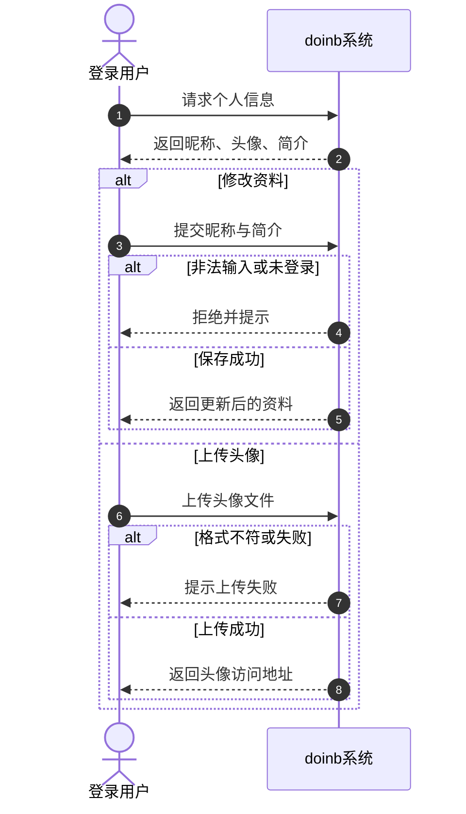
```mermaid
sequenceDiagram
    autonumber
    actor U as 登录用户
    participant S as doinb系统

    U->>S: 请求个人信息
    S-->>U: 返回昵称、头像、简介
    alt 修改资料
        U->>S: 提交昵称与简介
        alt 非法输入或未登录
            S-->>U: 拒绝并提示
        else 保存成功
            S-->>U: 返回更新后的资料
        end
    else 上传头像
        U->>S: 上传头像文件
        alt 格式不符或失败
            S-->>U: 提示上传失败
        else 上传成功
            S-->>U: 返回头像访问地址
        end
    end
```

**系统操作合约：**

**ViewOwnInformation()**

- 操作签名：ViewOwnInformation()
- 交叉引用：UC-03 个人信息维护
- 前置条件：用户已登录
- 后置条件：返回当前用户资料

**UpdateProfile(info) / UploadAvatar(file)**

- 操作签名：UpdateProfile(info)；UploadAvatar(file)
- 交叉引用：UC-03 个人信息维护
- 前置条件：用户已登录；输入合法
- 后置条件：users 表对应用户资料或头像路径已更新

---

**UC-04 浏览与播放视频**

| 项目 | 内容 |
|---|---|
| 用例名称 | 浏览与播放视频 |
| 用例编号 | UC-04 |
| 需求ID | REQ-04 |
| 关联子系统 | M2 视频浏览与播放 |
| 关联操作 | OP-010 `GET /video/list`；OP-011 `GET /video/getone` |
| 参与者 | 用户 |
| 用例描述 | 浏览已发布视频列表、进入详情并在线播放 |
| 触发器 | 用户打开首页或从搜索/订阅动态进入视频详情页并发起播放 |
| 前置条件 | 目标视频状态为已发布（或为本人视频） |
| 后置条件 | 用户获得播放地址并可暂停、调节进度 |

**基本事件流**

1. （用户）用户打开首页。
2. （系统）系统返回已发布视频列表（封面、标题、作者等）。
3. （用户）用户点击进入视频详情页并播放。
4. （系统）系统加载视频元数据、播放地址及赞踩汇总，播放器支持暂停、进度调节。

**扩展事件流**

- （可选）2a、列表无数据  
  （系统）1、展示空状态。
- （异常处理）3a、视频不存在或已下架  
  （系统）1、提示无法播放。
- （异常处理）4a、网络或加载异常  
  （系统）1、给出可理解的错误提示，不影响其他功能。

**补充约束**

1. 对于 95% 的设备，应在 3.0 秒内完成列表页切换。
2. 仅已发布视频（或作者本人视频）可被公开播放。

**系统顺序图：**

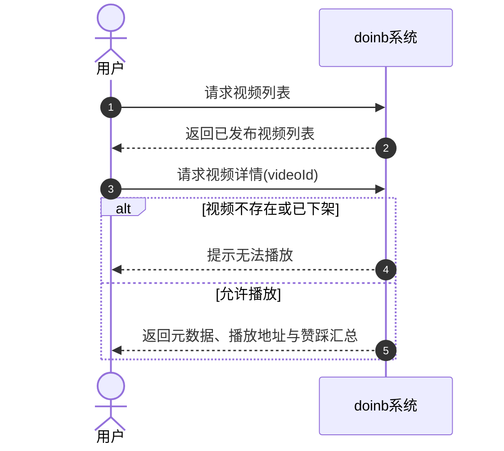
```mermaid
sequenceDiagram
    autonumber
    actor U as 用户
    participant S as doinb系统

    U->>S: 请求视频列表
    S-->>U: 返回已发布视频列表
    U->>S: 请求视频详情(videoId)
    alt 视频不存在或已下架
        S-->>U: 提示无法播放
    else 允许播放
        S-->>U: 返回元数据、播放地址与赞踩汇总
    end
```

**系统操作合约：**

**ListPublishedVideos(page)**

- 操作签名：ListPublishedVideos(page)
- 交叉引用：UC-04 浏览与播放视频
- 前置条件：系统正常运行
- 后置条件：返回已发布视频的分页列表

**PlayVideo(videoId)**

- 操作签名：PlayVideo(videoId)
- 交叉引用：UC-04 浏览与播放视频
- 前置条件：目标视频可访问
- 后置条件：返回元数据与播放地址

---

**UC-05 播放历史**

| 项目 | 内容 |
|---|---|
| 用例名称 | 播放历史 |
| 用例编号 | UC-05 |
| 需求ID | REQ-05 |
| 关联子系统 | M2 视频浏览与播放 |
| 关联操作 | OP-012 `POST /video/history/progress`；OP-013 `GET /video/history/list` |
| 参与者 | 登录用户 |
| 用例描述 | 保存播放进度并查询历史，支持续播 |
| 触发器 | 用户播放视频时上报进度，或进入个人中心查看历史 |
| 前置条件 | 用户已登录 |
| 后置条件 | play_history 存在记录，历史页可见且进度正确 |

**基本事件流**

1. （用户）用户在播放过程中产生进度变化。
2. （系统）系统写入或更新该用户对该视频的播放进度。
3. （用户）用户打开播放历史页。
4. （系统）系统返回历史列表（封面、标题、进度），用户可从上次进度续播。

**扩展事件流**

- （可选）3a、历史无数据  
  （系统）1、展示空状态。
- （异常处理）1a、未登录上报进度  
  （系统）1、返回 401，不写入历史。
- （异常处理）2a、视频不存在  
  （系统）1、拒绝写入。

**补充约束**

1. 同一用户对同一视频仅保留一条最新进度记录。
2. 历史列表应按最近观看时间排序。

**系统顺序图：**

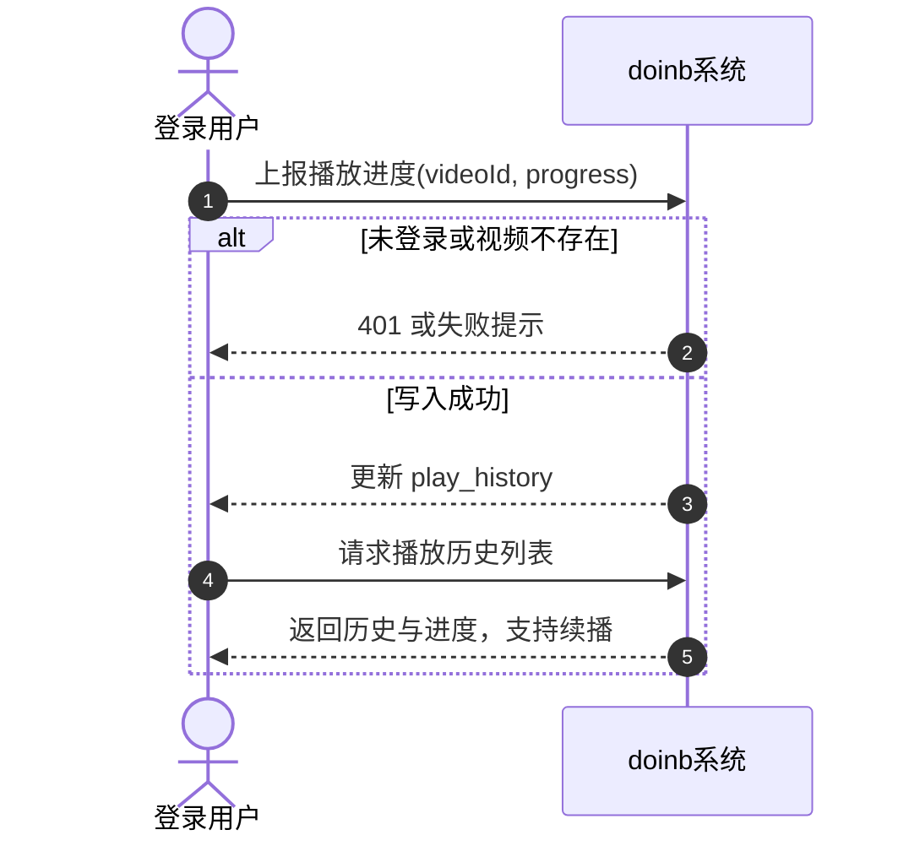
```mermaid
sequenceDiagram
    autonumber
    actor U as 登录用户
    participant S as doinb系统

    U->>S: 上报播放进度(videoId, progress)
    alt 未登录或视频不存在
        S-->>U: 401 或失败提示
    else 写入成功
        S-->>U: 更新 play_history
        U->>S: 请求播放历史列表
        S-->>U: 返回历史与进度，支持续播
    end
```

**系统操作合约：**

**ReportProgress(videoId, progress)**

- 操作签名：ReportProgress(videoId, progress)
- 交叉引用：UC-05 播放历史
- 前置条件：用户已登录；目标视频可访问
- 后置条件：play_history 插入或更新进度

**ListHistory()**

- 操作签名：ListHistory()
- 交叉引用：UC-05 播放历史
- 前置条件：用户已登录
- 后置条件：返回该用户播放历史列表

---

**UC-06 上传与编辑视频**

| 项目 | 内容 |
|---|---|
| 用例名称 | 上传与编辑视频 |
| 用例编号 | UC-06 |
| 需求ID | REQ-06 |
| 关联子系统 | M2 视频浏览与播放、M10 管理员审核 |
| 关联操作 | OP-014 `POST /video/upload`；OP-015 `GET /video/my/list`；OP-016 `POST /video/update`；OP-017 `POST /video/visibility` |
| 参与者 | 发布者 |
| 用例描述 | 上传视频、修改元数据与可见性；新上传进入待审核 |
| 触发器 | 作者在创作中心上传页提交视频，或编辑已有稿件 |
| 前置条件 | 作者已登录且具备发布权限；视频文件不超过 500MB 且格式符合要求 |
| 后置条件 | 新稿件进入待审核；编辑后详情与创作中心列表一致；仅自己可见的视频不出现在公开列表 |

**基本事件流**

1. （用户）作者选择视频文件与封面，填写标题、简介、可见性后提交。
2. （系统）系统校验通过后将文件保存至存储目录，写入视频元数据（状态=待审核），创作中心列表出现该稿件。
3. （用户）作者可查看自己的稿件列表，修改标题、简介、封面或切换可见性。
4. （系统）系统保存修改；若改为仅自己可见，则公开列表不再展示。

**扩展事件流**

- （异常处理）2a、文件超限或格式不符  
  （系统）1、提交被拒绝并给出原因。
- （异常处理）1a、未授权账号调用上传接口  
  （系统）1、返回 401/403。
- （可选）3a、作者删除自己的稿件  
  （系统）1、稿件不再出现在列表与公开页。

**补充约束**

1. 新上传视频默认 status=待审核，不得直接进入公开列表。
2. 单文件大小上限 500MB。

**系统顺序图：**

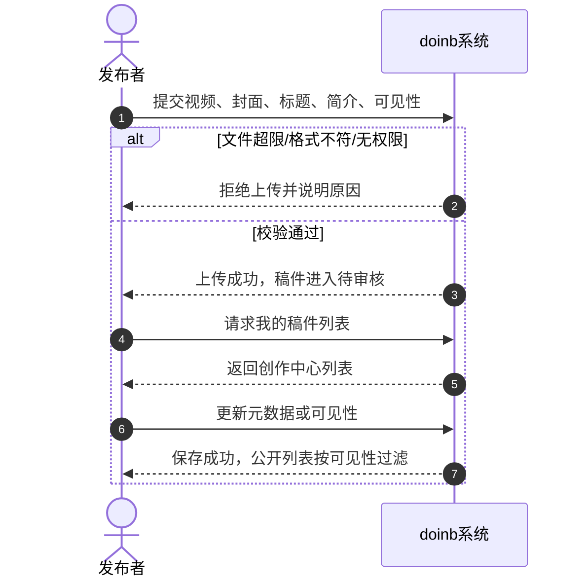
```mermaid
sequenceDiagram
    autonumber
    actor P as 发布者
    participant S as doinb系统

    P->>S: 提交视频、封面、标题、简介、可见性
    alt 文件超限/格式不符/无权限
        S-->>P: 拒绝上传并说明原因
    else 校验通过
        S-->>P: 上传成功，稿件进入待审核
        P->>S: 请求我的稿件列表
        S-->>P: 返回创作中心列表
        P->>S: 更新元数据或可见性
        S-->>P: 保存成功，公开列表按可见性过滤
    end
```

**系统操作合约：**

**PublishVideo(file, cover, title, description, visibility)**

- 操作签名：PublishVideo(file, cover, title, description, visibility)
- 交叉引用：UC-06 上传与编辑视频
- 前置条件：作者已登录且具备发布权限
- 后置条件：存储目录新增媒体文件；videos 表新增记录且状态为待审核

**UpdateVideo(videoId, info) / SetVisibility(videoId, visibility)**

- 操作签名：UpdateVideo(videoId, info)；SetVisibility(videoId, visibility)
- 交叉引用：UC-06 上传与编辑视频
- 前置条件：作者已登录且为稿件所有者
- 后置条件：视频元数据或可见性已更新

---

**UC-07 举报视频**

| 项目 | 内容 |
|---|---|
| 用例名称 | 举报视频 |
| 用例编号 | UC-07 |
| 需求ID | REQ-07 |
| 关联子系统 | M2 视频浏览与播放、M10 管理员审核 |
| 关联操作 | OP-018 `POST /video/report`；OP-043 `GET /admin/video/report-review` |
| 参与者 | 登录用户、管理员 |
| 用例描述 | 登录用户提交举报，管理员在复审列表查看并处置 |
| 触发器 | 用户在视频详情页点击举报提交；或管理员进入举报复审页 |
| 前置条件 | 举报人已登录且目标视频存在；管理员为 role=2 |
| 后置条件 | video_reports 新增记录；管理员处置后视频可见状态与处置一致 |

**基本事件流**

1. （用户）用户对违规视频提交举报。
2. （系统）系统写入举报记录并提示已受理。
3. （用户）管理员在后台查看举报列表，预览被举报视频。
4. （用户）管理员复审处置：维持现状或对视频执行删除/下架。
5. （系统）举报与处置记录留存可查。

**扩展事件流**

- （异常处理）1a、目标视频已被删除  
  （系统）1、提示无法举报。
- （异常处理）1b、举报信息不完整或未登录  
  （系统）1、拒绝提交。
- （异常处理）3a、非管理员访问复审接口  
  （系统）1、返回 403。

**补充约束**

1. 复审接口仅 role=2 可调用。
2. 处置操作须留痕，便于追溯。

**系统顺序图：**

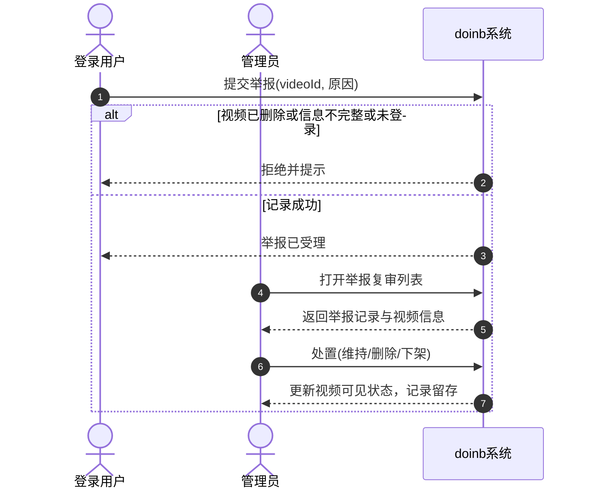
```mermaid
sequenceDiagram
    autonumber
    actor U as 登录用户
    actor A as 管理员
    participant S as doinb系统

    U->>S: 提交举报(videoId, 原因)
    alt 视频已删除或信息不完整或未登录
        S-->>U: 拒绝并提示
    else 记录成功
        S-->>U: 举报已受理
        A->>S: 打开举报复审列表
        S-->>A: 返回举报记录与视频信息
        A->>S: 处置(维持/删除/下架)
        S-->>A: 更新视频可见状态，记录留存
    end
```

**系统操作合约：**

**ReportVideo(videoId, reason)**

- 操作签名：ReportVideo(videoId, reason)
- 交叉引用：UC-07 举报视频
- 前置条件：举报人已登录；目标视频存在
- 后置条件：video_reports 新增一条待复审记录

**HandleReport(reportId, action)**

- 操作签名：HandleReport(reportId, action)
- 交叉引用：UC-07 举报视频
- 前置条件：管理员已登录；举报记录存在
- 后置条件：举报状态更新；若处置视频则 videos 状态与公开可见性一致

---

**UC-08 直播管理**

| 项目 | 内容 |
|---|---|
| 用例名称 | 直播管理 |
| 用例编号 | UC-08 |
| 需求ID | REQ-08 |
| 关联子系统 | M7 直播 |
| 关联操作 | OP-029 `POST /live/create`；OP-030 `POST /live/start`；OP-031 `POST /live/stop`；OP-032 `GET /live/list`；OP-033 `GET /live/getone` |
| 参与者 | 主播、注册用户（观众） |
| 用例描述 | 创建房间、开播、停播、观看 |
| 触发器 | 作者在创作中心创建直播间并开播；观众打开直播列表 |
| 前置条件 | 作者已登录；直播间标题等信息填写完整 |
| 后置条件 | 直播间创建/开播/停播状态流转正确并体现在列表 |

**基本事件流**

1. （用户）作者创建直播间。
2. （系统）系统写入直播间数据（初始为未开播）。
3. （用户）作者执行开播。
4. （系统）直播间状态变为直播中，公开列表可见。
5. （用户）观众在直播列表查看进行中的直播间并进入直播间页，查看房间信息。
6. （用户）作者停播。
7. （系统）房间状态更新。

**扩展事件流**

- （异常处理）5a、直播间不存在或已结束  
  （系统）1、进入时明确提示。
- （可选）5b、直播画面依赖外部推流工具与 SRS，观众端画面在本版本为演示占位（不计入核心验收）。
- （可选）5c、未开播状态下观众进入  
  （系统）1、按实际设计提示房间未开播。

**补充约束**

1. 开播/停播仅直播间创建者（或管理员）可执行。
2. 本场直播评论见 UC-10，不在本用例展开。

**系统顺序图：**

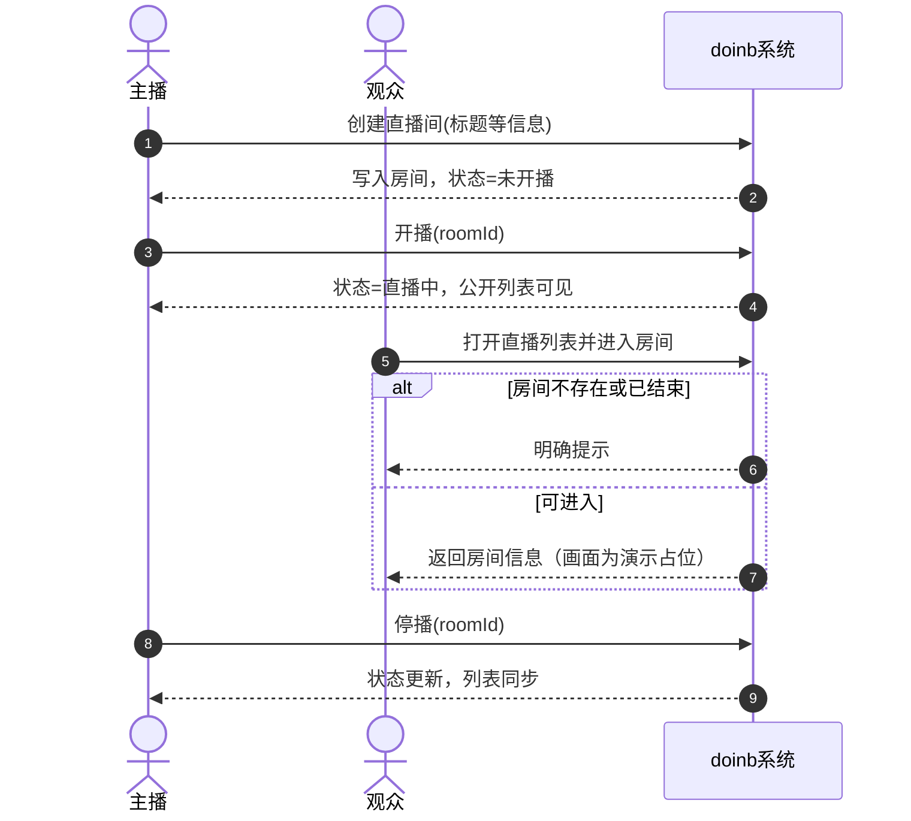
```mermaid
sequenceDiagram
    autonumber
    actor P as 主播
    actor V as 观众
    participant S as doinb系统

    P->>S: 创建直播间(标题等信息)
    S-->>P: 写入房间，状态=未开播
    P->>S: 开播(roomId)
    S-->>P: 状态=直播中，公开列表可见
    V->>S: 打开直播列表并进入房间
    alt 房间不存在或已结束
        S-->>V: 明确提示
    else 可进入
        S-->>V: 返回房间信息（画面为演示占位）
    end
    P->>S: 停播(roomId)
    S-->>P: 状态更新，列表同步
```

**系统操作合约：**

**CreateLiveRoom(info) / StartLive(roomId) / StopLive(roomId)**

- 操作签名：CreateLiveRoom(info)；StartLive(roomId)；StopLive(roomId)
- 交叉引用：UC-08 直播管理
- 前置条件：作者已登录；房间信息完整
- 后置条件：live_rooms 状态按未开播→直播中→结束流转

**JoinLive(roomId)**

- 操作签名：JoinLive(roomId)
- 交叉引用：UC-08 直播管理
- 前置条件：房间可进入
- 后置条件：返回房间信息

---

**UC-09 关注与订阅动态**

| 项目 | 内容 |
|---|---|
| 用例名称 | 关注与订阅动态 |
| 用例编号 | UC-09 |
| 需求ID | REQ-09 |
| 关联子系统 | M5 关注订阅 |
| 关联操作 | OP-024 `POST /subscription/follow`；OP-025 `POST /subscription/unfollow`；OP-026 `GET /subscription/status`；OP-027 `GET /subscription/feed` |
| 参与者 | 登录用户 |
| 用例描述 | 关注/取消关注作者，并查看订阅 Feed |
| 触发器 | 用户在他人公开主页或视频页点击“关注”按钮 |
| 前置条件 | 已登录；目标用户存在 |
| 后置条件 | 关注后其新视频出现在订阅动态页；取消后不再出现；subscriptions 状态正确 |

**基本事件流**

1. （用户）用户查询与某作者的关注状态并点击关注。
2. （系统）系统写入订阅关系，按钮状态变为已关注。
3. （用户）用户打开订阅动态页。
4. （系统）系统按关注列表聚合展示被关注作者的最新视频并分页。
5. （用户）用户可取消关注。
6. （系统）系统删除订阅关系并刷新状态。

**扩展事件流**

- （异常处理）1a、目标用户不存在  
  （系统）1、提示失败。
- （异常处理）1b、并发重复点击关注/取消  
  （系统）1、以最终一致状态为准，避免重复提示。
- （异常处理）1c、未登录  
  （系统）1、返回 401，引导登录。

**补充约束**

1. 用户不能关注不存在的账号。
2. 订阅动态仅聚合已关注作者的已发布内容。

**系统顺序图：**

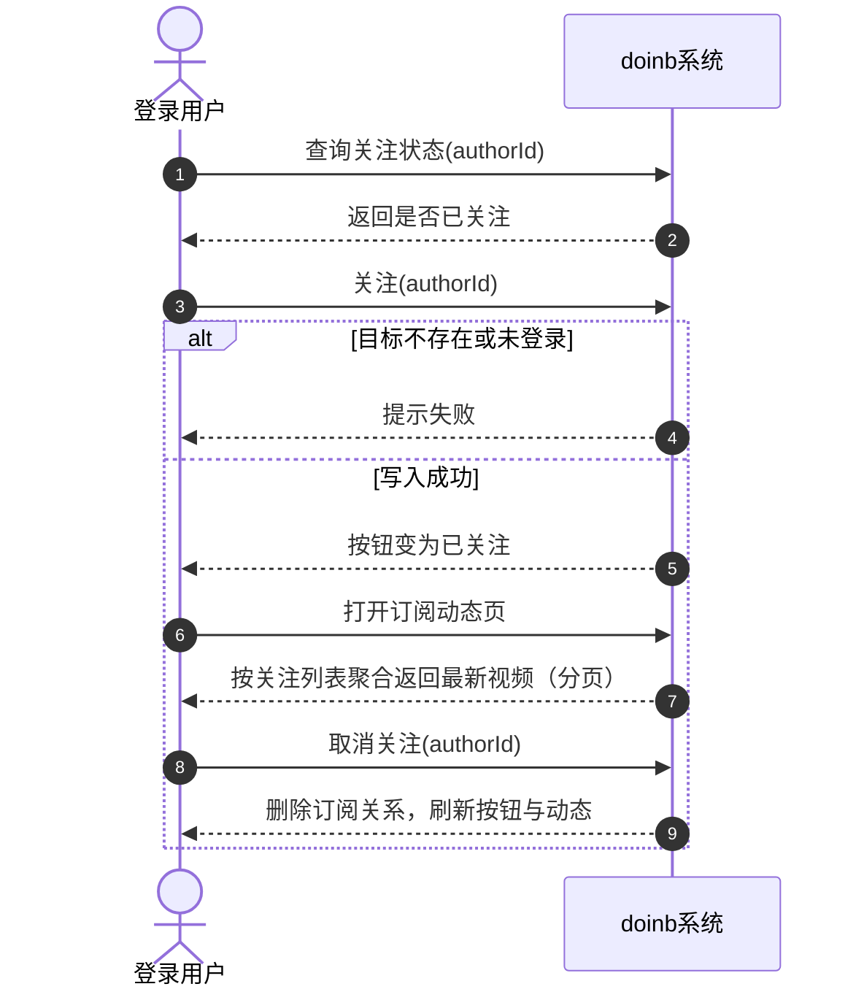
```mermaid
sequenceDiagram
    autonumber
    actor U as 登录用户
    participant S as doinb系统

    U->>S: 查询关注状态(authorId)
    S-->>U: 返回是否已关注
    U->>S: 关注(authorId)
    alt 目标不存在或未登录
        S-->>U: 提示失败
    else 写入成功
        S-->>U: 按钮变为已关注
        U->>S: 打开订阅动态页
        S-->>U: 按关注列表聚合返回最新视频（分页）
        U->>S: 取消关注(authorId)
        S-->>U: 删除订阅关系，刷新按钮与动态
    end
```

**系统操作合约：**

**Subscribe(authorId) / Unsubscribe(authorId)**

- 操作签名：Subscribe(authorId)；Unsubscribe(authorId)
- 交叉引用：UC-09 关注与订阅动态
- 前置条件：用户已登录；目标用户存在
- 后置条件：subscriptions 新增或删除对应关系

**ListFeed(page)**

- 操作签名：ListFeed(page)
- 交叉引用：UC-09 关注与订阅动态
- 前置条件：用户已登录
- 后置条件：返回关注作者最新已发布视频的分页列表

---

**UC-10 发表评论**

| 项目 | 内容 |
|---|---|
| 用例名称 | 发表评论 |
| 用例编号 | UC-10 |
| 需求ID | REQ-10 |
| 关联子系统 | M3 评论、M7 直播 |
| 关联操作 | OP-021 `POST /comment/add`；OP-022 `GET /comment/list` |
| 参与者 | 登录用户 |
| 用例描述 | 在视频或直播下发表评论并查看评论列表 |
| 触发器 | 用户在视频详情页或直播间提交评论 |
| 前置条件 | 已登录；目标视频或直播间存在 |
| 后置条件 | 新评论出现在对应评论列表；直播评论仅展示本场 |

**基本事件流**

1. （用户）用户打开视频详情或直播间，系统加载已有评论列表。
2. （用户）用户输入文字或选择表情图片提交评论。
3. （系统）系统写入评论数据并刷新评论列表。

**扩展事件流**

- （异常处理）2a、未登录  
  （系统）1、提示登录后再操作。
- （异常处理）2b、评论内容为空  
  （系统）1、拒绝提交。
- （异常处理）2c、目标已被删除  
  （系统）1、提示不存在。

**补充约束**

1. 不允许未登录用户发表评论。
2. 直播评论仅展示本场直播相关评论，不混入历史弹幕。

**系统顺序图：**

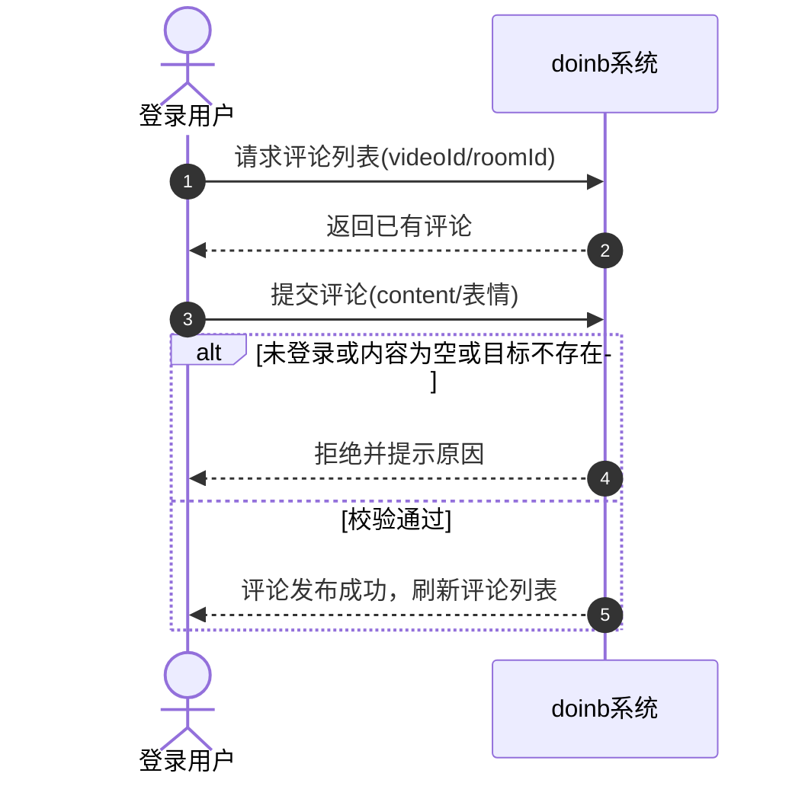
```mermaid
sequenceDiagram
    autonumber
    actor U as 登录用户
    participant S as doinb系统

    U->>S: 请求评论列表(videoId/roomId)
    S-->>U: 返回已有评论
    U->>S: 提交评论(content/表情)
    alt 未登录或内容为空或目标不存在
        S-->>U: 拒绝并提示原因
    else 校验通过
        S-->>U: 评论发布成功，刷新评论列表
    end
```

**系统操作合约：**

**ListComments(targetId)**

- 操作签名：ListComments(targetId)
- 交叉引用：UC-10 发表评论
- 前置条件：目标对象存在
- 后置条件：返回该对象的评论列表

**PostComment(targetId, content)**

- 操作签名：PostComment(targetId, content)
- 交叉引用：UC-10 发表评论
- 前置条件：用户已登录；目标视频或直播间存在；内容非空
- 后置条件：comments 表新增记录；评论列表包含该条

---

**UC-11 赞踩互动**

| 项目 | 内容 |
|---|---|
| 用例名称 | 赞踩互动 |
| 用例编号 | UC-11 |
| 需求ID | REQ-11 |
| 关联子系统 | M4 赞踩互动 |
| 关联操作 | OP-019 `GET /video/reaction/summary`；OP-020 `POST /video/reaction`；OP-023 `POST /comment/reaction` |
| 参与者 | 登录用户 |
| 用例描述 | 对视频或评论点赞或点踩，计数与本人状态同步 |
| 触发器 | 用户点击视频或评论的赞、踩按钮 |
| 前置条件 | 已登录；目标视频或评论存在 |
| 后置条件 | 赞踩状态与计数正确；被互动方可收到通知 |

**基本事件流**

1. （用户）用户查看视频赞踩汇总。
2. （用户）用户对视频点赞或点踩。
3. （系统）系统记录该用户对视频的反应状态并更新计数汇总。
4. （用户）用户对某条评论点赞或点踩。
5. （系统）系统记录状态、更新计数，必要时向被互动方推送通知。

**扩展事件流**

- （可选）2a、用户再次点击同一反应  
  （系统）1、取消或切换该反应，计数同步更新。
- （异常处理）2b、未登录  
  （系统）1、提示登录后再操作。
- （异常处理）4a、目标已被删除  
  （系统）1、提示不存在。

**补充约束**

1. 不允许未登录用户赞踩。
2. 同一用户对同一对象的赞/踩为互斥或可取消，计数须与本人状态一致。

**系统顺序图：**

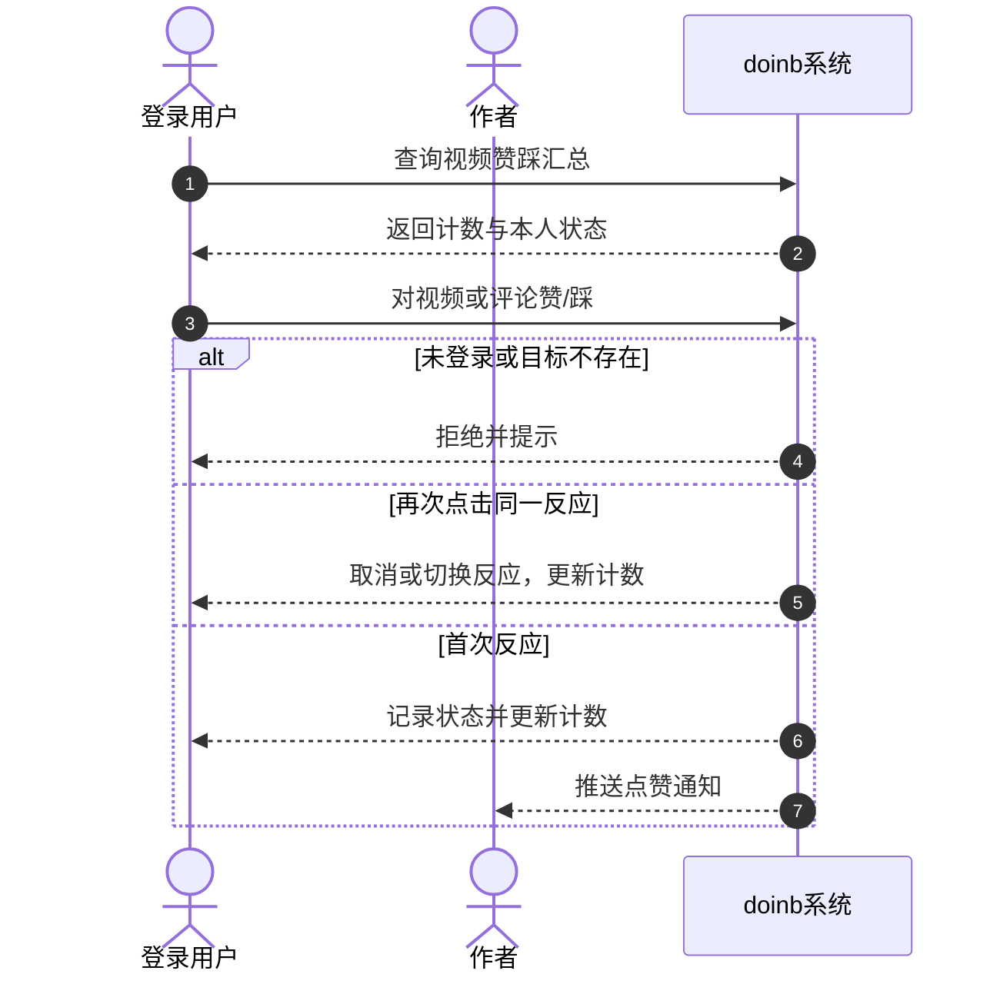
```mermaid
sequenceDiagram
    autonumber
    actor U as 登录用户
    actor P as 作者
    participant S as doinb系统

    U->>S: 查询视频赞踩汇总
    S-->>U: 返回计数与本人状态
    U->>S: 对视频或评论赞/踩
    alt 未登录或目标不存在
        S-->>U: 拒绝并提示
    else 再次点击同一反应
        S-->>U: 取消或切换反应，更新计数
    else 首次反应
        S-->>U: 记录状态并更新计数
        S-->>P: 推送点赞通知
    end
```

**系统操作合约：**

**React(targetType, targetId, type)**

- 操作签名：React(targetType, targetId, type)
- 交叉引用：UC-11 赞踩互动
- 前置条件：用户已登录；目标对象存在
- 后置条件：反应状态与计数更新；必要时写入 notifications

---

**UC-12 关键词搜索**

| 项目 | 内容 |
|---|---|
| 用例名称 | 关键词搜索 |
| 用例编号 | UC-12 |
| 需求ID | REQ-12 |
| 关联子系统 | M6 搜索 |
| 关联操作 | OP-028 `GET /search` |
| 参与者 | 用户 |
| 用例描述 | 按关键词检索视频、用户、直播 |
| 触发器 | 用户在顶部导航搜索框输入关键词并提交 |
| 前置条件 | 关键词非空 |
| 后置条件 | 按已发布视频标题关键词能搜到该视频并成功跳转详情页 |

**基本事件流**

1. （用户）用户输入关键词发起搜索。
2. （系统）服务端在视频标题、用户昵称、直播间标题等字段执行模糊匹配查询。
3. （系统）返回视频、用户、直播结果并分页展示。
4. （用户）用户点击结果跳转视频详情页、用户公开主页或直播间。

**扩展事件流**

- （异常处理）1a、关键词为空或含非法字符  
  （系统）1、提示并阻止搜索。
- （可选）3a、无匹配结果  
  （系统）1、展示空结果页。
- （异常处理）2a、查询超时  
  （系统）1、提示重试。

**补充约束**

1. 对于 95% 的搜索，应在 3 秒内返回搜索结果。
2. 搜索视频范围默认限于已发布内容。

**系统顺序图：**

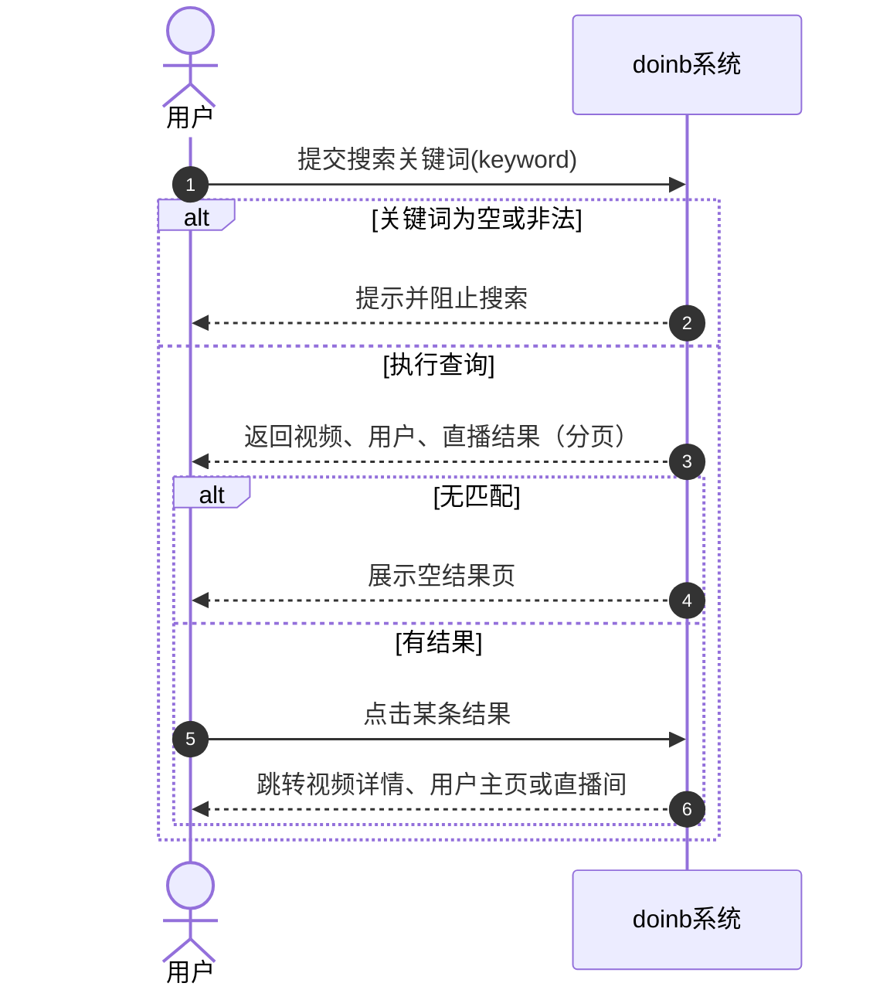
```mermaid
sequenceDiagram
    autonumber
    actor U as 用户
    participant S as doinb系统

    U->>S: 提交搜索关键词(keyword)
    alt 关键词为空或非法
        S-->>U: 提示并阻止搜索
    else 执行查询
        S-->>U: 返回视频、用户、直播结果（分页）
        alt 无匹配
            S-->>U: 展示空结果页
        else 有结果
            U->>S: 点击某条结果
            S-->>U: 跳转视频详情、用户主页或直播间
        end
    end
```

**系统操作合约：**

**Search(keyword, page)**

- 操作签名：Search(keyword, page)
- 交叉引用：UC-12 关键词搜索
- 前置条件：关键词非空
- 后置条件：返回匹配的视频、用户、直播列表

**OpenSearchResult(type, id)**

- 操作签名：OpenSearchResult(type, id)
- 交叉引用：UC-12 关键词搜索
- 前置条件：搜索结果页已展示
- 后置条件：进入对应视频详情、用户公开主页或直播间

---

**UC-13 通知**

| 项目 | 内容 |
|---|---|
| 用例名称 | 通知 |
| 用例编号 | UC-13 |
| 需求ID | REQ-13 |
| 关联子系统 | M8 通知 |
| 关联操作 | OP-034 `GET /notification/list`；OP-035 `GET /notification/unread-count`；OP-036 `POST /notification/read` |
| 参与者 | 登录用户 |
| 用例描述 | 查看通知列表、未读数，并将通知标记已读 |
| 触发器 | 他人点赞、私信或审核结果等系统事件产生通知后，用户打开通知栏 |
| 前置条件 | 用户已登录 |
| 后置条件 | 未读数随已读操作减少；列表展示点赞、私信、审核等类型通知 |

**基本事件流**

1. （系统）互动或审核等事件为接收方生成通知，未读数增加。
2. （用户）用户打开通知列表并查看未读数。
3. （系统）系统返回通知列表。
4. （用户）用户逐条或全部标记已读。
5. （系统）通知变为已读，未读数减少或清零。

**扩展事件流**

- （异常处理）2a、未登录  
  （系统）1、返回 401。
- （可选）4a、无可读通知  
  （系统）1、未读数保持为 0。

**补充约束**

1. 通知已读后未读数须立即减少。
2. 通知类型包括点赞、私信、审核结果等。

**系统顺序图：**

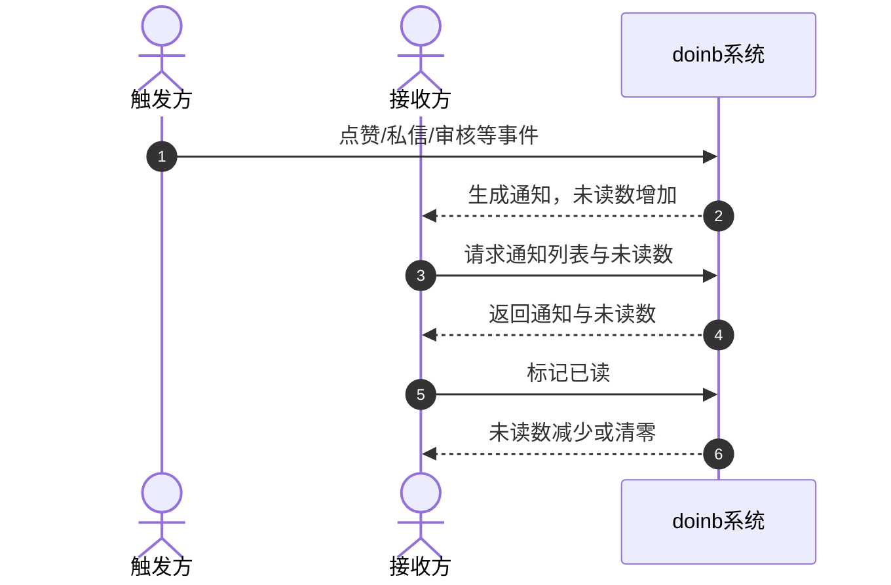
```mermaid
sequenceDiagram
    autonumber
    actor A as 触发方
    actor B as 接收方
    participant S as doinb系统

    A->>S: 点赞/私信/审核等事件
    S-->>B: 生成通知，未读数增加
    B->>S: 请求通知列表与未读数
    S-->>B: 返回通知与未读数
    B->>S: 标记已读
    S-->>B: 未读数减少或清零
```

**系统操作合约：**

**ListNotifications() / GetUnreadCount()**

- 操作签名：ListNotifications()；GetUnreadCount()
- 交叉引用：UC-13 通知
- 前置条件：用户已登录
- 后置条件：返回该用户通知列表与未读数量

**MarkNotificationRead(ids)**

- 操作签名：MarkNotificationRead(ids)
- 交叉引用：UC-13 通知
- 前置条件：用户已登录且拥有该通知
- 后置条件：通知已读且未读数更新

---

**UC-14 私信**

| 项目 | 内容 |
|---|---|
| 用例名称 | 私信 |
| 用例编号 | UC-14 |
| 需求ID | REQ-14 |
| 关联子系统 | M9 私信 |
| 关联操作 | OP-037 `POST /message/room/open`；OP-038 `GET /message/room/get`；OP-039 `POST /message/send` |
| 参与者 | 登录用户 |
| 用例描述 | 打开会话、发送与查看消息 |
| 触发器 | 用户在他人公开主页点击私信图标发起会话 |
| 前置条件 | 双方均已注册；发送方已登录；接收方账号存在 |
| 后置条件 | 双方在同一会话中能看到消息往返 |

**基本事件流**

1. （用户）发送方进入与对方的私信房间（无则自动创建）。
2. （系统）系统返回房间与历史消息。
3. （用户）发送消息。
4. （系统）系统写入私信数据并在会话中展示；接收方可查看并回复。

**扩展事件流**

- （异常处理）1a、未登录  
  （系统）1、返回 401，引导登录。
- （异常处理）1b、对方账号不存在  
  （系统）1、提示失败。
- （异常处理）3a、消息内容为空  
  （系统）1、拒绝发送。

**补充约束**

1. 私信房间按双方用户唯一确定，重复发起不重复建房。
2. 私信到达可触发 UC-13 通知。

**系统顺序图：**

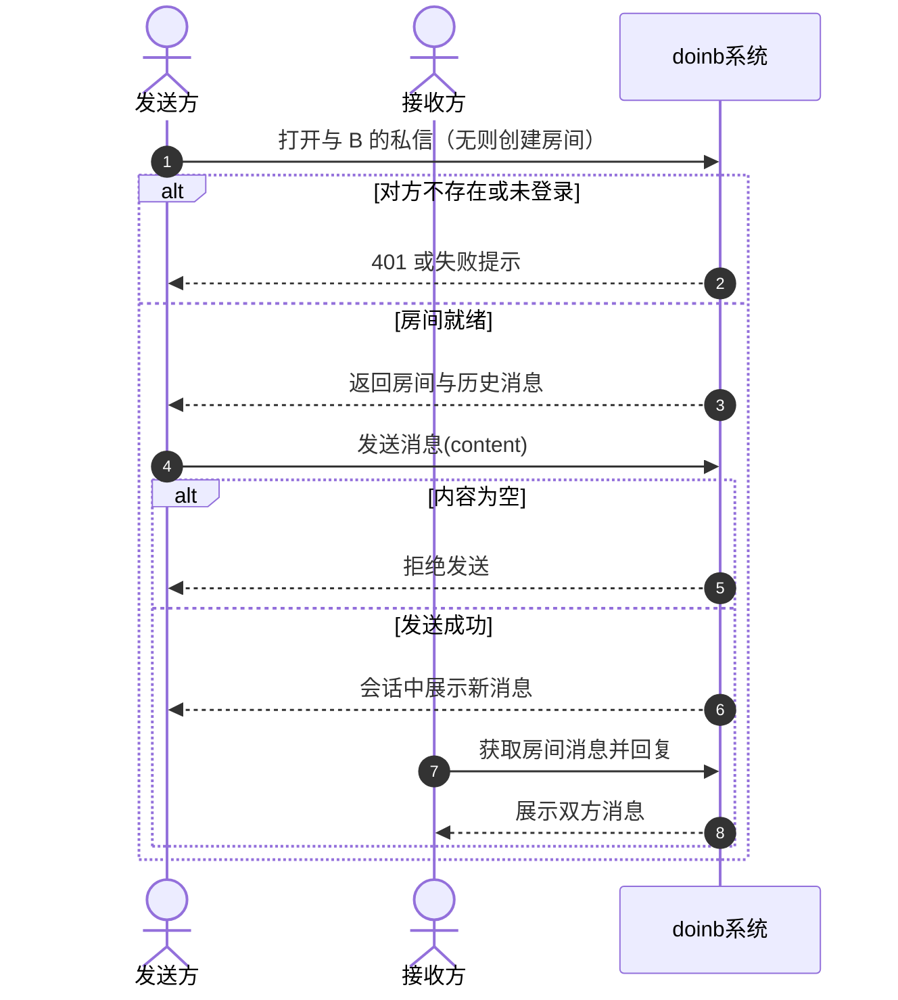
```mermaid
sequenceDiagram
    autonumber
    actor A as 发送方
    actor B as 接收方
    participant S as doinb系统

    A->>S: 打开与 B 的私信（无则创建房间）
    alt 对方不存在或未登录
        S-->>A: 401 或失败提示
    else 房间就绪
        S-->>A: 返回房间与历史消息
        A->>S: 发送消息(content)
        alt 内容为空
            S-->>A: 拒绝发送
        else 发送成功
            S-->>A: 会话中展示新消息
            B->>S: 获取房间消息并回复
            S-->>B: 展示双方消息
        end
    end
```

**系统操作合约：**

**OpenOrCreateRoom(peerUserId)**

- 操作签名：OpenOrCreateRoom(peerUserId)
- 交叉引用：UC-14 私信
- 前置条件：双方账号存在；发送方已登录
- 后置条件：存在唯一私信房间；返回房间与消息列表

**SendMessage(roomId, content)**

- 操作签名：SendMessage(roomId, content)
- 交叉引用：UC-14 私信
- 前置条件：用户已登录且属于该房间；内容非空
- 后置条件：dm_messages 新增记录

---

**UC-15 管理员审核**

| 项目 | 内容 |
|---|---|
| 用例名称 | 管理员审核 |
| 用例编号 | UC-15 |
| 需求ID | REQ-15 |
| 关联子系统 | M10 管理员审核 |
| 关联操作 | OP-040 `GET /admin/video/pending`；OP-041 `POST /admin/video/approve`；OP-042 `POST /admin/video/reject`；OP-043 `GET /admin/video/report-review`；OP-044 `POST /admin/video/delete` |
| 参与者 | 管理员 |
| 用例描述 | 查看待审列表，对视频执行通过、驳回或删除 |
| 触发器 | 管理员进入后台待审页面 |
| 前置条件 | 管理员已登录且 role=2；存在待审核或待处置视频 |
| 后置条件 | 通过后视频出现在公开列表；驳回后仅作者可见；删除后不可再公开访问；作者可收到审核结果通知 |

**基本事件流**

1. （用户）管理员打开待审列表并预览视频。
2. （系统）系统返回待审视频与播放信息。
3. （用户）管理员执行审核通过。
4. （系统）视频状态变为已发布，公开列表可见，并向作者推送审核结果通知。

**扩展事件流**

- （可选）3a、管理员驳回  
  （系统）1、视频转为仅作者可见并通知作者。
- （可选）3b、管理员删除视频  
  （系统）1、视频不可再公开访问。
- （异常处理）1a、非管理员访问  
  （系统）1、返回 403。

**补充约束**

1. 待审、通过、驳回、删除接口仅 role=2 可调用。
2. 新上传视频必须经过本用例审核后才能进入公开列表。

**系统顺序图：**

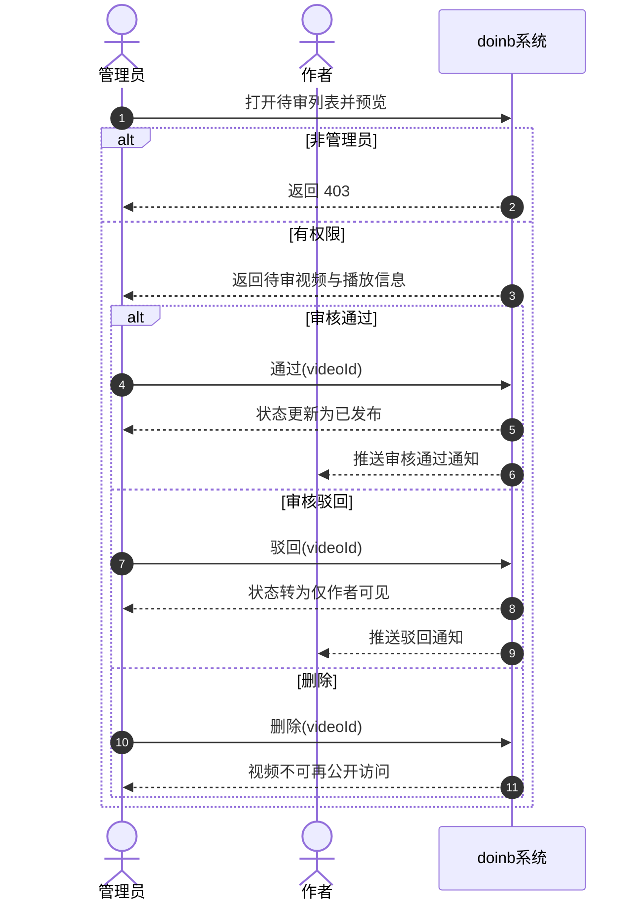
```mermaid
sequenceDiagram
    autonumber
    actor A as 管理员
    actor P as 作者
    participant S as doinb系统

    A->>S: 打开待审列表并预览
    alt 非管理员
        S-->>A: 返回 403
    else 有权限
        S-->>A: 返回待审视频与播放信息
        alt 审核通过
            A->>S: 通过(videoId)
            S-->>A: 状态更新为已发布
            S-->>P: 推送审核通过通知
        else 审核驳回
            A->>S: 驳回(videoId)
            S-->>A: 状态转为仅作者可见
            S-->>P: 推送驳回通知
        else 删除
            A->>S: 删除(videoId)
            S-->>A: 视频不可再公开访问
        end
    end
```

**系统操作合约：**

**ListPendingVideos()**

- 操作签名：ListPendingVideos()
- 交叉引用：UC-15 管理员审核
- 前置条件：管理员已登录
- 后置条件：返回待审核视频列表

**ReviewVideo(videoId, decision)**

- 操作签名：ReviewVideo(videoId, decision)
- 交叉引用：UC-15 管理员审核
- 前置条件：管理员已登录；目标视频处于待审核或可被处置
- 后置条件：通过则 status=已发布；驳回则仅作者可见；删除则不可公开访问；notifications 可新增审核结果

#### 3.1.3 领域模型

**概念类图**

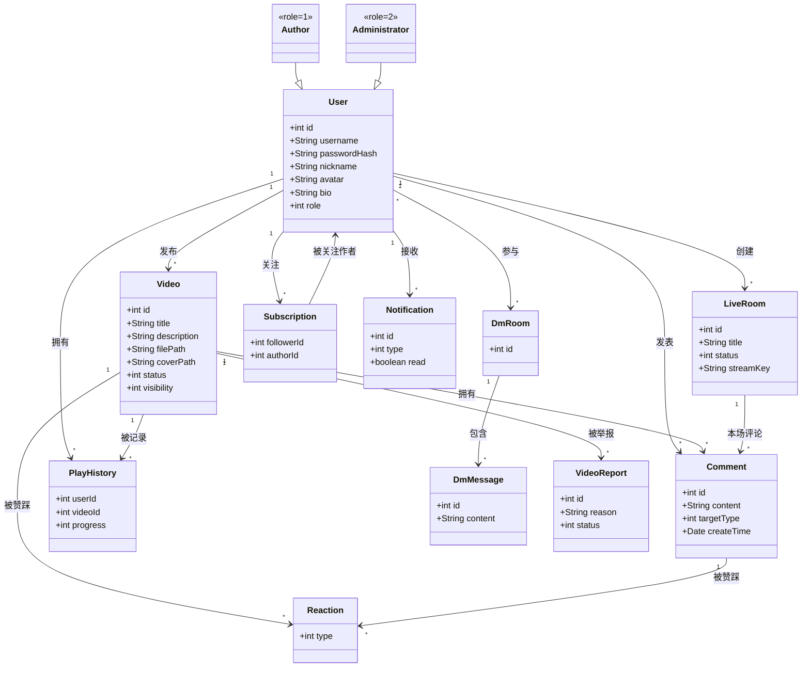
```mermaid
classDiagram
    class User {
        +int id
        +String username
        +String passwordHash
        +String nickname
        +String avatar
        +String bio
        +int role
    }
    class Video {
        +int id
        +String title
        +String description
        +String filePath
        +String coverPath
        +int status
        +int visibility
    }
    class Comment {
        +int id
        +String content
        +int targetType
        +Date createTime
    }
    class LiveRoom {
        +int id
        +String title
        +int status
        +String streamKey
    }
    class Subscription {
        +int followerId
        +int authorId
    }
    class PlayHistory {
        +int userId
        +int videoId
        +int progress
    }
    class Notification {
        +int id
        +int type
        +boolean read
    }
    class DmRoom {
        +int id
    }
    class DmMessage {
        +int id
        +String content
    }
    class VideoReport {
        +int id
        +String reason
        +int status
    }
    class Reaction {
        +int type
    }
    class Author {
        <<role=1>>
    }
    class Administrator {
        <<role=2>>
    }

    Author --|> User
    Administrator --|> User
    User "1" --> "*" Video : 发布
    User "1" --> "*" Comment : 发表
    User "1" --> "*" LiveRoom : 创建
    User "1" --> "*" Subscription : 关注
    Subscription --> User : 被关注作者
    User "1" --> "*" PlayHistory : 拥有
    User "1" --> "*" Notification : 接收
    User "*" --> "*" DmRoom : 参与
    DmRoom "1" --> "*" DmMessage : 包含
    Video "1" --> "*" Comment : 拥有
    Video "1" --> "*" PlayHistory : 被记录
    Video "1" --> "*" VideoReport : 被举报
    Video "1" --> "*" Reaction : 被赞踩
    Comment "1" --> "*" Reaction : 被赞踩
    LiveRoom "1" --> "*" Comment : 本场评论
```

*图 3-2 领域概念类图*

**相关实体**

**E1 - 用户 User**

| 属性名称 | 属性类型 | 属性描述 |
|---|---|---|
| id | int | 用户主键 |
| username | String | 登录用户名，唯一 |
| passwordHash | String | 密码哈希 |
| nickname | String | 昵称 |
| avatar | String | 头像路径 |
| bio | String | 简介 |
| role | int | 0 普通用户 / 1 作者 / 2 管理员 |

**E2 - 视频 Video**

| 属性名称 | 属性类型 | 属性描述 |
|---|---|---|
| id | int | 视频主键 |
| title | String | 标题 |
| description | String | 简介 |
| filePath | String | 视频文件路径 |
| coverPath | String | 封面路径 |
| status | int | 待审核 / 已发布 / 仅自己可见等 |
| visibility | int | 可见范围 |

**E3 - 评论 Comment**

| 属性名称 | 属性类型 | 属性描述 |
|---|---|---|
| id | int | 评论主键 |
| content | String | 评论文本或表情 |
| targetType | int | 视频评论 / 直播评论 |
| createTime | Date | 发表时间 |

**E4 - 直播间 LiveRoom**

| 属性名称 | 属性类型 | 属性描述 |
|---|---|---|
| id | int | 直播间主键 |
| title | String | 房间标题 |
| status | int | 未开播 / 直播中 / 已结束 |
| streamKey | String | 推流标识 |

**E5 - 订阅 Subscription、播放历史 PlayHistory、通知 Notification、私信 DmRoom/DmMessage、举报 VideoReport、反应 Reaction**

分别表达关注关系、观看进度、系统通知、私信会话、视频举报与赞踩状态，属性与《软件详细设计说明书》及数据库表结构一致。

### 3.2 对外接口需求

#### 3.2.1 用户界面

- 输入设备：键盘，鼠标。
- 输出设备：显示器。
- 输出格式：网页。
- 界面风格：用户界面友好，适配显示器比例，导航清晰，分区明确。
- 警告呈现：对于操作出现异常的情况，交互界面需要提示用户出错的信息。
- 主要页面：首页、视频详情、搜索、订阅动态、创作中心、直播列表与直播间、个人中心、私信、管理后台（待审、举报）。

#### 3.2.2 硬件接口

无。本系统不直接与专用硬件设备（如读卡器、传感器、打印机等）交互。客户端运行所需的标准输入/输出设备及网络设备由操作系统和浏览器管理。

#### 3.2.3 软件接口

- 操作系统：支持 Windows、Linux 等常用操作系统。
- 数据库：MySQL 8.0，通过 JDBC 访问。
- 对象存储/文件系统：视频、封面、头像保存于本地 `uploads/` 目录，经 HTTP 访问。
- 可选流媒体：SRS（RTMP/HLS），用于直播推流演示。

#### 3.2.4 通讯接口

- 通信协议：TCP/IP。
- 应用协议：HTTP/HTTPS，RESTful API。
- 鉴权：请求头 `Authorization` 携带 JWT（支持 Bearer 或直接 token）。
- 统一响应：`{ code, message, data }`，`code=200` 表示成功。

### 3.3 性能需求

#### 3.3.1 静态数值要求

- 支持的终端数量：课程演示与小组并发访问，不以全校规模为设计目标。
- 支持的并发用户数：满足小组并发演示与基本访问。
- 要处理的信息数量和类型：以文本、图片（封面/头像/表情）和视频文件为主。

#### 3.3.2 动态数值需求

- 对于 95% 的设备，应在 3.0 秒内完成页面切换。
- 对于 90% 的翻页点击，应在 2.0 秒内完成新页面的加载。
- 对于 90% 的页面更新（如发布评论、关注、标记已读等），应在 1 秒内处理。
- 对于 95% 的搜索，应在 3 秒内返回搜索结果。
- 数据的上传和下载时间：由网络状况和文件大小决定；视频上传上限 500MB。

### 3.4 设计约束

#### 3.4.1 标准合规性

- 为保证用户账号安全，密码须哈希存储，登录传输使用 HTTP 环境下的基本防护（部署阶段建议 HTTPS）。
- 未注册/未登录用户不得评论、赞踩、上传、私信。
- 新上传视频必须经过管理员审核后才能进入公开列表。

#### 3.4.2 硬件限制

暂无专用硬件限制。服务端建议 2 核 CPU、4GB 内存、20GB 以上存储。

### 3.5 软件系统属性

#### 3.5.1 可靠性

1. 交付前应进行充分的测试，包括单元测试、集成/API 测试、端到端测试。
2. 采用模块化开发、接口设计规范，达到高内聚低耦合。
3. 对常见异常（网络、鉴权、资源不存在）有明确提示，避免未处理崩溃导致数据明显损坏。

#### 3.5.2 可用性

1. 建立错误和异常处理机制，例如日志记录，以便排查。
2. 执行合理的备份和存储策略，确保用户、视频和评论等数据可恢复。
3. 在部署与课设演示时段内，系统可被正常访问与操作。

#### 3.5.3 安全

- 密码不以明文存储或回显。
- 需保留关键操作与错误日志。
- 按角色控制上传、审核、复审等敏感接口。
- 未授权访问返回 401/403，不泄露多余账号信息。

#### 3.5.4 可维护性

整个系统的各个功能高度模块化，实现清晰的模块接口。数据库表结构与用例编号可追溯，方便以后的系统维护。

#### 3.5.5 可移植性

服务端与数据层在常见 Web 与 MySQL 环境下可重新部署；客户端通过现代浏览器访问，不绑定单一专有客户端形态。

### 3.6 其他需求

#### 3.6.1 逻辑数据库要求

**用户信息**

- 使用频率：中等
- 应包含：用户 id（主键）、用户名（unique, not null）、密码哈希、昵称、头像、简介、角色

**视频信息**

- 使用频率：高
- 应包含：视频 id（主键）、作者 id（外键）、标题、简介、文件路径、封面、状态、可见性、创建时间

**评论、赞踩、订阅、播放历史、通知、私信、直播间、举报表**

- 字段与约束以满足 UC-01～UC-15 为准，详见《软件详细设计说明书》与 `database/database.sql`。

#### 3.6.2 需求的优先次序和关键程度

| 优先级 | 用例 | 说明 |
|---|---|---|
| 高 | UC-01、UC-02、UC-04、UC-06、UC-15 | 账号、播放、上传审核为系统主链路 |
| 高 | UC-03、UC-05、UC-09、UC-10、UC-11、UC-12 | 资料、历史、关注、评论赞踩、搜索为高频能力 |
| 中 | UC-07、UC-08、UC-13、UC-14 | 举报、直播房间、通知、私信为完整业务闭环 |
| 低 | 直播真实推流画面 | 本版本演示占位，不计入核心验收 |

## 4 合格性规定

各用例须覆盖主成功流程、备选流程和异常流程，并与《需求追溯矩阵》中的测试编号对应：

| 用例 | 可验证结果 | 对应测试 |
|---|---|---|
| UC-01 | 新注册账号写入 users 表；用户名冲突有明确提示 | U000、U001、U002 |
| UC-02 | 凭据正确签发 JWT；错误凭据失败；登出后需鉴权接口返回 401 | U010、U011、U020、U031、U040 |
| UC-03 | 资料与头像保存后刷新仍保持 | U030、U080、U081、U060、U061 |
| UC-04 | 已发布视频可列表与播放；下架视频不可播 | V000、V010、V011、V020 |
| UC-05 | 完整播放后 play_history 有记录且历史页进度正确 | V050、V051 |
| UC-06 | 上传后创作中心可见且待审核；编辑与可见性生效 | V030、V031、V040、V060、V061 |
| UC-07 | 举报写入 video_reports；管理员可在复审列表处理 | V063、A020 |
| UC-08 | 开播/停播状态正确并体现在直播列表 | L020、L021、L022、L000、L010 |
| UC-09 | 关注后新视频出现在订阅页；取消后不再出现 | F000、F001、F010、F030 |
| UC-10 | 新评论即时出现；直播评论不混入历史弹幕 | C000、C001、C002、C010、L040、L041 |
| UC-11 | 赞踩状态与计数正确；再次点击可取消或切换 | R000、R001、R010 |
| UC-12 | 按标题关键词能搜到已发布视频并跳转详情 | S000、S001、S002 |
| UC-13 | 通知列表可见；未读数可清零 | N000、N010、N021 |
| UC-14 | 双方能看到消息往返 | M000、M010、M020 |
| UC-15 | 审核通过后视频出现在公开列表；驳回后仅作者可见 | A000、A001、A010、A011、A040 |

测试须使用断言判断结果，不能仅以“不报错”作为通过准则。流水线中任一层级测试失败时，不得继续构建镜像或部署。

## 5 需求可追踪性

| 需求ID | 用例 | SRS 来源 | 主要参与者 | 概念类 | 主要代码模块 | 测试ID |
|---|---|---|---|---|---|---|
| REQ-01 | UC-01 | 3.4.1 注册 | 访客 | User | UserAccountController.register | U000、U001、U002 |
| REQ-02 | UC-02 | 3.4.1 登录/鉴权 | 用户、管理员 | User | login / logout / JWT Filter | U010、U011、U020、U031、U040 |
| REQ-03 | UC-03 | 3.4.1 资料维护 | 登录用户 | User | UserController、avatar | U030、U080、U081、U060、U061 |
| REQ-04 | UC-04 | 3.4.2 浏览播放 | 用户 | Video | VideoController list/getone | V000、V010、V011、V020 |
| REQ-05 | UC-05 | 3.4.2 播放历史 | 登录用户 | PlayHistory | history/progress、history/list | V050、V051 |
| REQ-06 | UC-06 | 3.4.5 上传编辑 | 发布者 | Video | upload、update、visibility、my/list | V030、V031、V040、V060、V061 |
| REQ-07 | UC-07 | 3.4.5/扩展 举报 | 登录用户、管理员 | VideoReport | video/report、admin/report-review | V063、A020 |
| REQ-08 | UC-08 | 3.4.3 直播 | 主播、观众 | LiveRoom | LiveRoomController | L020、L021、L022、L000、L010 |
| REQ-09 | UC-09 | 3.4.4 订阅 | 登录用户 | Subscription | SubscriptionController | F000、F001、F010、F030 |
| REQ-10 | UC-10 | 3.4.6 评论 | 登录用户 | Comment | CommentController | C000、C001、C002、C010、L040、L041 |
| REQ-11 | UC-11 | 扩展 赞踩 | 登录用户 | Reaction | ReactionController | R000、R001、R010 |
| REQ-12 | UC-12 | 3.4.6 搜索 | 用户 | Video、User、LiveRoom | SearchController | S000、S001、S002 |
| REQ-13 | UC-13 | 扩展 通知 | 登录用户 | Notification | NotificationController | N000、N010、N021 |
| REQ-14 | UC-14 | 扩展 私信 | 登录用户 | DmRoom、DmMessage | MessageController | M000、M010、M020 |
| REQ-15 | UC-15 | 扩展 审核 | 管理员 | Video | AdminVideoController | A000、A001、A010、A011、A040 |

详细追溯见《需求追溯矩阵》（含概要设计、详细设计顺序图、API 操作 OP-001～OP-044）。

## 6 尚未解决的问题

- 直播观众端真实拉流与浏览器内推流尚未纳入本版本验收。
- AI 审核、以图搜视频列为 2.0 版本候选，不在 UC-01～UC-15 范围内。
- 生产环境 HTTPS 证书与对象存储独立部署方式在部署文档中约定，本 SRS 不展开。

## 7 注解

本文档中的系统顺序图均为系统级（参与者为用户/作者/管理员与“doinb系统”黑盒），用于刻画业务场景的输入输出与异常分支。对象级顺序图见《软件详细设计说明书》。

## 附录

- 《需求追溯矩阵》
- 《软件概要设计说明书》
- 《软件详细设计说明书》
- 项目 README 与 `database/database.sql`
